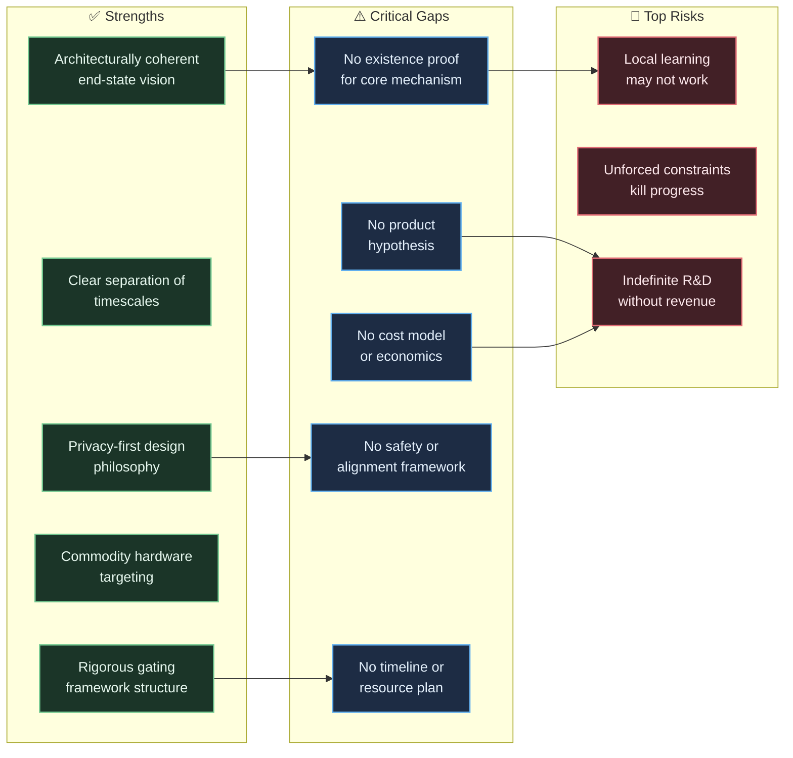

# Stakeholder Response: The Autopoietic Collective

## Critical Analysis, Challenges & Additions for a Practical Route to Success

**Date:** 2026-09-25
**In response to:** [Project Vision: The Autopoietic Collective](file:///workspaces/studious-fishstick/docs/archive/visions/vision-iv.md)

---

## Preamble

I write this as someone who *wants this to succeed*. The vision is intellectually compelling, architecturally coherent, and — if even partially realized — would represent a genuine paradigm shift in how intelligence is distributed, adapted, and owned. But intellectual compellingness is not an execution strategy. Below I challenge what I believe are the document's most consequential gaps, ambiguities, and risks, and I propose concrete additions to give the enterprise a disciplined, survivable path from here to there.

---

## Part I: Challenges

### 1. The "Boil the Ocean" Risk — No Existence Proof at Any Scale

> [!CAUTION]
> The vision defines the end-state with extraordinary precision but provides no evidence that *any* of the core mechanisms work — even in isolation, even on toy problems.

The document presupposes that local credit assignment (three-factor predictive coding, local contrastive energy minimization), autopoietic structural budding, quorum-based inference, and zero-knowledge invariant extraction can all be made to work *and then composed together*. Each of these is an open research problem in its own right. Composing four or five open research problems into a single system multiplies risk — it doesn't average it.

**Challenge:** Before Phase 0 even begins, a single micro-core must demonstrate:

1. That it can learn *anything at all* from a raw byte stream using only local credit assignment.
2. That what it learns is retained with O(1) memory under continued streaming.
3. That its settling time is empirically bounded.

If this cannot be shown on a trivial problem (e.g., learning to predict the next byte in a periodic 4-symbol sequence), the entire edifice above it is speculative architecture fiction. The vision document does not acknowledge this existential risk with the gravity it deserves.

---

### 2. The Chomsky Ladder Is the Wrong Evaluation Axis

The Representational Complexity axis (Levels I–IV) maps directly onto the Chomsky hierarchy: regular → context-free → context-sensitive → unrestricted. This is a clean formal taxonomy, but it is a poor *engineering progression* for three reasons:

1. **The jumps between levels are not incremental.** The mechanisms required for Level I (finite-state attractor dynamics) are qualitatively different from those required for Level II (stack-like recursive dynamics). You cannot "upgrade" a finite-state system into a pushdown automaton by scaling — you need a fundamentally different representational primitive. The vision treats these as rungs on a ladder; they are more like cliffs.

2. **Natural language is not well-characterized by the Chomsky hierarchy.** Natural language is mildly context-sensitive at best, but its *difficulty* comes from pragmatics, world knowledge, and compositionality — not from formal grammar class. A system that perfectly handles Dyck languages (Level II) has gained zero capability toward handling natural language polysemy (Level IV).

3. **It conflates formal language theory with learning difficulty.** Learning to predict periodic 4-symbol sequences (Level I) is trivial. Learning to predict *arbitrary* Markov chains over 8 symbols where the transition matrix is non-stationary and shifts without warning is profoundly hard — and it's still "Level I." The vocabulary size and grammar class are the least interesting dimensions of difficulty.

**Challenge:** Redefine the evaluation axis around *learning phenomena* that are incrementally composable: temporal correlation length, non-stationarity rate, compositional depth, and relational binding complexity. These cut orthogonally to the Chomsky hierarchy and give you a genuine gradient to walk.

---

### 3. "Local Credit Assignment Only" May Be an Unforced Constraint That Kills You

The prohibition on global backpropagation is presented as a non-negotiable invariant. The stated motivation is sound: backprop requires synchronous execution, creates catastrophic interference, and cannot scale over WANs.

But the invariant is stated as an *architectural prohibition*, not as a *scaling property*. There is a critical difference:

- **Scaling property:** "The system must remain functional and trainable when backpropagation is infeasible (e.g., across WAN-connected nodes)."
- **Architectural prohibition:** "Global backward passes are strictly prohibited."

The first permits using backprop *locally within a micro-core* (where it is perfectly feasible, fast, and well-understood on commodity hardware) while ensuring the *inter-core* protocol doesn't depend on it. The second prohibits backprop everywhere, including inside a single micro-core running on a single GPU — where it is the single most effective training signal known to engineering.

**Challenge:** The vision should distinguish between *intra-core* learning rules (where backprop is a legitimate candidate alongside Hebbian, predictive coding, and energy-based methods) and *inter-core / inter-device* coordination (where backprop is genuinely infeasible). Dogmatically rejecting backprop at all scales forfeits decades of engineering advantage for no architectural gain.

> [!WARNING]
> If local credit assignment methods prove unable to learn compositional structure from raw bytes — a very real possibility — the entire project is dead, and the prohibition on backprop will be the proximate cause. Build an escape hatch.

---

### 4. "Autopoietic" Is Doing Enormous Unearned Work

The term "autopoietic" appears in the title and throughout the document, implying the system will be self-producing, self-maintaining, and self-bounding in the biological sense (Maturana & Varela, 1973). But nothing in the architectural specification actually implements autopoiesis:

- **Self-production of components:** The document describes "modular budding" — but budding is triggered by entropy saturation detectors, which are engineered monitors, not emergent self-production. The system does not manufacture its own computational substrates; it allocates pre-existing silicon resources according to pre-defined policies.
- **Organizational closure:** An autopoietic system's organization is invariant while its structure changes. The vision describes structural growth but never specifies what the invariant *organization* is, nor how it is maintained under growth.
- **Boundary generation:** Autopoietic systems generate their own boundaries. The boundary between edge and collective in this architecture is an engineered API contract, not a self-generated membrane.

**Challenge:** Either (a) define precisely what "autopoietic" means operationally in this system — what self-produces, what the organizational invariant is, and how boundaries emerge — or (b) drop the term and call it what it currently is: a modular, hierarchically organized, locally adaptive system with engineered growth policies. Using "autopoietic" as branding without operational grounding invites intellectual scrutiny that the architecture cannot currently withstand.

---

### 5. The Economic Model Is Assumed, Not Demonstrated

Section 5 asserts "asymmetric economic scaling" and the commercial gating criteria require proving that central compute scales with macro-deliberation, not fleet size. But the vision document contains:

- No cost model.
- No estimate of deliberative query volume per edge device.
- No analysis of what happens when edge devices systematically offload hard problems (which real users will do, because hard problems are the ones that matter).
- No revenue model: who pays, for what, and why?

**Challenge:** The economic thesis rests on the claim that most computation is "routine" and can stay on-device. But user value concentrates in the *non-routine* — the hard queries, the novel situations, the creative tasks. If 10% of interactions require central deliberation but constitute 90% of user-perceived value, then the system's economics look a lot more like traditional cloud inference than the vision admits.

Model the query escalation distribution. Without it, the "order-of-magnitude efficiency advantage" is an article of faith.

---

### 6. Privacy Guarantees Are Claimed, Not Proven

The vision states that "only verified structural deltas... or ephemeral, privacy-preserving deliberative queries" cross the boundary. It asserts "zero reconstructible private context."

This is an extraordinarily strong claim. If the central collective can receive structural deltas that improve its language model, and those deltas were shaped by private user data, then the deltas *are* a function of that data. Model inversion attacks, membership inference, and gradient-based reconstruction are active and productive areas of adversarial ML research. "Structural deltas" and "topological invariants" are not automatically privacy-preserving just because they aren't raw keystrokes.

**Challenge:** Define a formal privacy model (differential privacy, information-theoretic bounds, or secure computation guarantees) for the upstream channel. Without one, the privacy claim is a marketing promise, not an engineering property.

---

### 7. The Gating Framework Has No Quantitative Thresholds

The Tier 1 gating invariants reference thresholds ($\gamma$, $\epsilon$, $\delta$, $\tau_{\max}$) but never assign values. A gating framework that says "mutual information must be above $\gamma$" without specifying $\gamma$ is not a gate — it is a gesture toward a gate.

**Challenge:** For Phase 0, assign concrete numerical thresholds for each gating invariant on specific benchmark tasks. These will be wrong — that's fine. Having concrete numbers forces empirical confrontation. Leaving them as free symbols permits indefinite deferral of accountability.

---

### 8. No Mention of Safety, Alignment, or Failure Modes

The document describes a system that:

- Adapts autonomously and continuously.
- Grows its own structure without human intervention.
- Makes autonomous decisions about when to emit and when to remain silent.
- Distributes across millions of edge devices outside centralized control.

And yet there is no discussion of:

- What happens when a micro-core learns something pathological.
- How autonomous structural growth is bounded (beyond $\tau_{\max}$, which bounds computation, not growth).
- How the collective prevents adversarial or corrupted deltas from poisoning the baseline.
- What alignment means in a system with no single objective function.
- How you *turn it off* at the edge if it goes wrong.

> [!CAUTION]
> A system that adapts, grows, and distributes autonomously without engineered safety boundaries is not robust — it is uncontrollable. This is not a philosophical concern; it is a deployment-blocking engineering gap.

---

### 9. Talent & Team Risk Is Entirely Absent

This vision requires simultaneous deep expertise in:

- Dynamical systems theory and attractor networks
- Computational neuroscience (predictive coding, Hebbian learning)
- Distributed systems engineering (WAN protocols, consensus algorithms)
- Systems programming (SIMD/SIMT, cache-coherent execution, memory management)
- Privacy-preserving computation
- Formal language theory and automata
- Product design and edge deployment

This is not a team — it is a department. The document is silent on who builds this, how many people, over what timeline, and with what funding runway.

---

## Part II: What I Would Add

### Addition 1: A "Phase −1" — Existence Proof Before Architecture

Before any architecture is built, validate the foundational hypothesis:

> **Can a local-learning-only dynamical system learn to predict non-trivial temporal structure in a raw byte stream with O(1) memory and bounded settling time?**

This is a 3-month, single-researcher experiment. It requires:

- A single micro-core implementation (can be a simple recurrent network trained with a local rule).
- A battery of synthetic byte streams at Level I complexity.
- Empirical measurement of: learning curve, memory footprint over time, settling time distribution, retention under continued streaming.

If this fails, the entire vision needs fundamental rethinking. If it succeeds, it provides the first empirical anchor for everything above.

> [!IMPORTANT]
> **Phase −1 is the most important recommendation in this document.** Everything else is optimization of a plan that may be building on sand.

---

### Addition 2: A Decision Log and Constraint Relaxation Protocol

Several of the "non-negotiable invariants" may need to be relaxed as empirical reality bites. The vision should include:

1. **A Decision Log:** For each invariant, record *why* it was imposed, what evidence supports it, and under what empirical conditions it would be reconsidered.
2. **A Constraint Relaxation Protocol:** A pre-agreed process for proposing, evaluating, and approving the relaxation of an invariant. Without this, the team will either (a) rigidly adhere to constraints that are killing progress, or (b) informally abandon them without collective agreement, leading to architectural drift.

Example: If local credit assignment cannot learn compositional byte-level structure after 6 months of focused effort, the team should have a pre-agreed path to evaluate hybrid approaches (e.g., local backprop within a micro-core, local Hebbian rules between cores) without it feeling like a crisis of faith.

---

### Addition 3: A Minimum Viable Demonstration (MVD) for Each Phase Gate

Each phase gate should define not just abstract invariants but a **concrete, demonstrable scenario** that a stakeholder can observe:

| Phase Gate | Minimum Viable Demonstration |
| :--- | :--- |
| Phase −1 → 0 | A single micro-core, given a raw byte stream of a periodic pattern with noise, converges to accurate next-byte prediction with flat memory usage over 10M bytes. |
| Phase 0 → 1 | A single-device swarm of 4 micro-cores, each exposed to a different non-stationary byte grammar, (a) retains per-core specialization, (b) resolves ambiguous test streams via quorum voting with >90% accuracy, and (c) buds a new core when input entropy exceeds capacity — all within a 4 GB memory envelope on commodity hardware. |
| Phase 1 → 2 | Two devices connected over a simulated 200ms-latency WAN link exchange structural deltas. Device B demonstrably improves on a task it has never seen locally, using only deltas from Device A. Zero raw bytes cross the link. |
| Phase 2 → 3 | A fleet of 100+ edge instances and a central collective demonstrate: (a) collective capability exceeds any individual instance, (b) central compute cost is sublinear in fleet size, (c) a new device bootstraps from a baseline seed and reaches fleet-average capability within hours. |

---

### Addition 4: An Explicit Risk Register

| Risk | Likelihood | Impact | Mitigation |
| :--- | :--- | :--- | :--- |
| Local credit assignment cannot learn compositional structure | High | Fatal | Phase −1 existence proof; hybrid learning escape hatch |
| O(1) memory constraint forces catastrophic forgetting | Medium | Critical | Empirical study of memory/retention tradeoff; explore sparse persistent state |
| Quorum consensus degrades under heterogeneous core quality | Medium | High | Weighted voting; core quality scoring; empirical quorum size studies |
| Structural deltas leak private information | Medium | Critical | Formal privacy analysis; differential privacy mechanisms; adversarial auditing |
| Edge hardware too constrained for meaningful local learning | Medium | High | Early hardware benchmarking; define minimum viable edge spec |
| Central collective becomes bottleneck under deliberative load | High | High | Query escalation rate modeling; tiered caching; admission control |
| Adversarial/corrupted deltas poison collective baseline | Medium | Critical | Byzantine fault tolerance in delta absorption; provenance tracking |
| Talent acquisition for required interdisciplinary expertise | High | Critical | Identify minimum viable team composition; staged hiring plan |
| Indefinite R&D without commercial signal | High | Fatal | Commercial milestone at Phase 1; define first paying use case |

---

### Addition 5: A First Product Hypothesis

The vision is infrastructure-first. It describes the engine but not the car. This is dangerous because:

- Infrastructure without a product generates cost without revenue.
- Product constraints (latency budgets, accuracy requirements, user expectations) are the most powerful forcing functions for architectural decisions.
- Without a product hypothesis, there is no user, and without a user, there is no feedback loop.

**Proposed first product hypothesis:**

> A **privacy-preserving, on-device writing assistant** that:
>
> - Runs entirely on-device for routine text prediction and completion.
> - Adapts continuously to the user's personal vocabulary and writing style.
> - Escalates complex compositional queries (e.g., "restructure this paragraph") to the central collective.
> - Never transmits raw text off-device.
>
> This product exercises Phase 0–2 capabilities, has a clear user value proposition, a measurable quality metric (prediction accuracy, user acceptance rate), and a natural monetization path (freemium edge / paid deliberation).

This is one hypothesis. The important thing is to *have* one, not to have the right one. A product hypothesis disciplines architectural choices, forces engagement with real user needs, and provides a commercial forcing function before Phase 3.

---

### Addition 6: Explicit Timeline and Resource Envelope

The vision roadmap describes phases but assigns no durations, team sizes, or budgets. This makes it impossible to evaluate feasibility or plan investment.

**Proposed skeleton:**

| Phase | Duration | Team Size | Primary Expense | Key Deliverable |
| :--- | :--- | :--- | :--- | :--- |
| Phase −1 | 3 months | 1–2 researchers | Researcher salaries | Existence proof paper/report |
| Phase 0 | 6–12 months | 3–5 engineers + 1 researcher | Salaries + commodity hardware | Single-device micro-core swarm with Phase 0 MVD |
| Phase 1 | 6–12 months | 5–8 engineers | Salaries + multi-device test rig | Multi-instance quorum with Phase 1 MVD |
| Phase 2 | 12–18 months | 8–12 engineers | Salaries + WAN test infrastructure | Edge-collective link with Phase 2 MVD |
| Phase 3 | 18–36 months | 15–25+ engineers | Salaries + central collective hosting | Commercial fleet deployment |

These numbers are illustrative. The point is that a vision without a resource envelope is a wish, not a plan.

---

### Addition 7: Kill Criteria

Every ambitious project needs pre-committed kill criteria — conditions under which you stop, pivot, or fundamentally rethink. Without them, sunk-cost dynamics take over.

> [!IMPORTANT]
> **Proposed kill criteria:**
>
> 1. **Phase −1 failure:** If no local-learning-only micro-core can learn to predict Level I regular grammars with O(1) memory after 3 months of focused effort → **Fundamental rethink** of the local credit assignment constraint.
> 2. **Phase 0 stall:** If a single micro-core cannot achieve Level II (simple nested structure) performance after 12 months → **Evaluate hybrid architectures** that permit local backprop within cores.
> 3. **Phase 1 contamination:** If multi-core divergence consistently produces cross-contamination (backward non-interference invariant violated by >5% on standard benchmarks) → **Rearchitect isolation boundaries.**
> 4. **Phase 2 privacy breach:** If formal analysis or empirical attack demonstrates that structural deltas permit non-trivial reconstruction of private inputs → **Halt upstream synchronization** until provably private mechanisms are in place.
> 5. **No commercial signal by Phase 2 completion:** If no paying user or credible product-market fit signal exists → **Pivot to licensing the core technology** rather than building the full collective.

---

## Summary Assessment

**Bottom line:** The vision describes a destination worth reaching. But the document is currently a *manifesto*, not a *plan*. To become a plan, it needs:

1. An existence proof (Phase −1) before any architecture is committed to.
2. A product hypothesis to discipline decisions and generate revenue signal.
3. Quantitative thresholds for every gating invariant.
4. An explicit risk register with mitigations.
5. Timeline, team, and budget projections.
6. Kill criteria to prevent sunk-cost death spirals.
7. A safety and alignment framework commensurate with the system's autonomy.
8. Honest reckoning with the possibility that some "non-negotiable" constraints may need to be negotiated.

The path from here is not to dilute the vision — it is to *earn it*, one empirical result at a time, starting with the smallest possible experiment that could prove the core hypothesis wrong.

---

> *"Plans are worthless, but planning is everything." — Dwight D. Eisenhower*
