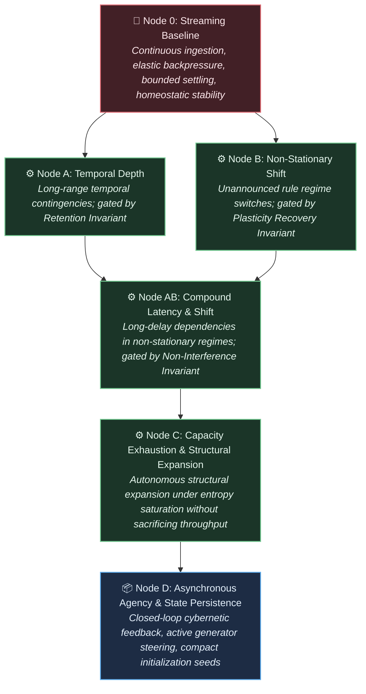

# Project Framing: The Autopoietic Core

---

## 1\. The Problem

Modern deep learning achieves functional utility through architectures that are structurally rigid and biologically anomalous:

* **Train Once, Freeze Forever:** A model is optimized offline over a static dataset, then deployed as a fixed, immutable function. Continuous adaptation in a changing world requires retraining or fine-tuning, both of which induce catastrophic forgetting of prior competencies.

* **Recompute Everything, Every Time:** Stateless transformer architectures do not maintain persistent, embodied physical state across invocations. The entire contextual "memory" must be reconstructed from a volatile KV cache on every forward pass, forcing redundant computational sweeps over historical inputs.

* **Brute-Force Attention:** Global all-to-all attention grants every token direct access to every other token. This imposes quadratic computational scaling, enforces no intrinsic notion of temporal or topological locality, and lacks resemblance to physical or biological information processing.

* **Thermodynamic Inefficiency:** Dense floating-point tensor contractions on high-wattage accelerators run orders of magnitude above the physical thermodynamic minimum. Information processing remains completely decoupled from metabolic costs.

These limitations are not incidental engineering hurdles; they are direct structural consequences of relying on monolithic parameter tensors optimized by global gradient descent, devoid of endogenous temporal dynamics, structural capacity growth, or autonomous error-recovery.

---

## 2\. The North Star

> **Vision:** Engineer an autopoietic computational core that operates indefinitely within an asynchronous, open-ended stream—continuously adapting, preserving acquired competencies, and autonomously expanding its structural and state capacity under evolutionary selection pressures, without relying on offline pre-training, external tokenizers, or historical context recomputation.

The objective is defined by functional capabilities across three distinct operational timescales:

1. **Experiential Plasticity (Runtime):** Continuously assimilate incoming sensory streams, adapt local dynamics, and form persistent associative states in real time without degrading prior baseline competencies.

2. **Developmental Expansion (Somatic Growth):** Detect internal state and capacity saturation, autonomously triggering physical structural expansion (allocating new compute units, rewiring routing topologies, and pruning redundant pathways) to match environmental complexity.

3. **Structural Expansion (Capacity Scaling):** Detect internal state and capacity saturation, autonomously triggering physical structural expansion (allocating new compute units, rewiring routing topologies, and pruning redundant pathways) to match environmental complexity.

4. **Archival Compression (State Inheritance):** Compress, stabilize, and transfer successful architectural and routing configurations across operational lifecycles, ensuring the core never initializes as an unconfigured baseline.

## 3\. Environmental & Interface Constraints

To avoid accidental solutioning via arbitrary data representations, the environment contract is defined strictly at the byte boundary:

* **Standardized UTF-8 Byte Stream:**

* The environment presents an unbroken sequence of discrete symbols standardized at the raw **UTF-8 byte level** ($\\vert{}V\\vert{} \\le 256$, or constrained subsets during early development).

* No external multi-thousand-token vocabularies, BPE tokenizers, or arbitrary high-dimensional embedding projections are permitted at the interface.

* All compositional abstractions—from byte combinations to morphemes, syntax, and relational concepts—must be discovered and represented endogenously within the core's own dynamics.

* **Continuous, Open-Ended Ingestion:** Input arrives as an unending temporal sequence without artificial episode resets, context-window flushes, or distinct training versus inference modes.

* **Active Cybernetic Closure:** The environment is reactive and non-stationary. Output bytes emitted by the core act directly upon the environment, altering its state and biasing future incoming sequences.

* **Dynamic Capacity Saturation:** The environment's generative complexity and entropy will eventually outstrip any fixed-size computational state space, exerting continuous selection pressure toward autonomous structural growth.

---

## 4\. Hardware & Interaction Invariants

The core must operate within strict physical boundary conditions to ensure execution viability on real-world silicon:

* **Lifetime Invariance ($O(1)$ Complexity with respect to $T$):** The computational cost and memory footprint required to process incoming byte $N$ must remain strictly independent of the total accumulated historical lifetime $T$. State is embodied entirely within the persistent topology and dynamical configuration of the core, not accumulated in an expanding history log.

* **Elastic Pacing & Bounded Relaxation:**

* The core is not slaved to a rigid wall-clock tick. It interfaces via an elastic pull/backpressure mechanism, consuming variable internal relaxation cycles ($\\tau$) per byte depending on input entropy and structural reorganization demands.

* **Operational Halting Invariant:** State transitions must guarantee convergence to an attractor, an emission, or a stable quiescent state within a hard maximum computational budget ($\\tau \\le \\tau\_{\\max}$). Unbounded livelocks, dynamic divergences, and silent stalls constitute fatal failure.

* **Asynchronous Emission Autonomy:** The core decides *if* and *when* to emit bytes back into the stream. It may absorb multiple input bytes during internal contemplation before emitting, or stream an emission sequence across continuous observations.

* **Silicon-Native Parallelism:** Execution targets commodity CPU and GPU architectures, not theoretical neuromorphic silicon. All local dynamical updates, state transitions, and structural graph transformations must compile into cache-coherent, vector-parallel (SIMD/SIMT) execution primitives.

---

## 5\. Progression Roadmap: The 2D Capability Matrix

Progress is evaluated across a two-dimensional capability space: **Dynamical Resilience (Nodes 0–D)** crossed with **Representational Complexity (Levels I–IV)**. System advancement requires earning passage through rigorous empirical gating invariants rather than meeting arbitrary feature milestones.

### Gating Invariants

* **Homeostatic Invariant:** Flat physical memory allocation, zero resource leakage, and bounded internal settling ($\\tau \\le \\tau\_{\\max}$) across statistically significant numbers of consecutive streaming bytes.

* **Retention Invariant:** Mutual information between an early trigger signal $S\_{t\_0}$ and a conditional response at $t\_0 \+ K$ remains above threshold $\\gamma$ across distractor intervals without historical caches or replay buffers.

* **Plasticity Recovery Invariant:** Upon an unannounced environmental distribution shift ($\\Delta E$), the time-to-recovery ($T\_{\\text{recover}}$) settles into an optimal asymptotic bound, proving active dynamic reconfiguration.

* **Backward Non-Interference Invariant:** Adapting to novel environmental dynamics $B$ induces performance degradation on previously mastered dynamics $A$ bounded strictly by $\\Delta \\le \\epsilon$.

---

### The Representational Complexity Ladder (The Information Axis)

Level IV: Open-Domain Natural Distributions  
  \* Full UTF-8 byte stream (|V| \= 256\)  
  \* Natural language, polysemy, open-ended conversational context, programmatic interaction  
  \* Challenge: Compositional semantics and large-scale relational reasoning without an external tokenizer  
        ▲  
Level III: Context-Sensitive Systems & Variable Binding  
  \* Structured byte grammars (|V| \~ 64–128)  
  \* Dynamic variable binding, cross-serial dependencies (e.g., w w patterns), pseudo-code execution traces  
  \* Challenge: Decoupling operators from arguments; dynamic relational reference  
        ▲  
Level II: Hierarchical & Context-Free Languages  
  \* Nested byte sequences (|V| \~ 8–32)  
  \* Dyck languages, balanced bracket expressions, recursive syntax trees  
  \* Challenge: Autonomous formation of internal counter or stack-like attractor dynamics  
        ▲  
Level I: Regular & Markovian Grammars  
  \* Sub-byte / Micro-alphabets (|V| ≤ 8\)  
  \* Local n-grams, parity checks, periodic and finite-state regular languages  
  \* Challenge: Establishing fundamental state persistence and deterministic attractor transitions

---

### The Dynamical Resilience Ladder (The Operational Axis)

---

### Execution Matrix

| Capability Node | Level I (Regular) | Level II (Hierarchical) | Level III (Context-Sensitive) | Level IV (Open UTF-8) |
| :---- | :---- | :---- | :---- | :---- |
| **Node 0 (Streaming)** | Stream micro-tokens; establish settling ceiling $\\tau\_{\\max}$ | Stream nested byte streams; confirm stack-free stability | Continuous stream of code-like execution traces | Sustained multi-gigabyte ingestion of raw UTF-8 text |
| **Node A (Temporal Depth)** | Parity / delay checks across significant distractor bytes | Dyck-path resolution separated by long distractor streams | Variable assignment with distant operational calls | Long-range context resolution across thousands of intervening UTF-8 characters |
| **Node B (Non-Stationary)** | Periodic shifting of Markov transition rules | Alternating syntax rules (e.g., swapping delimiter pairs) | Dynamic re-binding of variables and operation primitives | Fluid domain-adaptation across disparate natural language topics/styles |
| **Node AB (Compound)** | Multi-delay recall under shifting alphabetic rules | Deeply nested recursive matching with shifting grammar modes | Complex algorithmic execution with mid-stream protocol changes | Sustained dialogue/reasoning across fluctuating conversational regimes |
| **Node C (Structural Expansion)** | Expand nodes when regular state count saturates | Grow dynamic depth when nesting exceeds initial state bounds | Allocate parallel sub-graphs for disjoint variable sets | Autonomously expand structural parameter footprint under open-domain web data |
| **Node D (Agency & State Persistence)** | Steer generator between low-entropy Markov states | Actively query generator to resolve grammatical ambiguities | Interactively debug and solve simulated programmatic tasks | Full autonomous agent dialogue: steering human/synthetic environments; distilling architectural priors |

---
