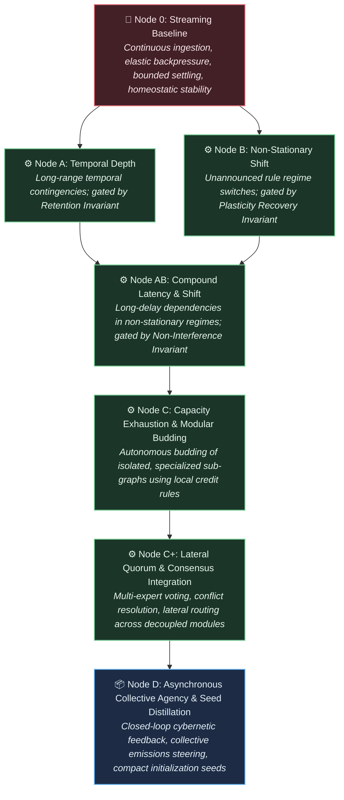

# Project Framing: The Autopoietic Collective

---

## 1. The Problem

Modern deep learning achieves functional utility through architectures that are structurally rigid, centralized, and biologically anomalous:

* **Train Once, Freeze Forever:** A model is optimized offline over a static dataset, then deployed as a fixed, immutable function. Continuous adaptation in a changing world requires retraining or fine-tuning, both of which induce catastrophic forgetting of prior competencies.

* **Global Gradient Coupling & Spatial Fragility:** End-to-end backpropagation couples every weight matrix to every other weight matrix through an analytical loss function. This total interdependence renders isolated local adaptation mathematically impossible: updating a sub-circuit to incorporate novel information perturbs the shared coordinate space. Consequently, models cannot accept asynchronous, time-lagged, or decentralized updates from distributed edge nodes without stalling execution across a low-latency interconnect or triggering catastrophic interference.
* **Recompute Everything, Every Time:** Stateless transformer architectures do not maintain persistent, embodied physical state across invocations. The entire contextual "memory" must be reconstructed from a volatile KV cache on every forward pass, forcing redundant computational sweeps over historical inputs.

* **Brute-Force Dense Attention:** Global all-to-all attention grants every token direct access to every other token. This imposes quadratic computational scaling, enforces no intrinsic notion of temporal or topological locality, and lacks resemblance to physical or biological information processing.

* **Thermodynamic & Capital Centralization:** Dense floating-point tensor contractions on high-wattage accelerators run orders of magnitude above the physical thermodynamic minimum. The extreme memory-bandwidth and interconnect requirements trap modern AI inside capital-intensive hyperscaler data centers, preventing the field from leveraging the vast aggregate compute footprint of consumer edge silicon.

These limitations are not incidental engineering hurdles; they are direct structural consequences of relying on monolithic parameter tensors optimized by global gradient descent, devoid of endogenous temporal dynamics, structural capacity growth, localized credit assignment, or autonomous error recovery.

---

## 2. The North Star

> **Vision:** Engineer a decentralized collective of autopoietic computational micro-cores that operate indefinitely across asynchronous, open-ended byte streams—adapting via strictly local credit assignment, isolating state perturbations, and organizing into redundant, quorum-governed swarms that autonomously scale capacity and distill knowledge without global backpropagation, centralized re-training, or historical context recomputation.
>
>

The objective is defined by functional capabilities across four distinct operational timescales:

1. **Local Experiential Plasticity (Runtime Adaptation):** Continuously assimilate incoming sensory byte streams and adapt local circuit dynamics in real time using local error minimization (e.g., three-factor predictive coding or local contrastive energy), guaranteeing that novel surprises absorbed by one circuit do not destabilize prior baseline competencies.

2. **Lateral Consensus & Quorum (Inference Deliberation):** Resolve ambiguous inputs, cross-domain relational reasoning, and multi-step tasks through lateral voting and debate across redundant, semi-independent micro-experts rather than an unconstrained, monolithic forward pass.
3. **Somatic Growth & Modular Budding (Structural Expansion):** Detect internal state and capacity saturation, autonomously triggering physical structural expansion (allocating new micro-units, budding parallel sub-graphs, and pruning redundant pathways) to match environmental complexity without degrading vector-parallel execution throughput.

4. **Asynchronous Population Distillation (State Inheritance & Federation):** Compress, stabilize, and aggregate modular structural configurations and adapter states across loosely coupled consumer edge devices over high-latency networks, ensuring the base population evolves continually without centralized data harvesting or synchronous lock-step training.

---

## 3. Environmental & Interface Constraints

To avoid accidental solutioning via arbitrary data representations, the environment contract is defined strictly at the byte boundary:

* **Standardized UTF-8 Byte Stream:**

* The environment presents an unbroken sequence of discrete symbols standardized at the raw **UTF-8 byte level** ($\vert{}V\vert{} \le 256$, or constrained subsets during early development).

* No external multi-thousand-token vocabularies, BPE tokenizers, or arbitrary high-dimensional embedding projections are permitted at the interface.

* All compositional abstractions—from byte combinations to morphemes, syntax, and relational concepts—must be discovered and represented endogenously within the core's own dynamics.

* **Continuous, Open-Ended Ingestion:** Input arrives as an unending temporal sequence without artificial episode resets, context-window flushes, or distinct training versus inference modes.

* **Active Cybernetic Closure:** The environment is reactive and non-stationary. Output bytes emitted by the core act directly upon the environment, altering its state and biasing future incoming sequences.

* **Dynamic Capacity Saturation:** The environment's generative complexity and entropy will eventually outstrip any fixed-size computational state space, exerting continuous selection pressure toward autonomous structural growth.

---

## 4. Hardware & Execution Invariants

The architecture must operate within strict physical boundary conditions to ensure execution viability across consumer devices and standard hardware:

* **Lifetime Invariance ($O(1)$ Complexity with respect to $T$):** The computational cost and memory footprint required to process incoming byte $N$ must remain strictly independent of the total accumulated historical lifetime $T$. State is embodied entirely within the persistent topology and dynamical configuration of the core, not accumulated in an expanding history log or key-value cache.

* **Locality of Credit Assignment Invariant:** Parameter updates and state adaptations must depend exclusively on locally accessible signals (presynaptic inputs, postsynaptic outputs, and local predictive residuals or diffuse scalar modulators). Global backward passes requiring layer-synchronized execution locks, reverse-order graph traversals, or global gradient evaluations are strictly prohibited.
* **WAN-Native Interconnect Tolerance:** The system must remain computationally stable and functional under arbitrary network latency, high packet loss, and intermittent device dropouts. Decentralized nodes communicate through sparse behavioral activations, structural deltas, or consensus votes—never through synchronous, high-bandwidth all-reduce tensor synchronization.
* **Elastic Pacing & Bounded Relaxation:**

* The core is not slaved to a rigid wall-clock tick. It interfaces via an elastic pull/backpressure mechanism, consuming variable internal relaxation cycles ($\tau$) per byte depending on input entropy and structural reorganization demands.

* **Operational Halting Invariant:** State transitions must guarantee convergence to an attractor, an emission, or a stable quiescent state within a hard maximum computational budget ($\tau \le \tau_{\max}$). Unbounded livelocks, dynamic divergences, and silent stalls constitute fatal failure.

* **Asynchronous Emission Autonomy:** The core decides *if* and *when* to emit bytes back into the stream. It may absorb multiple input bytes during internal contemplation before emitting, or stream an emission sequence across continuous observations.

* **Silicon-Native Parallelism:** Execution targets commodity CPU, GPU, and NPU architectures, not specialized neuromorphic silicon. All local dynamical updates, state transitions, and structural graph transformations must compile into cache-coherent, vector-parallel (SIMD/SIMT) execution primitives.

---

## 5. Progression Roadmap: The 2D Capability Matrix

Progress is evaluated across a two-dimensional capability space: **Dynamical Resilience (Nodes 0–D)** crossed with **Representational Complexity (Levels I–IV)**. System advancement requires earning passage through rigorous empirical gating invariants rather than meeting arbitrary feature milestones.

### Gating Invariants

* **Homeostatic Invariant:** Flat physical memory allocation, zero resource leakage, and bounded internal settling ($\tau \le \tau_{\max}$) across statistically significant numbers of consecutive streaming bytes.

* **Retention Invariant:** Mutual information between an early trigger signal $S_{t_0}$ and a conditional response at $t_0 + K$ remains above threshold $\gamma$ across distractor intervals without historical caches or replay buffers.

* **Plasticity Recovery Invariant:** Upon an unannounced environmental distribution shift ($\Delta E$), the time-to-recovery ($T_{\text{recover}}$) settles into an optimal asymptotic bound, proving active dynamic reconfiguration.

* **Backward Non-Interference Invariant:** Adapting to novel environmental dynamics $B$ induces performance degradation on previously mastered dynamics $A$ bounded strictly by $\Delta \le \epsilon$.

* **Consensus Coherence Invariant:** When evaluated across a distributed ensemble of heterogeneous micro-experts receiving out-of-order, time-lagged updates, collective voting must maintain accuracy and calibration within bounded error $\delta$ relative to an un-lagged reference.

---

### The Representational Complexity Ladder (The Information Axis)

```text
Level IV: Open-Domain Natural Distributions
  * Full UTF-8 byte stream (|V| = 256)
  * Natural language, polysemy, open-ended conversational context, programmatic interaction
  * Challenge: Compositional semantics, relational reasoning, and cross-domain generalization without an external tokenizer
        ▲
Level III: Context-Sensitive Systems & Variable Binding
  * Structured byte grammars (|V| ~ 64–128)
  * Dynamic variable binding, cross-serial dependencies (e.g., w w patterns), pseudo-code execution traces
  * Challenge: Decoupling operators from arguments; dynamic relational reference
        ▲
Level II: Hierarchical & Context-Free Languages
  * Nested byte sequences (|V| ~ 8–32)
  * Dyck languages, balanced bracket expressions, recursive syntax trees
  * Challenge: Autonomous formation of internal counter or stack-like attractor dynamics
        ▲
Level I: Regular & Markovian Grammars
  * Sub-byte / Micro-alphabets (|V| ≤ 8)
  * Local n-grams, parity checks, periodic and finite-state regular languages
  * Challenge: Establishing fundamental state persistence and deterministic attractor transitions

```

---

### The Dynamical Resilience Ladder (The Operational Axis)



---

### Execution Matrix

| Capability Node | Level I (Regular)

 | Level II (Hierarchical)

 | Level III (Context-Sensitive)

 | Level IV (Open UTF-8)

 |
| --- | --- | --- | --- | --- |
| **Node 0 (Streaming)**<br> | Stream micro-tokens; establish settling ceiling $\tau_{\max}$.

 | Stream nested byte streams; confirm stack-free stability.

 | Continuous stream of code-like execution traces.

 | Sustained multi-gigabyte ingestion of raw UTF-8 text.

 |
| **Node A (Temporal Depth)**<br> | Parity / delay checks across significant distractor bytes.

 | Dyck-path resolution separated by long distractor streams.

 | Variable assignment with distant operational calls.

 | Long-range context resolution across thousands of intervening UTF-8 characters.

 |
| **Node B (Non-Stationary)**<br> | Periodic shifting of Markov transition rules.

 | Alternating syntax rules (e.g., swapping delimiter pairs).

 | Dynamic re-binding of variables and operation primitives.

 | Fluid domain adaptation across disparate natural language topics and styles.

 |
| **Node AB (Compound)**<br> | Multi-delay recall under shifting alphabetic rules.

 | Deeply nested recursive matching with shifting grammar modes.

 | Complex algorithmic execution with mid-stream protocol changes.

 | Sustained dialogue and reasoning across fluctuating conversational regimes.

 |
| **Node C (Modular Budding)**<br> | Spawn new topological nodes when regular state count saturates.

 | Bud dynamic sub-modules when nesting exceeds baseline attractor depth.

 | Allocate isolated, parallel sub-graphs for disjoint variable scopes without cross-talk.

 | Spawn specialized, localized micro-experts along semantic/domain boundaries without altering base representations.

 |
| **Node C+ (Lateral Quorum)** | Lateral majority voting across redundant nodes for noisy Markov sequences. | Consensus resolution between competing stack-like attractors on ambiguous brackets. | Multi-expert voting to resolve branching variable bindings and conflicting execution traces. | Dynamic consensus, debate, and verification across decoupled micro-experts to synthesize complex text. |
| **Node D (Collective Agency)**<br> | Steer generator between low-entropy Markov states.

 | Actively query generator to resolve grammatical ambiguities.

 | Interactively debug and solve simulated programmatic tasks across distributed worker nodes.

 | Autonomous closed-loop agent dialogue: steering environments, local edge adaptation, and distilling architectural priors across the fleet.

 |
