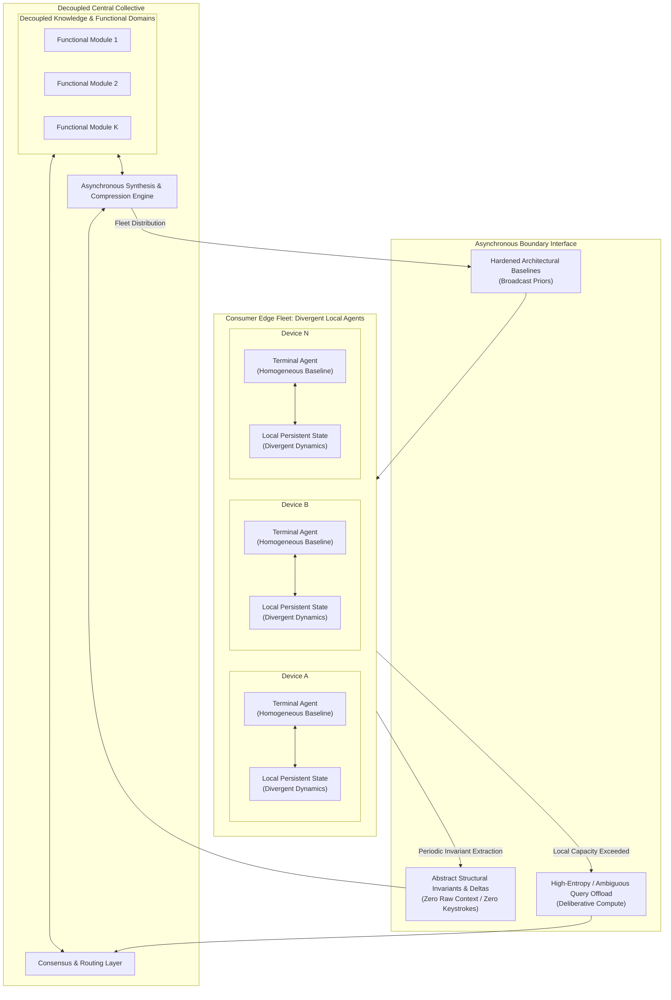
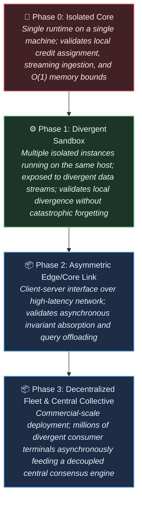

# Vision Document: The Autopoietic Collective

## 1. The Problem Space

Modern artificial intelligence is constrained by three deeply intertwined systemic bottlenecks:

* **Monolithic Parameter Entanglement:** Modern architectures rely on dense, globally coupled parameter spaces optimized via end-to-end analytical gradient descent. Because every parameter is coupled to every other parameter, updating a sub-region to assimilate new information destabilizes the global coordinate space (catastrophic interference). Isolated, continuous learning is mathematically precluded by the optimization regime itself.

* **The Asynchronous Distributed Wall:** Global backpropagation requires instantaneous, synchronous awareness of the entire network state. It cannot tolerate non-deterministic latencies, time-lagged updates, or intermittent disconnections. Consequently, models cannot be trained or continuously adapted across geographically dispersed, loosely coupled devices over commodity networks.
* **Capital and Infrastructural Centralization:** Because the computational substrate demands multi-terabit, low-latency interconnects (e.g., NVLink) to coordinate dense matrix operations across thousands of accelerators, training and large-scale inference are confined to hyper-centralized, capital-intensive data centers. Meanwhile, billions of consumer-edge processors sit idle as passive terminal consumers rather than active computational participants, creating a structural barrier to entry that is purely an artifact of monolithic architecture.
* **Statelessness and Thermodynamic Waste:** Models maintain no persistent physical embodiment or endogenous state between invocations, requiring brute-force contextual recomputation on every interaction.

---

## 2. The North Star

> **Vision:** Engineer an autopoietic intelligence architecture comprising an asymmetric topology: an autonomous, locally plastic terminal agent running natively on consumer edge hardware, coupled asynchronously to a decoupled, modular central collective. Terminal agents instantiate from a common homogeneous baseline, diverge continuously through private local learning, and asynchronously contribute invariant structural updates to the central collective—which integrates distributed discoveries and redistributes refined baseline configurations without monolithic parameter synchronization, raw data harvesting, or global backpropagation.
>
>

The objective spans four distinct operational timescales:

1. **Local Runtime Adaptation (Edge Plasticity):** Continuously assimilate incoming byte streams and adapt internal states in real time using strictly local update rules. Surprise and novelty absorbed by an agent must remain isolated, never corrupting baseline capabilities.

2. **Local Structural Growth (Somatic Expansion):** Detect internal state and capacity saturation under high-entropy streams, autonomously allocating new localized compute units and routing pathways to match environmental complexity without altering global operational latency.

3. **Asynchronous Collective Synthesis (Hive Integration):** The central collective must absorb time-lagged, heterogeneous, and sparse structural updates from millions of divergent edge agents, reconciling them into a unified knowledge repository without requiring global cluster synchronization or lock-step training passes.
4. **Fleet-Wide Baseline Distribution (Evolutionary Inheritance):** Periodically compress, stabilize, and broadcast updated baseline architectural priors back down to the edge fleet, lifting the general capability ceiling of all terminal instances.

---

## 3. System Topology & Information Flow

The architecture decouples immediate interaction from collective generalization:

---

## 4. Hardware, Boundary & Topology Invariants

To prevent the engineering effort from defaulting to traditional coupled deep learning techniques, the architecture must satisfy the following non-negotiable invariants:

* **Locality of Credit Assignment:** Internal state updates and learning dynamics must depend exclusively on locally accessible variables within the immediate computational neighborhood. Global backward passes requiring layer-synchronized locks or reverse-order graph traversals are strictly prohibited.
* **Asynchronous WAN Resilience:** The coordination between edge agents and the central collective must be fundamentally asynchronous. The central collective must converge and maintain stability despite arbitrarily delayed, out-of-order, or dropped updates from the fleet.
* **Client Autonomy & Privacy Boundary:** A terminal agent must remain a fully functioning generative system in an air-gapped environment. Raw interaction logs, private context, or uncompressed observation streams must never leave the client device; the boundary interface permits only abstract structural updates, verified state invariants, or ephemeral deliberation queries.
* **Lifetime Complexity Invariance ($O(1)$ with respect to $T$):** The computational cost and working memory footprint required to process byte $N$ must remain independent of total operational lifetime $T$. Memory is dynamic state topology, not a growing history log.

* **Asymmetric Economic Scaling:** Total infrastructure hosting costs must scale with the rate of *collective capability synthesis*, not with *aggregate user inference volume*. Routine inference, interactive contemplation, and personal adaptation costs are born by client-side silicon.

---

## 5. The Progression Roadmap: Complexity vs. Topology

Advancement is measured across two intersecting axes: **Representational Complexity (Levels I–IV)** and **Deployment Topology (Phases 0–3)**. Early technical feasibility is earned entirely on a developer laptop; scaling to later phases introduces the economic and distributed systems constraints.

### The Integrated Execution Matrix

| Topology Phase | Level I: Regular Grammars ($\vert{}V\vert{} \le 8$)

 | Level II: Hierarchical Grammars ($\vert{}V\vert{} \le 32$)

 | Level III: Context-Sensitive Systems ($\vert{}V\vert{} \sim 128$)

 | Level IV: Open Natural UTF-8 ($\vert{}V\vert{} = 256$)

 |
| --- | --- | --- | --- | --- |
| **Phase 0: Isolated Core** 

 *(Single Laptop)* | Establish bounded settling ($\tau \le \tau_{\max}$) and baseline streaming stability on raw micro-tokens.

 | Resolve nested Dyck brackets and recursive dependencies via endogenous attractor states.

 | Dynamic variable binding and execution traces; demonstrate zero backward interference.

 | Sustained multi-gigabyte ingestion of raw text; continuous byte-level predictive settling on local CPU/GPU.

 |
| **Phase 1: Divergent Sandbox** 

 *(Multi-instance / Local Host)* | Two local instances adapt to mutually exclusive Markov transition rules without baseline degradation. | Instances diverge on conflicting delimiter/syntax systems; verify isolation of learned structures. | Instances independently debug disjoint code traces; confirm zero cross-contamination of local states.

 | **UX Benchmark:** Standalone agent demonstrates real-time personal context adaptation on edge hardware within $<4$ GB RAM. |
| **Phase 2: Asymmetric Link** 

 *(Emulated WAN / LAN)* | Local instance offloads unresolved state transitions to an emulated central module. | Central module resolves ambiguous recursive branches; validates latency-tolerant query-response. | Client emits local structural deltas; central engine merges functional graphs without retraining.

 | Central core absorbs time-lagged deltas from multiple edge instances; validates absence of catastrophic interference. |
| **Phase 3: Collective Fleet** 

 *(Commercial WAN Scale)* | Distributed fleet maps disjoint state spaces; collective unifies them into a minimal baseline seed.

 | Central engine extracts common grammar invariants from a fleet exposed to diverse synthetic dialects. | Distributed fleet resolves large-scale programmatic suites; collective synthesizes optimal execution paths.

 | **Market Deployment:** Fleet of divergent personal agents run inference locally; central collective distills global capabilities. |

---

## 6. Commercial & Operational Gating Criteria

Advancement across topological phases requires clearing non-technical validation gates:

* **Edge Footprint Feasibility (Phase 0 $\rightarrow$ 1 Gate):** The runtime must operate comfortably within constrained consumer compute envelopes (e.g., modern laptop/desktop CPU, integrated GPU, or NPU), maintaining responsive settling times without thermal throttling or continuous high-wattage utilization.
* **Privacy & Bandwidth Viability (Phase 1 $\rightarrow$ 2 Gate):** Invariant updates sent over the network must be ultra-sparse, requiring bandwidth orders of magnitude lower than transmitting the raw interaction stream, with zero reconstructible private context.
* **Decoupled Infrastructure Economics (Phase 2 $\rightarrow$ 3 Gate):** The central infrastructure must demonstrate that compute consumption does not scale linearly with the number of connected edge users, proving that the consumer fleet absorbs the primary inference and continuous-learning cost burden.
