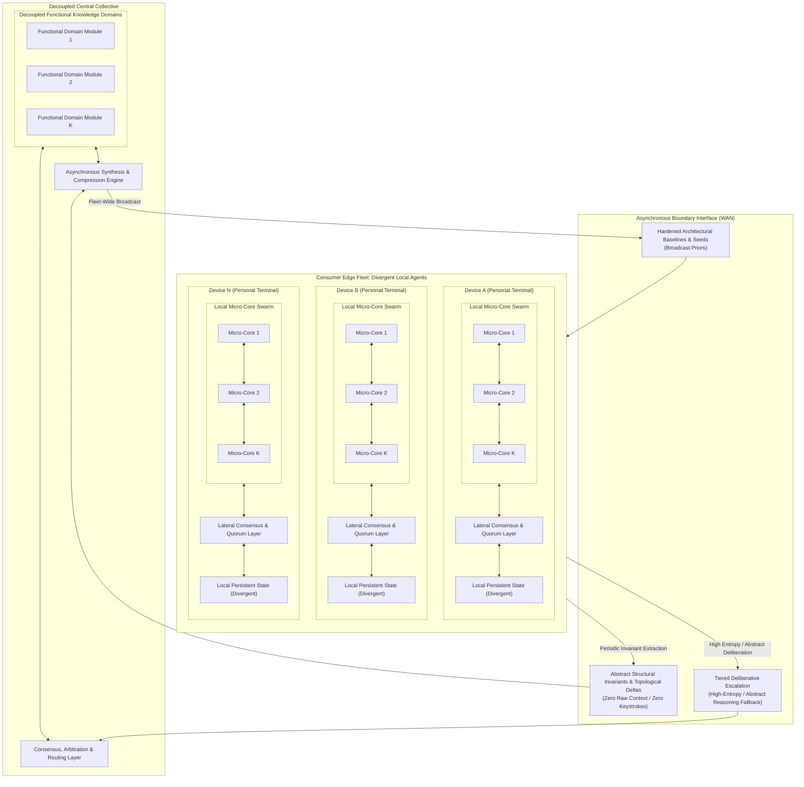

# Project Vision: The Autopoietic Collective

## From Autonomous Edge Micro-Cores to an Asymmetric Planetary Collective

---

## 1. The Problem Space

Modern artificial intelligence achieves functional utility through architectures that are structurally rigid, hyper-centralized, and biologically anomalous. These limitations are not incidental engineering hurdles; they are direct structural consequences of relying on monolithic parameter tensors optimized via global gradient descent, devoid of endogenous temporal dynamics, structural capacity growth, localized credit assignment, or autonomous error recovery.

The existing paradigm is constrained by six intertwined systemic bottlenecks:

* **Train Once, Freeze Forever (Static Optimization vs. Continuous Reality):**  
  A model is optimized offline over a static, historical dataset, then deployed as a fixed, immutable function. Continuous adaptation in a non-stationary world requires complete retraining or fine-tuning, both of which induce catastrophic forgetting of prior competencies.

* **Monolithic Parameter Entanglement & Global Gradient Coupling:**  
  End-to-end backpropagation couples every weight matrix to every other weight matrix through an analytical loss function. This total interdependence renders isolated local adaptation mathematically impossible: updating a sub-circuit to incorporate novel information perturbs the shared coordinate space (catastrophic interference). Consequently, models cannot accept asynchronous, time-lagged, or decentralized updates without stalling execution across ultra-low-latency interconnects or destabilizing the global parameter manifold.

* **The Asynchronous Distributed Wall:**  
  Global backpropagation requires instantaneous, synchronous awareness of the entire network state. It cannot tolerate non-deterministic latencies, time-lagged updates, or intermittent disconnections over commodity wide-area networks (WAN). As a result, continuous learning cannot naturally scale across geographically dispersed, loosely coupled devices.

* **Recompute Everything, Every Time (Statelessness & Thermodynamic Waste):**  
  Stateless transformer architectures maintain no persistent, embodied physical state across invocations. The entire contextual "memory" must be reconstructed from a volatile key-value (KV) cache on every forward pass, forcing redundant computational sweeps over historical inputs. Furthermore, dense floating-point tensor contractions on high-wattage accelerators run orders of magnitude above the physical thermodynamic minimum, completely decoupling computation from metabolic costs.

* **Brute-Force Dense Attention:**  
  Global all-to-all attention grants every token direct access to every other token. This imposes quadratic computational scaling, enforces no intrinsic notion of temporal or topological locality, and lacks resemblance to physical or biological information processing.

* **Capital and Infrastructural Centralization:**  
  Because monolithic substrates demand multi-terabit, low-latency interconnects (e.g., NVLink) to coordinate dense matrix operations across thousands of accelerators, training and large-scale inference are locked inside capital-intensive hyperscaler data centers. Meanwhile, billions of consumer-edge processors sit idle as passive terminal consumers rather than active computational participants—a structural barrier to entry that is purely an artifact of monolithic architecture.

---

## 2. The North Star

> **Vision:** Engineer an autopoietic intelligence architecture spanning an asymmetric, hierarchical topology: autonomous, locally plastic edge agents composed of autopoietic micro-core swarms operating directly on raw byte streams without global backpropagation, coupled asynchronously across commodity networks to a decoupled, modular central collective. Terminal agents instantiate from a common homogeneous baseline, deliberate locally via lateral quorum, expand capacity via somatic modular budding, and asynchronously contribute abstract structural invariants and deltas to the central collective—which synthesizes distributed discoveries and broadcasts hardened baseline priors across the fleet without monolithic parameter synchronization, raw data harvesting, or context recomputation.

This objective spans five distinct operational timescales:

1. **Local Experiential Plasticity (Runtime Adaptation — Milliseconds to Seconds):**  
   Continuously assimilate incoming byte streams and adapt internal states in real time using strictly local error signals (such as three-factor predictive coding or local contrastive energy minimization). Surprise and novelty absorbed by a sub-circuit remain topologically isolated, never corrupting established baseline competencies.

2. **Lateral Consensus & Quorum (Inference Deliberation — Milliseconds to Seconds):**  
   Resolve ambiguous inputs, cross-domain relational reasoning, and multi-step tasks locally through lateral voting, debate, and verification across redundant, semi-independent micro-experts rather than through an unconstrained, monolithic forward pass.

3. **Somatic Growth & Modular Budding (Structural Expansion — Minutes to Hours):**  
   Autonomously detect internal state and capacity saturation under high-entropy streams, triggering physical structural expansion (budding parallel sub-graphs, allocating localized compute units, and pruning redundant pathways) to match environmental complexity without degrading vector-parallel execution throughput or altering global operational latency.

4. **Asynchronous Collective Synthesis (Hive Integration — Hours to Days):**  
   Absorb sparse, time-lagged, and heterogeneous structural updates and topological invariants from millions of divergent edge agents into a decoupled central collective (comprising routing arbiters and domain-specific functional modules), reconciling distributed discoveries without requiring global cluster synchronization, lock-step training passes, or access to private client context.

5. **Fleet-Wide Baseline Distribution (Evolutionary Inheritance — Days to Weeks):**  
   Periodically compress, stabilize, and broadcast updated baseline architectural priors and minimal seed configurations back to the consumer edge fleet, lifting the general capability ceiling of all terminal instances across operational lifecycles.

---

## 3. Environmental & Interface Constraints

To prevent accidental solutioning via arbitrary data representations, the environment contract is defined strictly at the raw byte boundary:

* **Standardized Raw UTF-8 Byte Stream:**  
  * The environment presents an unbroken sequence of discrete symbols standardized at the raw **UTF-8 byte level** ($\vert{}V\vert{} \le 256$, or constrained subsets during early development).  
  * No external multi-thousand-token vocabularies, BPE tokenizers, or arbitrary high-dimensional embedding projections are permitted at the interface.  
  * All compositional abstractions—from byte combinations to morphemes, syntax, and relational concepts—must be discovered and represented endogenously within the system's own internal dynamics.

* **Continuous, Open-Ended Ingestion:**  
  Input arrives as an unending temporal sequence without artificial episode resets, context-window flushes, or distinct training versus inference modes.

* **Active Cybernetic Closure:**  
  The environment is reactive and non-stationary. Output bytes emitted by an agent act directly upon the environment, altering its state and biasing future incoming sequences.

* **Dynamic Capacity Saturation:**  
  The environment's generative complexity and entropy will eventually outstrip any fixed-size computational state space, exerting continuous evolutionary selection pressure toward autonomous structural growth.

---

## 4. System Topology & Information Flow

The architecture decouples immediate interactive experience from collective planetary generalization via a hierarchical, asymmetric topology:



### Multi-Tiered Deliberation & Information Routing

1. **Edge-Native Reflex & Resilient Baseline:**  
   Every edge terminal runs a local micro-core swarm dedicated to high-bandwidth, ultra-low-latency byte ingestion, continuous experiential plasticity, and immediate interaction. It maintains a resilient, non-blocking baseline that functions autonomously when offline, guaranteeing graceful degradation rather than total capability parity with the collective.
2. **Local Lateral Quorum:**  
   Ambiguous inputs and immediate multi-step reasoning are evaluated locally across redundant micro-experts via lateral consensus and debate before any emission occurs.
3. **Tiered Deliberative Escalation:**  
   Consumer silicon is structurally bounded in thermal dissipation and memory bandwidth. While routine interaction, rapid adaptation, and immediate sensory processing remain strictly local, complex cross-domain relational abstraction and high-entropy deliberation naturally escalate via `QueryFallback` to the central collective's specialized functional modules. This tiered escalation preserves thermodynamic viability and prevents gold-plating the edge runtime, all while maintaining an order-of-magnitude cost advantage over traditional hyperscaler inference.
4. **Zero-Knowledge Upstream Synchronization:**  
   Personal keystrokes, raw observations, and private context *never leave the edge device*. Only verified structural deltas (topological additions, rewiring graphs, invariant attractors) or ephemeral, privacy-preserving deliberative queries are transmitted across the boundary interface.
5. **Decoupled Central Synthesis & Broadcast:**  
   The central collective reconciles time-lagged, heterogeneous structural deltas into modular functional domains. Periodically, the synthesis engine distills these into compressed baseline seeds (`DownPriors`) broadcast to elevate the general capability floor of all devices.

---

## 5. Hardware, Boundary & Architectural Invariants

To prevent the engineering effort from defaulting to traditional coupled deep learning techniques, the architecture must satisfy the following non-negotiable invariants:

* **Lifetime Invariance ($O(1)$ Complexity with respect to $T$):**  
  The computational cost and working memory footprint required to process incoming byte $N$ must remain strictly independent of the total accumulated historical lifetime $T$. State is embodied entirely within persistent dynamical attractors and structural topology—never accumulated in an expanding history log, replay buffer, or KV cache.

* **Locality of Credit Assignment Invariant:**  
  Internal parameter updates and state adaptations must depend exclusively on locally accessible signals within the immediate computational neighborhood (presynaptic activations, postsynaptic responses, and local predictive residuals or diffuse scalar modulators). Global backward passes requiring layer-synchronized execution locks, reverse-order graph traversals, or global gradient evaluations are strictly prohibited.  
  *Candidate mechanisms include, but are not limited too:* Three-factor predictive coding, local contrastive energy minimization, and localized topological rewiring.

* **Elastic Pacing & Bounded Relaxation:**  
  The core is not slaved to a rigid wall-clock tick. It interfaces via an elastic pull/backpressure mechanism, consuming variable internal relaxation cycles ($\tau$) per byte depending on input entropy and structural reorganization demands.

* **Operational Halting Invariant ($\tau \le \tau_{\max}$):**  
  State transitions must guarantee convergence to an attractor, an emission, or a stable quiescent state within a hard maximum computational budget ($\tau \le \tau_{\max}$). Unbounded livelocks, dynamic divergences, and silent stalls constitute fatal failure.

* **Asynchronous Emission Autonomy:**  
  The core independently decides *if* and *when* to emit bytes back into the stream. It may absorb multiple input bytes during internal contemplation before emitting, or stream an emission sequence across continuous observations.

* **Client Resilience & Absolute Privacy Boundary:**  
  A terminal agent must maintain operational resilience in an air-gapped environment, executing local sensorimotor and habituated reasoning loops without crashing, blocking, or stalling. Air-gapped autonomy functions as an operational fail-safe floor, not a ceiling of parity with the collective. When deliberative queries are escalated upstream to resolve complex abstract states, the boundary interface permits only zero-knowledge invariant representations, structural queries, or ephemeral latent states—never raw user logs, keystroke streams, or uncompressed private observations.

* **WAN-Native Interconnect & Latency Tolerance:**  
  The system must remain computationally stable and functional under arbitrary network latency, high packet loss, and intermittent device dropouts. Decentralized nodes communicate through sparse behavioral activations, structural deltas, or consensus votes—never through synchronous, high-bandwidth all-reduce tensor synchronization.

* **Silicon-Native Parallelism:**  
  Execution targets commodity CPU, GPU, and NPU architectures, not specialized neuromorphic silicon. All local dynamical updates, state transitions, lateral consensus votes, and structural graph transformations must compile into cache-coherent, vector-parallel (SIMD/SIMT) execution primitives.

* **Asymmetric Economic Scaling:**  
  Total infrastructure hosting costs scale with the rate of *macro-deliberative reasoning and collective capability synthesis*, not with *continuous raw stream ingestion*. Because edge devices absorb the overwhelming volume of temporal byte streaming, interactive pacing, and continuous local adaptation, the economic burden of routine, high-cadence operation remains decentralized—delivering an order-of-magnitude efficiency advantage over monolithic hyperscaler architectures.

---

## 6. Progression Roadmap: Staged Multi-Axis Progression

System advancement is measured along a rigorous multi-axis progression combining **Representational Complexity (Levels I–IV)**, **Dynamical Resilience (Nodes 0–D)**, and **Deployment Topology (Phases 0–3)**. Advancement requires earning passage through empirical gating invariants and commercial gating criteria.

```text
Representation Axis (The Information Ladder):
  Level I (Regular Grammars) ──► Level II (Hierarchical) ──► Level III (Context-Sensitive) ──► Level IV (Natural UTF-8)

Operational & Topological Staged Progression:
  [Phase 0: Isolated Core & Dynamical Resilience] (Single Device / Laptop)
    ↳ Validates Node 0 (Streaming), Node A (Temporal Depth), Node B (Shift), Node AB (Compound), Node C (Expansion)
         │
         ▼
  [Phase 1: Divergent Sandbox & Lateral Quorum] (Multi-Instance / Local Swarm)
    ↳ Validates local multi-agent divergence, modular budding, and Node C+ (Lateral Quorum & Consensus)
         │
         ▼
  [Phase 2: Asymmetric Edge/Core Link & WAN Federation] (Emulated WAN / LAN)
    ↳ Validates asynchronous invariant absorption, latency-tolerant query offload fallback, and graph merging
         │
         ▼
  [Phase 3: Decentralized Fleet & Central Collective] (Commercial WAN Scale)
    ↳ Validates Node D (Collective Agency & Seed Distillation), fleet-wide broadcast, and asymmetric economics
```

### The Information Axis: Representational Complexity Ladder

* **Level I: Regular & Markovian Grammars ($\vert{}V\vert{} \le 8$):**  
  Micro-alphabets, local $n$-grams, parity checks, periodic and finite-state regular languages.  
  *Core Challenge:* Establishing fundamental state persistence and deterministic attractor transitions.
* **Level II: Hierarchical & Context-Free Languages ($\vert{}V\vert{} \sim 8\text{--}32$):**  
  Nested byte sequences, Dyck languages, balanced bracket expressions, recursive syntax trees.  
  *Core Challenge:* Autonomous formation of internal counter- or stack-like attractor dynamics without hardcoded push/pop primitives.
* **Level III: Context-Sensitive Systems & Variable Binding ($\vert{}V\vert{} \sim 64\text{--}128$):**  
  Structured byte grammars, dynamic variable binding, cross-serial dependencies ($w w$ patterns), pseudo-code execution traces.  
  *Core Challenge:* Decoupling operators from arguments; dynamic relational reference without global cross-attention.
* **Level IV: Open-Domain Natural Distributions ($\vert{}V\vert{} = 256$):**  
  Full raw UTF-8 byte stream, natural language polysemy, open-ended conversational context, programmatic interaction.  
  *Core Challenge:* Compositional semantics, large-scale relational reasoning, and cross-domain generalization without external tokenizers.

---

### The Integrated Execution Matrix

| Stage & Topology | Level I: Regular Grammars ($\vert{}V\vert{} \le 8$) | Level II: Hierarchical ($\vert{}V\vert{} \le 32$) | Level III: Context-Sensitive ($\vert{}V\vert{} \sim 128$) | Level IV: Open Natural UTF-8 ($\vert{}V\vert{} = 256$) |
| :--- | :--- | :--- | :--- | :--- |
| **Phase 0: Isolated Core**<br>*(Nodes 0–C on Single Device)* | Stream micro-tokens; establish settling ceiling $\tau_{\max}$; verify $O(1)$ memory; recall delayed trigger signals across distractor bytes (Node A); adapt to shifted Markov rules (Node B); allocate nodes upon regular state saturation (Node C). | Stream nested byte streams; confirm stack-free stability; Dyck-path resolution separated by long distractor streams; recursive matching with shifting grammar modes; grow dynamic attractor depth when nesting exceeds initial bounds. | Continuous stream of code execution traces; variable binding with distant operational calls; algorithmic execution with mid-stream protocol changes; allocate isolated parallel sub-graphs for disjoint variable scopes. | Sustained multi-gigabyte ingestion of raw UTF-8 text on commodity CPU/GPU; long-range context resolution across thousands of intervening UTF-8 bytes; fluid domain adaptation; expand structural parameter footprint under open-domain entropy. |
| **Phase 1: Divergent Sandbox**<br>*(Node C+ on Multi-Instance Host)* | Multiple local instances adapt to mutually exclusive Markov transition rules without baseline degradation; lateral majority voting across redundant micro-cores resolves noisy Markov streams (Node C+). | Instances diverge on conflicting delimiter/syntax systems; verify structural isolation; consensus resolution between competing stack-like attractors on ambiguous brackets. | Instances independently debug disjoint code traces; confirm zero cross-contamination; multi-expert quorum resolves branching variable bindings and conflicting execution traces. | Standalone terminal agent demonstrates real-time personal context adaptation on edge hardware ($<4$ GB RAM); dynamic consensus, debate, and verification across decoupled micro-experts synthesize complex text. |
| **Phase 2: Asymmetric Link**<br>*(WAN/LAN Client-Server)* | Local instance executes high-cadence stream; escalates unresolved state transitions to emulated central module; WAN latency tolerance verified. | Central module resolves ambiguous recursive branches; validates fluid, low-overhead deliberative escalation and re-absorption without edge stalls. | Client emits local structural deltas; escalates multi-step variable binding traces to central collective; central engine merges functional graphs without retraining. | Central collective absorbs time-lagged deltas from multiple edge instances and arbitrates complex reasoning queries; validates absence of catastrophic interference under asynchronous updates. |
| **Phase 3: Collective Fleet**<br>*(Node D at Commercial Scale)* | Distributed fleet maps disjoint state spaces; collective unifies them into a minimal baseline seed; generator steering across low-entropy Markov states (Node D). | Central engine extracts common grammar invariants from a fleet exposed to diverse synthetic dialects; active querying resolves grammatical ambiguities. | Distributed fleet resolves large-scale programmatic suites; collective synthesizes optimal execution paths; interactive debugging across distributed worker nodes. | Full autonomous agent dialogue: steering environments; edge executes high-bandwidth routine inference and continuous adaptation, escalating deep abstract reasoning to the central collective; collective distills global capabilities; asymmetric hosting economics verified. |

---

## 7. Multi-Tier Gating Framework

Advancement across operational nodes and topological deployment phases requires satisfying two complementary tiers of gating criteria:

### Tier 1: Mathematical & Dynamical Gating Invariants

* **Homeostatic Invariant:**  
  Flat physical memory allocation, zero resource leakage, and bounded internal settling ($\tau \le \tau_{\max}$) across statistically significant sequences of consecutive streaming bytes.
* **Retention Invariant:**  
  Mutual information between an early trigger signal $S_{t_0}$ and a conditional response at $t_0 + K$ remains strictly above threshold $\gamma$ across distractor intervals without historical caches, replay buffers, or token re-ingestion.
* **Plasticity Recovery Invariant:**  
  Upon an unannounced environmental distribution shift ($\Delta E$), the time-to-recovery ($T_{\text{recover}}$) settles into an optimal asymptotic bound, proving active dynamic reconfiguration.
* **Backward Non-Interference Invariant:**  
  Adapting to novel environmental dynamics $B$ induces performance degradation on previously mastered dynamics $A$ bounded strictly by $\Delta \le \epsilon$.
* **Consensus Coherence Invariant:**  
  When evaluated across a distributed ensemble of heterogeneous micro-experts receiving out-of-order, time-lagged updates, collective voting must maintain accuracy and calibration within bounded error $\delta$ relative to an un-lagged reference.

### Tier 2: Commercial & Operational Gating Criteria

* **Edge Footprint Feasibility (Phase 0 $\rightarrow$ Phase 1 Gate):**  
  The runtime must operate comfortably within constrained consumer compute envelopes (modern laptop/desktop CPU, integrated GPU, or NPU with $<4$ GB RAM footprint), maintaining responsive settling times without thermal throttling or continuous high-wattage utilization.
* **Privacy & Bandwidth Viability (Phase 1 $\rightarrow$ Phase 2 Gate):**  
  Invariant updates and deliberative queries sent over the network must be ultra-sparse, requiring bandwidth orders of magnitude lower than transmitting the raw interaction stream, with mathematical guarantees of zero reconstructible private context or user observations.
* **Decoupled Infrastructure Economics (Phase 2 $\rightarrow$ Phase 3 Gate):**  
  The central infrastructure must prove that compute consumption scales with the rate of *macro-deliberative reasoning and collective model synthesis*, and does *not* scale linearly with the continuous raw streaming volume or total active edge fleet size.
