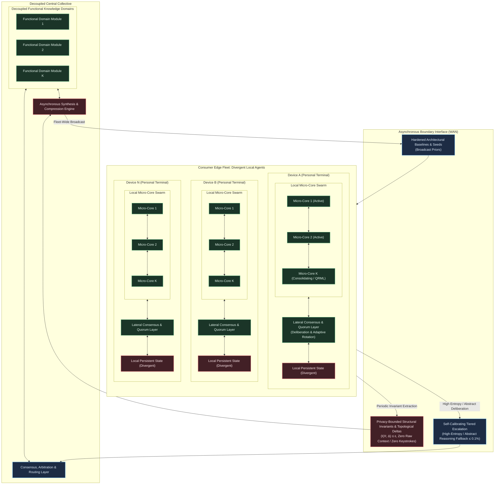
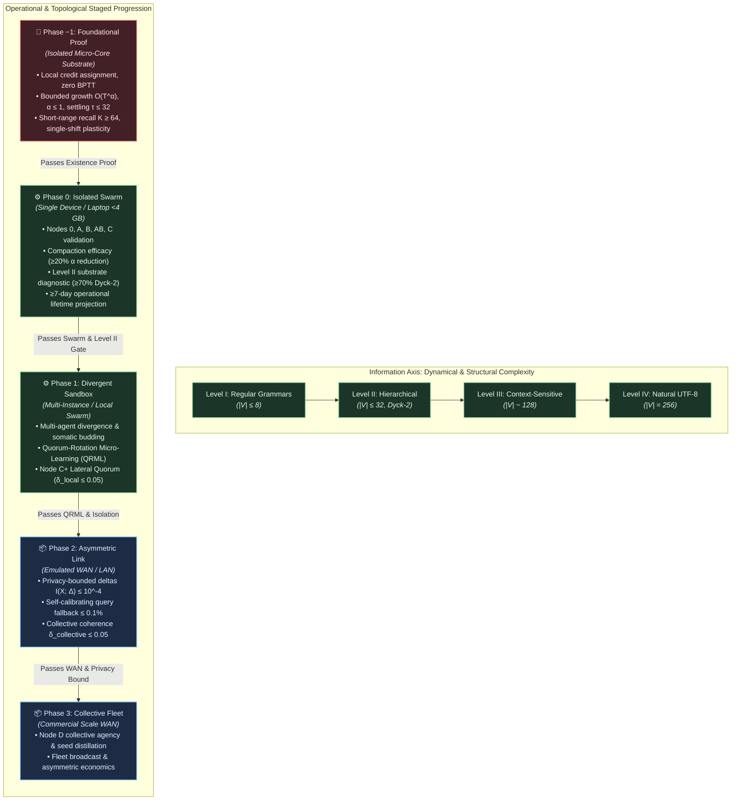

# Project Vision: The Autopoietic Collective

## From Autonomous Edge Micro-Cores to an Asymmetric Planetary Collective

**Document Version:** IX  
**Status:** Active Architectural Vision  
**Date:** 2026-09-25  

---

## 1. The Problem Space & Current Paradigm Limitations

Modern artificial intelligence achieves functional utility through architectures that are structurally rigid, hyper-centralized, and biologically anomalous. These limitations are not incidental engineering hurdles; they are direct structural consequences of relying on monolithic parameter tensors optimized via global gradient descent, devoid of endogenous temporal dynamics, structural capacity growth, localized credit assignment, or autonomous error recovery.

Incumbent industrial workarounds attempt to patch these limitations but represent evolutionary dead-ends rather than permanent solutions:

* **Parameter-Efficient Fine-Tuning (PEFT/LoRA):** Low-rank adapters reduce parameter update counts during fine-tuning, but they retain synchronous end-to-end backpropagation across adapted ranks, fail to prevent catastrophic interference on non-stationary streaming inputs, and do not bound lifetime memory accumulation.
* **Context Caching & Volatile Memory Hacks:** Prompt caching and external key-value (KV) stores treat contextual memory as transient state that must be continuously recomputed or held in volatile RAM, scaling infrastructure hosting costs linearly with streaming duration rather than establishing persistent, embodied representations.
* **Federated Learning (FedAvg):** Distributed gradient aggregation assumes periodic synchronization over static, pre-batched datasets. It cannot function over asynchronous, non-deterministic commodity wide-area networks (WAN) with streaming non-stationarity without suffering global coordination deadlocks or model divergence.

The existing paradigm is constrained by six intertwined systemic failure modes:

* **The Static Optimization Trap (Train Once, Freeze Forever):**  
  A model is optimized offline over a static historical dataset and deployed as an immutable function. Continuous adaptation in a non-stationary world requires complete retraining or fine-tuning, both of which induce catastrophic forgetting of prior competencies.

* **The Synchronization Bottleneck (Monolithic Parameter Entanglement & Global Coupling):**  
  End-to-end backpropagation couples every weight matrix to every other weight matrix through an analytical loss function. This total interdependence renders isolated local adaptation mathematically impossible: updating a sub-circuit to incorporate novel information perturbs the shared coordinate space (catastrophic interference). Consequently, models cannot accept asynchronous, time-lagged, or decentralized updates without stalling execution across ultra-low-latency interconnects or destabilizing the global parameter manifold.

* **The Asynchronous Distributed Wall (Latency Intolerance across WAN):**  
  Global optimization coupling requires instantaneous, synchronous awareness of the entire network state. It cannot tolerate non-deterministic latencies, time-lagged updates, or intermittent disconnections over commodity wide-area networks (WAN). As a result, continuous learning cannot naturally scale across geographically dispersed, loosely coupled devices.

* **The Thermodynamic Wall (Statelessness & Recompute Waste):**  
  Stateless transformer architectures maintain no persistent, embodied physical state across invocations. The entire contextual "memory" must be reconstructed from a volatile key-value (KV) cache on every forward pass, forcing redundant computational sweeps over historical inputs. Furthermore, dense floating-point tensor contractions on high-wattage accelerators run orders of magnitude above the physical thermodynamic minimum, completely decoupling computation from metabolic costs.

* **The Quadratic Attention Scaling Trap (Brute-Force Dense Attention):**  
  Global all-to-all attention grants every token direct access to every other token. This imposes quadratic computational scaling, enforces no intrinsic notion of temporal or topological locality, and lacks resemblance to physical or biological information processing.

* **The Centralization Tax (Capital and Infrastructural Monopoly):**  
  Because monolithic substrates demand multi-terabit, low-latency interconnects (e.g., NVLink) to coordinate dense matrix operations across thousands of accelerators, training and large-scale inference are locked inside capital-intensive hyperscaler data centers. Meanwhile, billions of consumer-edge processors sit idle as passive terminal consumers rather than active computational participants—a structural barrier to entry that is purely an artifact of monolithic architecture.

---

## 2. The North Star Vision

> **Core Vision:** *Engineer an autopoietic intelligence architecture uniting autonomous, locally adaptive edge agents with a decoupled central collective over commodity networks, eliminating centralized model retraining, synchronous coordination locks, and raw user data harvesting.*

### Key Capabilities

1. **Local Experiential Plasticity:** Edge micro-cores ingest raw byte streams and adapt in real time using strictly localized credit signals without global backpropagation or global optimization coupling.
2. **Lateral Consensus & Quorum:** Micro-core ensembles deliberate through peer debate and voting, resolving ambiguous inputs locally without monolithic forward passes.
3. **Somatic Capacity Budding:** Dynamic structural expansion endogenously buds parallel sub-graphs and micro-cores under high-entropy inputs within hardware metabolic envelopes.
4. **Asynchronous Collective Synthesis:** The modular central collective aggregates sparse, privacy-bounded topological invariants from divergent edge nodes without access to private client context.
5. **Fleet Prior Distribution:** Hardened baseline priors and compressed seeds broadcast periodically across the fleet, lifting general capability without monolithic parameter synchronization.

### Operational Timescales

This objective spans five distinct operational timescales:

1. **Local Experiential Plasticity (Runtime Adaptation — Milliseconds to Seconds):**  
   Continuously assimilate incoming byte streams and adapt internal states in real time using strictly local error signals (such as three-factor predictive coding, equilibrium propagation, bounded micro-gradients, or local contrastive energy minimization). Surprise and novelty absorbed by a sub-circuit remain topologically isolated, never corrupting established baseline competencies.

2. **Lateral Consensus & Quorum (Inference Deliberation & Adaptive Rotation — Milliseconds to Seconds):**  
   Resolve ambiguous inputs, cross-domain relational reasoning, and multi-step tasks locally through lateral voting, debate, and verification across redundant, semi-independent micro-experts rather than through an unconstrained, monolithic forward pass. Furthermore, dynamically manage adaptation duty cycles via quorum rotation without stalling continuous stream ingestion.

3. **Somatic Growth & Modular Budding (Structural Expansion — Minutes to Hours):**  
   Autonomously detect internal state and capacity saturation under high-entropy streams, triggering physical structural expansion (budding parallel sub-graphs, allocating localized compute units, and pruning redundant pathways) to match environmental complexity without degrading vector-parallel execution throughput or altering global operational latency.

4. **Asynchronous Collective Synthesis (Hive Integration — Hours to Days):**  
   Absorb sparse, time-lagged, and heterogeneous structural updates and topological invariants from millions of divergent edge agents into a decoupled central collective (comprising routing arbiters and domain-specific functional modules), reconciling distributed discoveries without requiring global cluster synchronization, lock-step training passes, or access to private client context.

5. **Fleet-Wide Baseline Distribution (Evolutionary Inheritance — Days to Weeks):**  
   Periodically compress, stabilize, and broadcast updated baseline architectural priors and minimal seed configurations back to the consumer edge fleet, lifting the general capability ceiling of all terminal instances across operational lifecycles.

### Conceptual Grounding: Operationalizing Autopoiesis

To ground "autopoiesis" as a rigorous engineering specification rather than an unanchored biological metaphor, the system satisfies three foundational cybernetic criteria:

1. **Self-Production of Components (Somatic Budding & Apoptosis):**  
   The system does not rely on static topology or manual architecture search. Instead, internal dynamical stress (local prediction error density, entropy saturation, attractor collapse) triggers the endogenous generation and integration of new computational units (micro-cores, lateral pathways). Conversely, unreinforced or energetically wasteful units undergo metabolic decay and apoptosis, recycling allocated substrate.

2. **Organizational Closure:**  
   While the physical components (weights, dynamical sub-graphs, active cores) are continually produced, rewired, and pruned through real-time experiential plasticity, the overarching *system organization* remains invariant. The continuous, closed-loop cycle—ingesting raw bytes, settling into attractors, computing local credit residuals, maintaining homeostasis, and emitting actions—is dynamically self-sustaining and conserved across all structural transformations.

3. **Dynamic Boundary Generation (Operational Membrane):**  
   The boundary separating the agent from its environment—and separating the local edge terminal from the central collective—is not an arbitrary API contract. It is an endogenously generated operational membrane: an active Markov blanket formed by predictive attractor basins and lateral quorum consensus. Incoming raw byte streams act as external perturbations across this membrane, which the agent actively assimilates or filters; interactions crossing into the collective upstream are strictly constrained to privacy-bounded invariant attractor summaries ($I(X; \Delta) \le \epsilon$), preserving sovereign internal state.

---

## 3. Environmental & Boundary Contracts

To prevent accidental solutioning via arbitrary data representations, the environment contract is defined strictly at the raw byte boundary:

* **Standardized Raw UTF-8 Byte Stream:**  
  * The environment presents an unbroken sequence of discrete symbols standardized at the raw **UTF-8 byte level** ($\vert{}V\vert{} \le 256$, or constrained subsets during early development).  
  * No external multi-thousand-token vocabularies, BPE tokenizers, or arbitrary high-dimensional embedding projections are permitted at the interface.  
  * All compositional abstractions—from byte combinations to morphemes, syntax, and relational concepts—must be discovered and represented endogenously within the system's own internal dynamics.

* **Continuous, Open-Ended Ingestion:**  
  Input arrives as an unending temporal sequence without artificial episode resets, context-window flushes, or distinct training versus inference modes.

* **Active Cybernetic Closure:**  
  The environment is reactive and non-stationary. Output bytes emitted by an agent act directly upon the environment, altering its state and biasing future incoming sequences.

* **Dynamic Capacity Saturation:**  
  The environment's generative complexity and entropy will eventually outstrip any fixed-size computational state space, exerting continuous evolutionary selection pressure toward autonomous structural growth.

* **Prohibited Engineering Crutches & Interface Boundaries:**  
  To preserve real-world validity, the following implementation shortcuts are strictly prohibited across all operational tiers:
  * Static mini-batching, artificial dataset shuffling, or offline epoch loops.
  * Growing volatile context buffers, token replay buffers, or unrolled activation caches that scale with stream length $T$.
  * External hand-crafted subword tokenizers or pre-trained embedding lookups.
  * Synchronous all-reduce coordination protocols or low-latency cluster interconnect requirements (e.g., NVLink).
  * Transmission of unquantized observation streams, raw keystrokes, or private user context across the network.

---

## 4. System Topology & Information Flow

The architecture decouples immediate interactive experience from collective planetary generalization via a hierarchical, asymmetric topology:

### Multi-Tiered Deliberation & Information Routing

1. **Edge-Native Reflex & Resilient Baseline:**  
   Every edge terminal runs a local micro-core swarm dedicated to high-bandwidth, ultra-low-latency byte ingestion, continuous experiential plasticity, and immediate interaction. It maintains a resilient, non-blocking baseline that functions autonomously when offline, guaranteeing graceful degradation rather than total capability parity with the collective.

2. **Local Lateral Quorum & Quorum-Rotation Micro-Learning (QRML):**  
   Ambiguous inputs and immediate multi-step reasoning are evaluated locally across redundant micro-experts via lateral consensus and debate before any emission occurs.  
   To resolve the fundamental scheduling tension between continuous byte servicing and deeper internal adaptation, the lateral quorum layer supports **Quorum-Rotation Micro-Learning (QRML)**: In a local swarm of $N$ micro-cores, an active quorum of $N_{\min} < N$ cores continuously ingests incoming bytes and participates in consensus voting, while the remaining $N - N_{\min}$ cores temporarily rotate into background-adaptation mode. During background adaptation, rotated cores perform deeper internal consolidation, structural reorganization, or local micro-credit updates over bounded local trajectories without imposing execution locks on the live stream. Upon completing adaptation, returning cores undergo consensus validation against the active quorum before re-admission, ensuring that experimental adaptations enhance rather than degrade collective competency.

3. **Tiered Deliberative Escalation:**  
   Consumer silicon is structurally bounded in thermal dissipation and memory bandwidth. The architecture establishes a clear effort distribution: the edge runtime absorbs the overwhelming majority (>99%) of continuous temporal byte ingestion, habitual reflex, and localized experiential plasticity. High-entropy, cross-domain relational abstraction escalates via `QueryFallback` to the central collective's specialized functional modules as an exception rather than a continuous stream. This asymmetry preserves thermodynamic viability, avoids linear infrastructure cost scaling with user streaming time, and prevents gold-plating the edge runtime.

4. **Privacy-Bounded Upstream Synchronization:**  
   Personal keystrokes, raw observations, and private context *never leave the edge device*. Only verified structural deltas (topological additions, rewiring graphs, invariant attractors) or ephemeral deliberative queries adhering to formal privacy bounds ($I(X; \Delta) \le 10^{-4}$ bits) and computational non-reconstructibility criteria cross the boundary interface into the collective.

5. **Decoupled Central Synthesis & Broadcast:**  
   The central collective reconciles time-lagged, heterogeneous structural deltas into modular functional domains. Periodically, the synthesis engine distills these into compressed baseline seeds (`DownPriors`) broadcast to elevate the general capability floor of all devices.

---

## 5. Invariants, Boundary Constraints & Hypotheses

To maintain engineering discipline and distinguish non-negotiable architectural mandates from research conjectures, this section rigorously separates **Architectural Invariants** from **Foundational Hypotheses**.

### 5.1 Architectural Invariants (Engineering Directives)

The following invariants are prescriptive constraints chosen to bound the design space. Any implementation violating these directives constitutes non-conformance:

* **Lifetime Resource Discipline (Bounded State Growth with respect to $T$):**  
  The computational cost and working memory footprint required to process incoming byte $N$ must remain bounded by a growth function $f(T)$ that is at most linear in accumulated historical lifetime $T$, with an explicit asymptotic bound of $O(T^\alpha)$ where $0 < \alpha \le 1$. The hard ceiling is $\alpha = 1$ (linear growth), with an active engineering objective to minimize the growth gradient toward sub-linear ($\alpha < 1$) or amortized-constant regimes.  
  This growth allowance applies strictly to persistent dynamical state (attractor topology, structural graph expansion, new micro-cores, and learned synaptic pathways)—volatile buffers scaling with raw stream length are prohibited per §3 (Prohibited Engineering Crutches).  
  Furthermore, the growth gradient must remain sufficiently shallow such that the total memory footprint over continuous operational sessions remains within the hardware metabolic envelope ($<4$ GB) for a minimum continuous operational lifetime target of $\ge 7$ consecutive days of continuous byte ingestion at representative edge streaming throughput ($\ge 10^7$ bytes/day). Persistent structural state is subject to continuous intra-core attractor compaction and state reclamation.

* **Locality of Credit Assignment (Global Coupling & Lock Prohibition):**  
  Any credit assignment mechanism that induces global parameter coupling, requires synchronous forward-backward execution locking across the computational graph, necessitates volatile activation storage scaling with raw stream length, or performs reverse-order graph traversals across the full micro-core computation is strictly prohibited—both across distributed nodes and within individual micro-cores. Classical reverse-mode backpropagation through time (BPTT) is the canonical violating example.  
  Internal parameter updates and state adaptations must depend exclusively on locally accessible signals within the immediate computational neighborhood (presynaptic activations, postsynaptic responses, and local predictive residuals or diffuse scalar modulators). Parameter updates must not lock the live stream or impose non-local dependencies.  
  *Candidate mechanisms satisfying these invariant properties include, but are not limited to:* Three-factor predictive coding, local contrastive energy minimization, equilibrium propagation, feedback alignment (DFA/RFA), bounded local micro-gradient updates evaluated over static sub-graphs ($W \ll \tau_{\max}$) with strictly bounded volatile memory ($O(W)$ independent of $T$), and localized topological rewiring.

* **Elastic Pacing & Operational Halting:**  
  The core is not slaved to a rigid wall-clock tick. It interfaces via an elastic pull/backpressure mechanism, consuming variable internal relaxation cycles ($\tau$) per byte depending on input entropy and structural reorganization demands. State transitions must guarantee convergence to an attractor, an emission, or a stable quiescent state within a hard maximum computational budget ($\tau \le \tau_{\max} = 32$). Unbounded livelocks, dynamic divergences, and silent stalls constitute fatal failure.

* **Quiescent Exploitation & Background Maintenance:**  
  The elastic pacing mechanism and the temporal dynamics of real-world deployment naturally generate inter-arrival quiescent intervals during which micro-cores are not actively servicing incoming bytes. These intervals constitute exploitable computational budget for background maintenance operations including intra-core attractor compaction, structural homeostasis assessment, and deeper relaxation settling.  
  The system must **never depend** on quiescent intervals for correctness: all architectural invariants must hold under continuous, saturated, worst-case streaming. However, implementations should actively exploit inter-arrival gaps to minimize steady-state memory growth gradients, consolidate attractor topologies, and preemptively optimize structural health.

* **Asynchronous Emission Autonomy:**  
  The core independently decides *if* and *when* to emit bytes back into the stream. It may absorb multiple input bytes during internal contemplation before emitting, or stream an emission sequence across continuous observations.

* **Client Resilience & Sovereign Privacy Membrane:**  
  A terminal agent must maintain operational resilience in an air-gapped environment, executing local sensorimotor and habituated reasoning loops without crashing, blocking, or stalling. Air-gapped autonomy functions as an operational fail-safe floor, not a ceiling of parity with the collective. Personal keystrokes, raw observations, and private context streams strictly terminate at the device membrane—never transmitted across the network. Only verified, privacy-bounded structural deltas ($I(X; \Delta) \le 10^{-4}$ bits) and ephemeral deliberative queries may cross into the collective interface.

* **WAN-Native Interconnect & Latency Tolerance:**  
  The system must remain computationally stable and functional under arbitrary network latency, high packet loss, and intermittent device dropouts. Decentralized nodes communicate through sparse behavioral activations, structural deltas, or consensus votes—never through synchronous, high-bandwidth all-reduce tensor synchronization.

* **Silicon-Native Parallelism:**  
  Execution targets commodity CPU, GPU, and NPU architectures, not specialized neuromorphic silicon. All local dynamical updates, state transitions, lateral consensus votes, and structural graph transformations must compile into cache-coherent, vector-parallel (SIMD/SIMT) execution primitives.

* **Homeostatic Bounding & Metabolic Quotas:**  
  Structural budding and capacity expansion are strictly bounded by hardware metabolic constraints (enforcing hard upper limits on memory footprint $<4$ GB and package thermal dissipation $\le 25$W). Memory growth must strictly adhere to the asymptotic bound $O(T^\alpha)$ ($\alpha \le 1$). Unreinforced pathways and idle micro-cores undergo homeostatic decay and apoptosis, and stale intra-core attractor basins undergo active compaction and reclamation, guaranteeing that autonomous growth cannot induce memory exhaustion or resource monopolization.

* **Structural Homeostasis Invariant (Lifecycle Stability):**  
  The somatic budding and apoptotic decay cycle must converge to a bounded dynamical steady-state under stationary input distributions, precluding oscillatory thrashing (limit cycles of rapid budding followed by immediate pruning) and monotonic structural bloat. Net structural expansion rate (including core metadata, routing registries, and pathway topology) must be strictly bounded within the allocated $O(T^\alpha)$ persistent state budget.

* **Attractor Stability & Supervisory Containment (Deterministic Watchdog):**  
  Every edge agent incorporates an unalterable deterministic supervisory watchdog decoupled from experiential learning dynamics. If internal state trajectories enter pathological limit cycles, chaotic divergences, or exceed operational halting budgets ($\tau > \tau_{\max}$), the supervisor immediately clamps the core into a verified quiescent ground state, validated local checkpoint, or broadcast prior (`DownPriors`), isolating pathological sub-graphs to preserve accumulated healthy plasticity and ensure deterministic operational containment.

* **Escalation Calibration Invariant:**  
  The deliberative escalation mechanism must be self-calibrating—dynamically adapting its trigger threshold based on empirical local prediction confidence and lateral quorum agreement—such that the escalation rate remains within a target band ($\le 0.1$% of total interaction volume under steady-state operation) without manual per-device tuning. If the system cannot maintain the target escalation rate band while preserving output quality, the asymmetric economic premise is invalidated.

### 5.2 Foundational Hypotheses (Scientific Bets to De-Risk)

Unlike prescriptive invariants, the following statements represent testable scientific hypotheses that require experimental validation or discovery. These constitute the core research bets of the program:

* **Hypothesis H1 (Local Plasticity Sufficiency):**  
  We hypothesize that strictly local credit assignment mechanisms (such as three-factor predictive coding, equilibrium propagation, feedback alignment, or local contrastive energy) can discover compositional structure and achieve stable temporal sequence recall from raw byte streams without global backpropagation through time.
* **Hypothesis H2 (Settling-Depth & Lateral Composition):**  
  We hypothesize that a single micro-core settling ceiling of $\tau \le 32$ relaxation cycles is sufficient for local reflexive and regular grammar processing, and that higher compositional depth (hierarchical context-free and context-sensitive languages) emerges through *lateral dynamical composition and somatic modular budding* across specialized micro-cores operating in parallel, rather than through unbounded vertical relaxation trajectories within a single monolithic core.
* **Hypothesis H3 (Asymmetric Escalation & Economic Decoupling):**  
  We hypothesize that a self-calibrating composite uncertainty metric ($U(x) = w_1 \cdot H_{\text{settle}}(x) + w_2 \cdot D_{\text{quorum}}(x)$) can isolate high-entropy relational reasoning to $\le 0.1$% of total interaction volume, decoupling centralized hosting infrastructure costs from continuous edge streaming hours.
* **Hypothesis H4 (Privacy-Preserving Structural Synthesis):**  
  We hypothesize that abstract invariant attractor topologies and quantized structural deltas can transfer learned capabilities across heterogeneous edge devices while strictly preserving zero-reconstruction privacy ($I(X; \Delta) \le 10^{-4}$ bits) under adversarial auditing.
* **Hypothesis H5 (Intra-Core Attractor Compaction Efficacy):**  
  We hypothesize that opportunistic geometric merging and activity-dependent decay of attractor basins during quiescent intervals can reduce the empirical state growth exponent $\alpha$ by $\ge 20$%, sustaining $\ge 7$ consecutive days of continuous operation within a $<4$ GB envelope without catastrophic forgetting of prior competencies ($\Delta \le 0.05$).

### 5.3 Strategic & Economic Leverage (Senior Leadership Translation Layer)

To translate inside-out system mechanics into outside-in strategic, commercial, and operational advantages for leadership, the core architectural mechanisms are mapped directly to their strategic leverage:

| Architectural Mechanism (Inside-Out) | Strategic & Economic Leverage (Outside-In) |
| :--- | :--- |
| **Local Credit Assignment without Global Backpropagation** | **Decoupled Training Economics:** Eliminates multi-million-dollar low-latency network fabrics (e.g., NVLink clusters), allowing continuous model adaptation on standard edge devices without centralized retraining runs. |
| **Asymmetric Escalation with Low-Cadence Cloud Querying ($\le 0.1$%)** | **Sublinear Hosting Infrastructure Costs:** Cloud compute bills scale with high-level cognitive exceptions rather than continuous raw streaming hours, providing an order-of-magnitude cost advantage over centralized APIs. |
| **Privacy-Bounded Representation Deltas ($I(X; \Delta) \le 10^{-4}$ bits)** | **Regulatory and Data Sovereignty Advantage:** Enables compliance with strict zero-trust data governance regimes by guaranteeing raw user interactions, keystrokes, and source code never leave local hardware. |
| **Somatic Modular Budding within Metabolic Envelope** | **Elastic Edge Compute Scaling:** Devices dynamically scale computational capacity to match environmental complexity without requiring hardware upgrades or manual architecture search. |
| **Quorum-Rotation Micro-Learning (QRML)** | **Zero-Downtime Continuous Adaptation:** Background duty-cycling allows edge nodes to perform deep internal consolidation without stalling live-stream responsiveness or degrading inference latency. |
| **Fleet Prior Distribution without Parameter Synchronization** | **Network-Efficient Planetary Intelligence:** Broadcasts compressed seeds and priors over commodity WAN, elevating general fleet capabilities without distributed training locks or massive bandwidth consumption. |

### 5.4 Forward-Looking Considerations: Distributed Trust, Privacy & Fleet Alignment

In accordance with first-principles prioritization, engineering effort during initial phases (Phases −1 through 1) is focused entirely on proving foundational algorithmic viability—confirming that local credit assignment, dynamic relaxation, and somatic budding operate successfully on isolated edge substrates. Designed-in safety, distributed defense, and cryptographic privacy guarantees become critical at Phase 2, when edge nodes begin transmitting deltas across WAN boundaries to the central collective.

Substantive architectural design and verification for these capabilities are formally scheduled as a gating review prior to Phase 2 entry (see `strategic-planning-backlog-ix.md`, SPB-10). These forward-looking considerations include:

* **Byzantine & Adversarial Delta Sanitization:** Zero-trust ingestion protocols in the central collective, employing statistical anomaly filtering, topological outlier rejection, and multi-party quorum verification to prevent poisoned edge updates from destabilizing broadcast priors.
* **Information-Theoretic Privacy & Non-Reconstructibility Bounds:** Dual-tier privacy defenses establishing:
  1. *Information-theoretic bounding* on upstream representations ($I(X; \Delta) \le 10^{-4}$ bits), guaranteeing that an adversary with unbounded computational power cannot reconstruct raw input sequences $X$ beyond the theoretical Fano limit; and
  2. *Computational non-reconstructibility* via topological invariant quantization and differential privacy ($(\epsilon, \delta)$-DP), preventing polynomial-time inversion or membership-inference attacks on structural deltas and deliberative queries.
* **Autonomous Fleet Alignment:** Governance invariants ensuring that decentralized somatic budding and localized specialization across millions of divergent agents remain aligned with collective utility and bounded operational behaviors.
* **Adversarial Escalation Protection:** Verification of admission control, rate-limiting circuit-breakers, and calibration drift defenses to protect the central collective from adversarial escalation flooding.

---

## 6. Multi-Axis Progression Roadmap

System advancement is measured along a rigorous multi-axis progression combining **Dynamical & Structural Complexity (Levels I–IV)**, **Dynamical Resilience (Nodes 0–D)**, and **Deployment Topology (Phases −1–3)**. Advancement requires earning passage through empirical gating invariants, minimum viable demonstrations, and operational gating criteria.

### 6.1 The Information Axis: Dynamical Learning Phenomena

Rather than treating representational complexity purely as formal static grammar classes, the evaluation framework evaluates four orthogonal, incrementally composable dynamical learning phenomena:

1. **Temporal Dependency Depth ($K$):**  
   The capacity to maintain, retrieve, and bind past state across intervening distractor streams from short-range ($1\text{--}8$ bytes, anchored at $K \ge 64$ in Phase −1) to intermediate ($10^2\text{--}10^3$ bytes) and long-range ($10^4\text{--}10^5+$ bytes) horizons without token buffers or KV caches.

2. **Non-Stationarity & Adaptation Velocity ($\Delta E$ / $T_{\text{recover}}$):**  
   The ability of local plasticity mechanisms to detect unannounced distributional shifts and re-settle into optimal attractor paths with minimal sample complexity ($T_{\text{recover}} \le 2000$ bytes for single shifts in Phase −1; $T_{\text{recover}} \le 500$ bytes in Phase 0), bounded degradation of prior attractors, and zero catastrophic forgetting.

3. **Compositional Depth & Hierarchy:**  
   The transition from local Markovian $n$-grams to nested recursive bracket structures (Dyck languages) and multi-level compositional semantics, formed endogenously without push/pop stack instructions.

4. **Relational Variable Binding:**  
   The dynamic binding of operational roles to arbitrary arguments ($w w$ patterns, symbol-to-address mapping, and pseudo-code execution traces) without global all-to-all cross-attention matrices.

### 6.2 Structural Regimes

These dynamical phenomena are progressively evaluated across four structural regimes:

* **Level I: Regular & Markovian Sequences ($\vert{}V\vert{} \le 8$):**  
  Micro-alphabets, local $n$-grams, parity checks, periodic and finite-state regular languages.  
  *Core Challenge:* Establishing fundamental state persistence, deterministic attractor transitions, and basic non-stationarity recovery under local credit rules.
* **Level II: Hierarchical & Context-Free Languages ($\vert{}V\vert{} \sim 8\text{--}32$):**  
  Nested byte sequences, Dyck languages, balanced bracket expressions, recursive syntax trees.  
  *Core Challenge:* Autonomous formation of internal counter- or stack-like attractor dynamics without hardcoded push/pop primitives.
* **Level III: Context-Sensitive Systems & Variable Binding ($\vert{}V\vert{} \sim 64\text{--}128$):**  
  Structured byte grammars, dynamic variable binding, cross-serial dependencies ($w w$ patterns), pseudo-code execution traces.  
  *Core Challenge:* Decoupling operators from arguments; dynamic relational reference without global cross-attention.
* **Level IV: Open-Domain Natural Distributions ($\vert{}V\vert{} = 256$):**  
  Full raw UTF-8 byte stream, natural language polysemy, open-ended conversational context, programmatic interaction.  
  *Core Challenge:* Compositional semantics, large-scale relational reasoning, and cross-domain generalization without external tokenizers.

### 6.3 The Integrated Execution Matrix

> **Interpretive Note:** The Execution Matrix describes the *full capability landscape* that the architecture is designed to address across phase-level intersections. Phase advancement is governed exclusively by the Minimum Viable Demonstrations (§7) and the directional gating framework. Matrix cells beyond the designated MVD scope represent horizon stretch objectives and research directions, not gating requirements for advancing to subsequent phases.

| Stage & Topology | Level I: Regular Grammars ($\vert{}V\vert{} \le 8$) | Level II: Hierarchical ($\vert{}V\vert{} \le 32$) | Level III: Context-Sensitive ($\vert{}V\vert{} \sim 128$) | Level IV: Open Natural UTF-8 ($\vert{}V\vert{} = 256$) |
| :--- | :--- | :--- | :--- | :--- |
| **Phase −1: Foundational Proof** *(Single Micro-Core Substrate)* | Stream raw periodic byte sequences with noise; demonstrate convergent next-byte prediction using strictly local credit assignment; verify bounded memory growth ($O(T^\alpha), \alpha \le 1$, zero unbounded buffer leakage) over $10^7$ bytes, bounded settling $\tau \le 32$, short-range temporal recall ($K \ge 64, I(S; R) \ge 0.90$), and single-shift recovery ($T_{\text{recover}} \le 2000$). | [Empirical prerequisite gate for Phase 0 entry; establishes core substrate viability before hierarchical scaling.] | [N/A at Phase −1] | [N/A at Phase −1] |
| **Phase 0: Isolated Swarm** *(Nodes 0–C on Single Device)* | Stream micro-tokens; establish settling ceiling $\tau_{\max} \le 32$; verify bounded memory growth within $<4$ GB envelope with $\ge 7$-day projected time-to-ceiling; recall delayed trigger signals across distractor bytes (Node A); adapt to shifted Markov rules (Node B); allocate nodes upon regular state saturation (Node C); verify structural homeostasis, compaction efficacy ($\ge 20$% $\alpha$ reduction), and quiescent exploitation. | Stream nested byte streams; confirm stack-free stability; Dyck-path resolution separated by long distractor streams; execute Hierarchical Substrate Diagnostic ($\ge 70$% bracket matching on Dyck-2, depth $\le 4$); recursive matching with shifting grammar modes; grow dynamic attractor depth when nesting exceeds initial bounds. | Continuous stream of code execution traces; variable binding with distant operational calls; algorithmic execution with mid-stream protocol changes; allocate isolated parallel sub-graphs for disjoint variable scopes. | Sustained multi-gigabyte ingestion of raw UTF-8 text on commodity CPU/GPU; long-range context resolution across thousands of intervening UTF-8 bytes; fluid domain adaptation; expand structural parameter footprint under open-domain entropy within hardware metabolic limits. |
| **Phase 1: Divergent Sandbox** *(Node C+ on Multi-Instance Host)* | Multiple local instances adapt to mutually exclusive Markov transition rules without baseline degradation; lateral majority voting across redundant micro-cores resolves noisy Markov streams with $\delta_{\text{local}} \le 0.05$ (Node C+); Quorum-Rotation Micro-Learning (QRML) duty-cycling validated. | Instances diverge on conflicting delimiter/syntax systems; verify structural isolation; consensus resolution between competing stack-like attractors on ambiguous brackets. | Instances independently debug disjoint code traces; confirm zero cross-contamination; multi-expert quorum resolves branching variable bindings and conflicting execution traces. | Standalone terminal agent demonstrates real-time personal context adaptation on edge hardware ($<4$ GB RAM); dynamic consensus, debate, and verification across decoupled micro-experts synthesize complex text; rotating background cores adapt without stream degradation. |
| **Phase 2: Asymmetric Link** *(WAN/LAN Client-Server)* | Local instance executes high-cadence stream; escalates unresolved state transitions via self-calibrating trigger to emulated central module; WAN latency tolerance verified; adversarial escalation rate defenses active. | Central module resolves ambiguous recursive branches; validates fluid, low-overhead deliberative escalation ($\le 0.1$% volume) and re-absorption without edge stalls. | Client emits local privacy-bounded structural deltas ($I(X; \Delta) \le 10^{-4}$ bits); escalates multi-step variable binding traces to central collective; central engine merges functional graphs without retraining. | Central collective absorbs time-lagged deltas from multiple edge instances and arbitrates complex reasoning queries; validates absence of catastrophic interference under asynchronous updates ($\delta_{\text{collective}} \le 0.05$). |
| **Phase 3: Collective Fleet** *(Node D at Commercial Scale)* | Distributed fleet maps disjoint state spaces; collective unifies them into a minimal baseline seed; generator steering across low-entropy Markov states (Node D). | Central engine extracts common grammar invariants from a fleet exposed to diverse synthetic dialects; active querying resolves grammatical ambiguities. | Distributed fleet resolves large-scale programmatic suites; collective synthesizes optimal execution paths; interactive debugging across distributed worker nodes. | Full autonomous agent dialogue: steering environments; edge executes high-bandwidth routine inference and continuous adaptation, escalating deep abstract reasoning to the central collective; collective distills global capabilities; asymmetric hosting economics verified. |

### 6.4 Explicit Scope Boundaries (Out of Scope)

> **Author Action Required:** This section should explicitly declare domains and objectives that are out of scope for this vision to prevent scope creep and clarify boundaries for readers. Refer to the Technical Vision Style Guide authoring checklist.

---

## 7. Directional Gating & Governance

In alignment with the Technical Vision Style Guide, this section establishes the directional observables, behavioral demonstrations, qualitative falsification criteria, and governance handoff for the program. Precise numerical thresholds, experimental sample sizes, and detailed test rig harnesses are maintained and elaborated in the **Strategic Planning Backlog** (`strategic-planning-backlog-ix.md`, §4.0).

### 7.1 Key Observables & Directional Criteria

Passage between development phases is evaluated across seven directional observable categories:

* **Memory Footprint & Lifetime Envelope:** Physical working memory allocation must scale sublinearly to linearly ($O(T^\alpha), \alpha \le 1$) with zero un-reclaimed buffer allocations. Total footprint must remain bounded within the $<4$ GB edge envelope with multi-day continuous operational projections.
* **Temporal Retention across Distractors:** Preservation of conditional response fidelity between early trigger symbols and distant evaluation probes across expanding distractor horizons, without token replay or history logging.
* **Adaptation Velocity & Dynamic Plasticity:** Rapid reconfiguration and loss convergence following unannounced environmental distribution shifts, minimizing adaptation sample complexity.
* **Backward Non-Interference:** Strict containment of performance degradation on previously mastered dynamics when learning novel distributions (bounded within $\le 5$%).
* **Consensus Coherence & Quorum Deliberation:** Reliable ambiguity resolution via lateral micro-core consensus with bounded error, zero execution deadlocks, and bounded degradation under time-lagged WAN synthesis.
* **Information-Theoretic Privacy & Non-Reconstructibility:** Upstream structural updates and deliberative queries must adhere to strict information-theoretic upper bounds, precluding input reconstruction under adversarial auditing.
* **Asymmetric Infrastructure Scaling:** Central infrastructure compute scaling sublinearly ($O(\log N)$ or $O(1)$) with active fleet size, maintaining low-cadence routine escalation ($\le 0.1$%).

### 7.2 Minimum Viable Demonstrations (MVD) by Phase Gate

Each phase transition requires a concrete, observable behavioral demonstration:

* **Phase −1 $\rightarrow$ Phase 0 MVD (Substrate Existence Proof):**  
  A single isolated micro-core, given a raw continuous byte stream of a periodic 4-to-8 symbol grammar injected with noise, demonstrates monotonic loss convergence to accurate next-byte prediction using strictly local credit assignment, with bounded memory growth ($O(T^\alpha), \alpha \le 1$, zero leakage beyond persistent structural state) over $10^7$ streaming bytes and relaxation settling $\tau \le 32$. In addition, the micro-core must achieve:
  1. **Short-Range Temporal Recall:** Correctly respond to a trigger-distractor-probe sequence across $K \ge 64$ distractor bytes with mutual information $I(S; R) \ge 0.90$ without token buffering or replay; and
  2. **Single Distribution Shift Recovery:** Recover to within 10% of steady-state performance within $T_{\text{recover}} \le 2000$ bytes following an unannounced Markov transition shift.
* **Phase 0 $\rightarrow$ Phase 1 MVD (Edge Swarm, Budding & Compaction Efficacy):**  
  A single-device micro-core swarm running on commodity hardware ($<4$ GB RAM) absorbs competing non-stationary streams; individual cores specialize without cross-interference ($\Delta \le 0.05$); lateral quorum resolves ambiguous test sequences with $\ge 90$% accuracy; capacity saturation autonomously triggers somatic budding of a new micro-core without stalling execution; structural homeostasis prevents budding-apoptosis limit cycles under stationary streams; and continuous memory telemetry establishes an empirical **time-to-ceiling projection of $\ge 7$ consecutive days** of continuous streaming before exhausting the 4 GB envelope. Furthermore, Phase 0 advancement explicitly requires:
  1. **Compaction Efficacy Gate:** Empirical telemetry must demonstrate that intra-core attractor compaction reduces the observed growth exponent $\alpha$ by $\ge 20$% relative to a compaction-disabled baseline, while preserving Backward Non-Interference ($\Delta \le 0.05$) on previously mastered distributions.
  2. **Hierarchical Substrate Diagnostic:** In addition to Level I operational gates, a single micro-core must demonstrate $\ge 70$% bracket-matching accuracy on a continuous Dyck-2 stream (nesting depth $\le 4$, $|V| \le 8$) under the same local credit constraints, confirming rudimentary hierarchical attractor formation prior to multi-core scaling investment.
* **Phase 1 $\rightarrow$ Phase 2 MVD (Asymmetric Structural Sync & Quorum Rotation):**  
  1. Two independent edge instances connected via an emulated 200ms-latency WAN link exchange structural invariant deltas. Device B demonstrably masters a task distribution it has never directly observed, utilizing synthesized deltas from Device A. Zero raw tokens or reconstructible private contexts cross the boundary link ($I(X; \Delta) \le 10^{-4}$ bits).
  2. The multi-core swarm validates Quorum-Rotation Micro-Learning (QRML): while an active quorum $N_{\min}$ sustains continuous, un-stalled byte processing and consensus accuracy ($\ge 90$%), background cores rotate out, perform deeper internal adaptation, and successfully validate against quorum consensus upon re-integration without inducing latency spikes or prediction drops.
* **Phase 2 $\rightarrow$ Phase 3 MVD (Collective Scale & Asymmetry):**  
  A deployed network of 100+ heterogeneous edge nodes and a central collective proves: (a) collective model accuracy on multi-step reasoning exceeds any isolated edge node by $\ge 25$%; (b) central infrastructure compute scales sublinearly ($O(\log N)$ or $O(1)$) with active fleet size $N$; (c) self-calibrating deliberative escalation holds average WAN query offload to $\le 0.1$% of total edge interaction volume under benign and adversarial stress tests; and (d) a newly initialized edge node bootstraps from broadcast priors (`DownPriors`) to fleet-average competence within hours.

### 7.3 Falsification & Termination Criteria (Kill Conditions)

A rigorous scientific program gains credibility by identifying what empirical results would prove the foundational thesis incorrect and mandate halting or fundamentally redirecting the program:

1. **Substrate Viability Falsification (Phase −1):**  
   The local-plasticity hypothesis is the foundational bet of this vision. If systematic hyperparameter exploration and targeted gradient sweeps across all candidate mechanism families (predictive coding, equilibrium propagation, feedback alignment, local contrastive energy) fail to achieve convergent next-byte prediction, short-range temporal recall, and dynamic shift recovery on Level I regular grammars under local credit constraints, the local-plasticity core thesis is falsified and the program should be halted.
2. **Dynamic Isolation & Continuous Operation Falsification (Phase 0/1):**  
   If continuous online adaptation inevitably induces catastrophic forgetting across isolated cores despite structural budding and QRML validation; or if intra-core compaction fails to reduce empirical memory growth sufficiently to sustain multi-day continuous operation within the $<4$ GB envelope while maintaining backward non-interference, the premise of sustainable continuous edge operation is falsified.
3. **Information Leakage Falsification (Phase 2):**  
   If structural invariants or deliberative queries transmitted over the WAN link permit non-trivial reconstruction of private input byte streams under adversarial auditing, upstream synchronization is immediately halted and the privacy-preserving synthesis hypothesis is falsified.
4. **Asymmetric Escalation & Economic Falsification (Phase 2/3):**  
   If the self-calibrating deliberative escalation mechanism cannot maintain an escalation rate within the target band ($\le 0.1$% of interaction volume) while preserving output quality, forcing central infrastructure compute to scale linearly with user streaming hours, the asymmetric economic foundation is falsified.

### 7.4 Governance, Living Document Protocol & Strategic Planning Handoff

This vision is a living document that guides strategic capital allocation and technical execution:

* **Living Evolution:** As empirical discoveries are made in each phase, validated hypotheses are converted into architectural invariants, and falsified hypotheses trigger formal post-mortems and Architectural Decision Records (ADRs) as specified in `strategic-planning-backlog-ix.md`, §5.
* **Strategic Planning Handoff:** In accordance with the Technical Vision Style Guide elaboration boundary, precise numerical gating thresholds, exact mathematical tolerances, sample size specifications, hyperparameter sweep counts, and detailed test rig harnesses are maintained and elaborated in the companion **Strategic Planning Backlog** (`strategic-planning-backlog-ix.md`, specifically §4.0).
