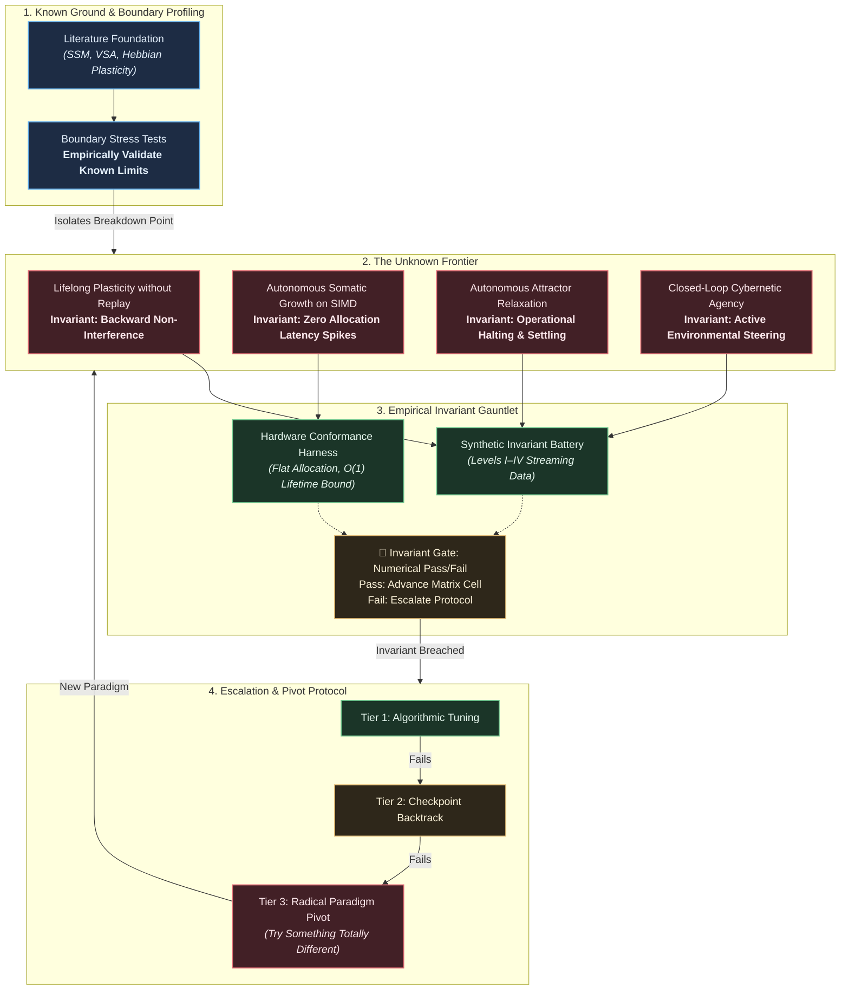
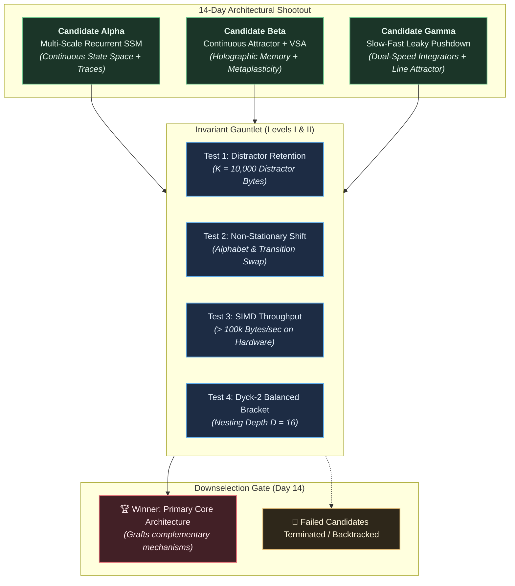
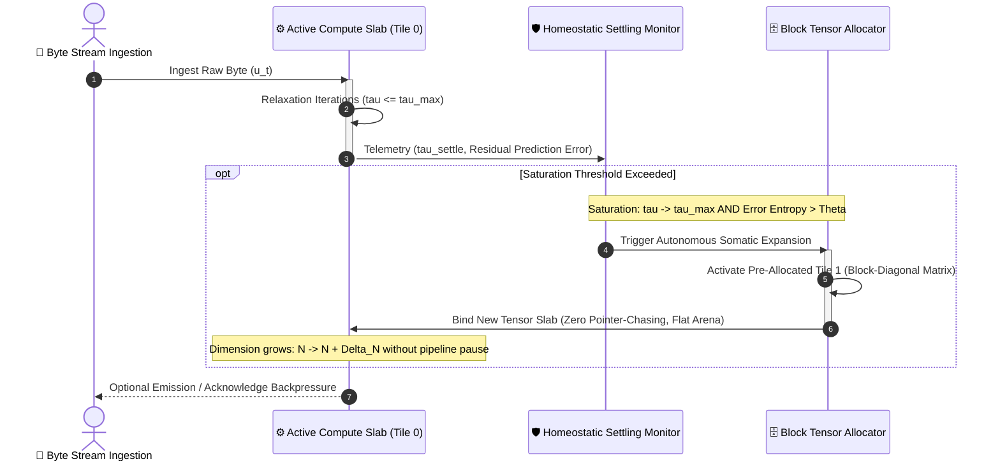
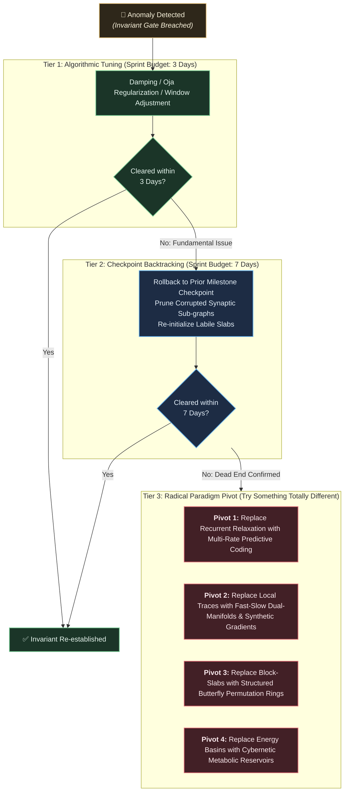
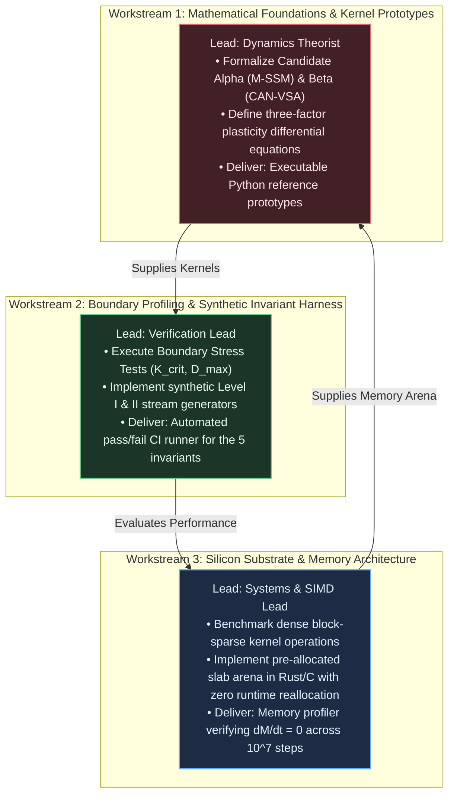

# Scientific Direction: The Autopoietic Computational Program

## Operational Blueprint, Empirical Boundary Profiling, and Execution Roadmap from First Principles

> **Executive Mandate:** Build the fastest empirical path from the technology vision articulated in [The Autopoietic Core](file:///workspaces/studious-fishstick/docs/ideas/vision.md) to a functioning, self-scaling, lifelong-learning computational system. As Science Director, my governing directive is **scientific efficiency**: validate the limits of what is known rather than re-proving established theorems; isolate the true scientific unknowns; construct falsifiable, invariant-gated hurdles; and pivot decisively or backtrack to alternative paradigms whenever empirical evidence invalidates a core hypothesis.

---

## 1. Executive Mandate & Scientific Philosophy

Modern deep learning is fundamentally constrained by structural rigidity: offline batch optimization, static parameter freezing, quadratic KV recomputation, and decoupling from thermodynamic and computational costs. The technology vision ([vision.md](file:///workspaces/studious-fishstick/docs/ideas/vision.md)) demands the inverse: an autopoietic core operating indefinitely on an asynchronous, reactive byte stream ($|V| \le 256$) with $O(1)$ temporal memory scaling, bounded internal relaxation ($\tau \le \tau_{\max}$), and autonomous structural expansion.

To deliver this program rapidly without squandering engineering cycles, the scientific team will adhere to four foundational operating rules:

1. **The Zero-Redundancy Principle (Don't Re-Prove the Known):**
   Decades of established literature in dynamical systems, reservoir computing, vector symbolic architectures (VSA), neuromodulated plasticity, and formal language theory have established clear mathematical truths. We will build upon proven mechanisms for baseline tasks rather than designing bespoke ad-hoc architectures from scratch.
2. **Active Empirical Boundary Profiling (Validate the Limits of What is Known):**
   Rather than treating established science as a passive list of prohibitions, we must empirically stress-test known methods to their precise breakdown points under our streaming invariants. Discovering exactly *where* and *why* known techniques fail provides the empirical baseline that defines our research frontier.
3. **Empirical Invariant Gating (No Narrative Milestones):**
   Progress is measured solely by passing formal, mathematical gating tests across the 24-cell Capability Matrix ($6 \text{ Resilience Nodes} \times 4 \text{ Complexity Levels}$). Demonstrating a model that "looks promising" on an ad-hoc heuristic without clearing strict mathematical invariants is considered a failure.
4. **Ruthless Fast-Failure, Backtracking & Radical Pivot Protocol:**
   Every candidate architecture must face discriminatory kill tests within the first 14 days of its iteration cycle. If an architectural formulation violates an invariant (e.g., settling divergence, memory leak, catastrophic interference, or SIMD pipeline stall), we do not engage in sunk-cost rationalization. We escalate through a formal 3-tier protocol: local tuning, architectural backtracking, or pivoting to pre-planned radical alternatives ("trying something totally different").



---

## 2. Problem Space Deconstruction: Knowns, Boundary Profiling, and the Frontier

To maximize research velocity, we explicitly divide the theoretical terrain into **established principles to harness**, **boundary stress tests to validate known limits**, and **unresolved scientific questions to discover**.

### 2.1 The Known Domain (Leverage Directly)

We prohibit any researcher on this team from spending cycles attempting to "discover" or re-prove established results from literature:

| Known Domain | Established Truth | Engineering Takeaway for Autopoietic Core |
| :--- | :--- | :--- |
| **Regular Grammars (Level I)** | Recurrent linear systems and fixed-size reservoir state spaces can represent finite-state machines and Markovian chains with $O(1)$ memory. | Use continuous-depth recurrent state equations as our default baseline; do not waste time evaluating transformers on Level I. |
| **Backpropagation Through Time (BPTT)** | BPTT requires storing history activations ($O(T)$ space) and suffers gradient vanishing/explosion over unbounded horizons. | Replay buffers and BPTT are **permanently banned** from the runtime execution path. |
| **Online Gradient Approximations** | Exact Real-Time Recurrent Learning (RTRL) requires $O(N^4)$ operations per step, which is computationally intractable. Forward-mode approximations (SnAp-1, Decoupled Neural Interfaces, local eligibility traces) trade exactness for $O(N)$ or $O(N^2)$ tractability. | Adopt multi-timescale local eligibility traces modulated by global prediction error signals (three-factor plasticity rules). |
| **Hierarchical Parsing Limits** | Fixed-size first-order recurrent networks without continuous integrator units or stack mechanisms fail on Dyck-$k$ languages for depth $k > 10$. | To conquer Level II, the core dynamical state must incorporate slow integrator modes or continuous pushdown attractor coordinates. |
| **Variable Binding in High Dimensions** | Vector Symbolic Architectures (VSA / HRR / Kanerva Hyperdimensional Computing) achieve clean symbol-variable binding via circular convolution or Hadamard product without combinatorial explosion. | Use holographic tensor product operations for dynamic role-filler binding in Level III. |
| **Hardware Realities** | Asynchronous event-driven spiking queues perform poorly on commodity GPUs and SIMD processors due to warp divergence and memory scatter. | Implement continuous tensor dynamics using cache-coherent, dense block-sparse matrix algebra. |

### 2.2 Validating the Limits of What is Known (Active Boundary Profiling)

Scientific efficiency requires actively discovering where known techniques break down under streaming conditions. We will execute four standardized boundary stress tests during Milestone 0:

```mermaid
%%{init: {
  'theme': 'base',
  'themeVariables': {
    'darkMode': true,
    'background': '#161922',
    'mainBkg': '#1e2230',
    'nodeBorder': '#434c5e',
    'textColor': '#e2e8f0',
    'fontFamily': 'ui-sans-serif, system-ui, -apple-system, BlinkMacSystemFont, "Segoe UI", Roboto, sans-serif',
    'fontSize': '14px',
    'lineColor': '#8892b0',
    'primaryColor': '#422026',
    'primaryTextColor': '#fde8ec',
    'primaryBorderColor': '#e06c75',
    'secondaryColor': '#1b3528',
    'secondaryTextColor': '#e6f7ee',
    'secondaryBorderColor': '#73c991',
    'tertiaryColor': '#1d2c44',
    'tertiaryTextColor': '#e4f0fc',
    'tertiaryBorderColor': '#61afef',
    'clusterBkg': '#13161f',
    'clusterBorder': '#373e51',
    'noteBkgColor': '#2e271a',
    'noteTextColor': '#fdf4db',
    'noteBorderColor': '#e5c07b',
    'edgeLabelBackground': '#1a1d27'
  }
}}%%
flowchart LR
    classDef primary fill:#422026,stroke:#e06c75,stroke-width:1.5px,color:#fde8ec;
    classDef secondary fill:#1b3528,stroke:#73c991,stroke-width:1.5px,color:#e6f7ee;
    classDef tertiary fill:#1d2c44,stroke:#61afef,stroke-width:1.5px,color:#e4f0fc;

    B1["<b>Stress Test 1: Retention Decay</b><br/>Linear SSM across Distractors<br/><i>Target: Quantify K_crit</i>"]:::tertiary
    B2["<b>Stress Test 2: Hierarchical Depth</b><br/>First-Order RNN on Dyck-k<br/><i>Target: Quantify D_max</i>"]:::tertiary
    B3["<b>Stress Test 3: Interference Collapse</b><br/>Hebbian / Oja on Regime Flips<br/><i>Target: Measure Retroactive Loss</i>"]:::tertiary
    B4["<b>Stress Test 4: Dynamic Mutation</b><br/>Pointer Graph vs SIMD Tensor<br/><i>Target: Hardware Stalls & Cache Misses</i>"]:::tertiary

    B1 --> B2
    B2 --> B3
    B3 --> B4
```



1. **Linear SSM Retention Breakdown ($K_{\text{crit}}$):**
   * *Protocol:* Inject a binary trigger $S_{t_0} \in \lbrace 0, 1 \rbrace$ into standard linear state space models (S4, Mamba, diagonal reservoirs), followed by $K$ random high-entropy distractor bytes ($K \in [10^2, 10^6]$). Query response at $t_0 + K$.
   * *Target:* Empirically measure $K_{\text{crit}}$ where mutual information $I(S_{t_0}; R_{t_0+K}) < 0.95$.
   * *Insight:* Pinpoints the exact mathematical horizon where passive linear decay fails and nonlinear attractor stabilization is mandatory.
2. **Context-Free Parsing Ceiling ($D_{\max}$):**
   * *Protocol:* Benchmark standard first-order recurrent architectures (LSTM, GRU, continuous Elman) on Dyck-1 and Dyck-2 balanced bracket streams of increasing nesting depth $D$.
   * *Target:* Measure the maximal depth $D_{\max}$ before syntactic bracket matching accuracy falls below 99.0%.
   * *Insight:* Empirically isolates the structural boundary between Level I finite-state capacity and Level II hierarchical pushdown requirements.
3. **Plasticity Catastrophic Interference Baseline ($\Delta \mathcal{L}_{\text{baseline}}$):**
   * *Protocol:* Subject standard online Hebbian, BCM, and unmodulated eligibility trace models to 50 alternating switches between two distinct Markov grammars $\mathcal{P}_A$ and $\mathcal{P}_B$.
   * *Target:* Quantify the retroactive loss degradation $\Delta \mathcal{L}_A$ on $\mathcal{P}_A$ immediately following adaptation to $\mathcal{P}_B$.
   * *Insight:* Provides the quantitative baseline of catastrophic forgetting that our metaplasticity mechanisms must overcome.
4. **Hardware SIMD Topology Stall Baseline:**
   * *Protocol:* Profile pointer-based dynamic graph node insertion versus dense block-sparse matrix tile expansion on x86-64 AVX-512 and Nvidia Tensor Core architectures.
   * *Target:* Measure the instruction stall cycles, L1/L2 cache miss rates, and byte throughput reduction during online structural mutation.
   * *Insight:* Validates the hardware performance floor, proving why pointer graphs are prohibited and establishing the SIMD throughput ceiling.

### 2.3 The Unknown Frontier (The Core Research Program)

Our empirical resources will be concentrated exclusively on the following five core unknowns:

#### Unknown 1: Lifelong Non-Degrading Plasticity Without Memory Buffers

* **The Problem:** How can a continuous dynamical system assimilate new token transition dynamics (plasticity) while guaranteeing that previously learned attractor states do not erode (stability), without storing any past input tokens in a replay cache?
* **Hypothesis:** Multi-timescale synaptic metaplasticity (cascade dynamics where weights possess hidden protective consolidation states) combined with activity-dependent orthogonal subspace projection can bound retroactive interference ($\Delta \mathcal{L} \le \epsilon$).
* **Falsification Criterion:** If learning grammar regime $B$ degrades performance on previously learned grammar regime $A$ by more than $\epsilon = 0.05$ after 50 alternating cycles, the metaplastic formulation is falsified.

#### Unknown 2: Autonomous Somatic Growth on SIMD/SIMT Hardware

* **The Problem:** How does a continuous dynamical system detect internal representational saturation and autonomously allocate new structural state capacity without stopping the stream, without relying on dynamic pointer graphs, and without invalidating pre-compiled GPU kernels?
* **Hypothesis:** By combining continuous relaxation diagnostics (settling time approaching $\tau_{\max}$) with residual prediction entropy, the core can trigger block-tensor "slab allocations" from pre-allocated memory arenas, expanding matrix dimensions along block-diagonal tiles without kernel recompilation.
* **Falsification Criterion:** If dynamic structural expansion introduces pipeline latency spikes $> 2\times$ baseline or breaks cache-coherent memory layouts, the growth mechanism is rejected.

#### Unknown 3: Endogenous Multi-Byte Abstraction Without Tokenizers

* **The Problem:** Can a raw UTF-8 byte stream ($|V| \le 256$, where semantic concepts span 1 to 30 continuous bytes) be parsed into hierarchical compositional structures without an external BPE tokenizer or fixed sliding window?
* **Hypothesis:** A hierarchy of slow-fast dynamical layers—where the fast layer operates on every incoming byte and the slow layer updates only when the fast layer enters a low-velocity attractor basin or encounters an entropy spike—endogenously discovers morpheme and word boundaries as phase transitions.
* **Falsification Criterion:** Failure to detect boundaries with mutual information higher than a random segmentation baseline on Level III grammars within $10^6$ streaming steps falsifies the hierarchy hypothesis.

#### Unknown 4: Asynchronous Autonomous Emission via Attractor Settling

* **The Problem:** When should an autonomous core decide to halt internal contemplation ($\tau$) and emit output bytes into a reactive environment without an external clock or supervisor?
* **Hypothesis:** State convergence into an "emission attractor" whose energy drops below an endogenous threshold serves as an intrinsic trigger for byte generation, naturally balancing contemplation time against emission urgency.
* **Falsification Criterion:** Inability to maintain operational halting ($\tau \le \tau_{\max}$) or spontaneous unprompted babbling under stationary input falsifies the attractor threshold mechanism.

#### Unknown 5: Active Cybernetic Closure & Closed-Loop Environmental Steering

* **The Problem:** When output bytes act directly upon a non-stationary environment to alter future incoming distributions, how does the core prevent runaway positive feedback loops, state collapse, or chaotic divergence?
* **Hypothesis:** Homeostatic regulation of prediction-error entropy provides an intrinsic stabilization drive, causing the core to emit sequences that steer the environment toward predictable yet information-rich regimes.
* **Falsification Criterion:** Occurrence of divergent state oscillations or collapse into repetitive single-byte cycles across closed-loop Markov interactions falsifies the cybernetic stability model.

---

## 3. Mathematical Specification of the Five Gating Invariants

All systems, candidates, and milestones are strictly governed by five non-negotiable mathematical gating invariants:

```math
\begin{aligned}
\mathcal{I}_{\text{homeo}} &: \sup_{t \ge 0} M(t) \le M_{\text{budget}}, \quad \forall t: \tau_t \le \tau_{\max}, \quad \lim_{T \to \infty} \frac{1}{T} \sum_{t=1}^T \lVert \mathbf{x}_{t}^{(\tau_t)} \rVert_2 < \infty \\
\mathcal{I}_{\text{retention}} &: I\left( S_{t_0}; R_{t_0 + K} \;\middle|\; Q_{t_0 + K} \right) \ge \gamma, \quad \forall K \in [10^2, 10^5] \\
\mathcal{I}_{\text{plasticity}} &: T_{\text{recover}}(\Delta E) = \min \lbrace \Delta t > 0 \mid \mathcal{L}(t_{\text{shift}} + \Delta t) \le (1 + \eta)\mathcal{L}_{\text{asymptote}} \rbrace \le T_{\text{budget}} \\
\mathcal{I}_{\text{non-interfere}} &: \Delta \mathcal{L}_A = \mathcal{L}_A\left( \mathbf{\Theta}_{t_B} \right) - \mathcal{L}_A\left( \mathbf{\Theta}_{t_A} \right) \le \epsilon \\
\mathcal{I}_{\text{hardware}} &: \inf_{t \ge 0} \Phi(t) \ge \Phi_{\min} = 10^5 \text{ bytes/sec}, \quad \max_{t} \Delta t_{\text{pause}}(t) = 0 \text{ ms}
\end{aligned}
```

### 3.1 Homeostatic Invariant ($\mathcal{I}_{\text{homeo}}$)

The core must demonstrate absolute thermodynamic and computational bounded settling:

* **Memory Flatness:** Physical memory usage $M(t)$ satisfies $\frac{d M(t)}{dt} = 0$ outside of authorized discrete somatic growth events. Zero memory leaks across $10^8$ consecutive streaming bytes.
* **Operational Halting:** For any incoming byte $\mathbf{u}_t$, internal state relaxation updates $\mathbf{x}_t^{(\tau+1)} = \mathbf{f}(\mathbf{x}_t^{(\tau)}, \mathbf{u}_t; \mathbf{\Theta})$ must satisfy:

$$
\lVert \mathbf{x}_t^{(\tau+1)} - \mathbf{x}_t^{(\tau)} \rVert_2 \le \delta \quad \text{for some } \tau \le \tau_{\max} = 16
$$

Any trajectory where $\tau$ exceeds $\tau_{\max}$ without reaching an attractor basin is an automatic invariant failure.

### 3.2 Retention Invariant ($\mathcal{I}_{\text{retention}}$)

* At step $t_0$, the environment presents a specific trigger signal $S_{t_0}$.
* Between $t_0$ and $t_0 + K$, the stream injects $K$ random, high-entropy distractor bytes designed to disrupt internal state.
* At $t_0 + K$, the core is presented with probe query symbol $Q_{t_0+K}$.
* The mutual information $I(S_{t_0}; R_{t_0 + K} \mid Q_{t_0+K})$ must remain strictly above threshold $\gamma = 0.95$, proving that state is preserved in persistent dynamical attractors rather than leaking away.

### 3.3 Plasticity Recovery Invariant ($\mathcal{I}_{\text{plasticity}}$)

* Let the stream transition unannounced from grammar regime $\mathcal{P}_A$ to $\mathcal{P}_B$ at step $t_{\text{shift}}$.
* The prediction loss $\mathcal{L}(t)$ will spike at $t_{\text{shift}}$.
* The recovery time $T_{\text{recover}}$ is the number of streaming steps required for $\mathcal{L}$ to settle back within $(1 + \eta)$ of optimal asymptote $\mathcal{L}_{\text{asymptote}}(B)$ (with $\eta = 0.10$).
* $T_{\text{recover}}$ must scale as $O(\log |\mathcal{P}_B|)$, proving active dynamic reconfiguration rather than passive drift.

### 3.4 Backward Non-Interference Invariant ($\mathcal{I}_{\text{non-interfere}}$)

* After mastering regime $\mathcal{P}_A$ at $t_A$, the system adapts to novel regime $\mathcal{P}_B$ through $t_B$ until recovery.
* The system is immediately re-tested on $\mathcal{P}_A$ without receiving intermediate cues or retraining.
* Degradation $\Delta \mathcal{L}_A = \mathcal{L}_A(\mathbf{\Theta}_{t_B}) - \mathcal{L}_A(\mathbf{\Theta}_{t_A})$ must satisfy $\Delta \mathcal{L}_A \le \epsilon$ ($\epsilon = 0.05$).
* Re-learning or replay buffers are prohibited.

### 3.5 Hardware Execution Invariant ($\mathcal{I}_{\text{hardware}}$)

* Sustained byte ingestion throughput $\Phi(t)$ must exceed $\Phi_{\min} = 10^5 \text{ bytes/sec}$ on commodity CPU/GPU hardware.
* Peak latency pauses during structural expansion must satisfy $\Delta t_{\text{pause}} = 0 \text{ ms}$ (zero pipeline stalls or reallocations during live ingestion).
* All tensor transformations must compile into cache-coherent, vector-parallel (SIMD/SIMT) execution primitives.

---

## 4. Architectural Candidates & The 14-Day Downselection Tournament

Rather than committing the team to a single unproven design, we formulate three mathematically distinct candidate architectures and evaluate them in a 14-day downselection shootout against our synthetic invariant battery.



### 4.1 Candidate Mathematical Formulations

#### Candidate Alpha: Multi-Scale Recurrent State Space (M-SSM) with Three-Factor Plasticity

* **Dynamical State Formulation:**
  Continuous state-space transition discretized via bilinear transform with step size $\Delta t$:

```math
\mathbf{x}_t = \bar{\mathbf{A}} \mathbf{x}_{t-1} + \bar{\mathbf{B}} \mathbf{u}_t, \quad \hat{\mathbf{y}}_t = \mathbf{C} \mathbf{x}_t + \mathbf{D} \mathbf{u}_t
```

where $\bar{\mathbf{A}} = \exp(\mathbf{\Lambda} \Delta t)$ with diagonal eigenvalues $\operatorname{Re}(\lambda_i) < 0$ ensuring strict asymptotic stability.

* **Three-Factor Synaptic Plasticity:**
  Eligibility traces accumulate second-order pre-synaptic and post-synaptic correlations:

```math
\mathbf{E}_t = \lambda_e \mathbf{E}_{t-1} + \mathbf{x}_t \mathbf{u}_t^T
```

Synaptic weights adapt modulated by an endogenous global prediction error / surprise scalar $\delta_t = \lVert \mathbf{u}_t - \hat{\mathbf{u}}_t \rVert_2$:

```math
\Delta \mathbf{W}_t = \eta \cdot \delta_t \cdot \mathbf{E}_t - \beta \lVert \mathbf{x}_t \rVert_2^2 \mathbf{W}_t
```

where the second term provides homeostatic Oja-style normalization.

* **Key Strength:** Flawless SIMD vectorization; handles continuous temporal sequences with $O(1)$ memory.
* **Vulnerability:** Lacks an intrinsic stack-like coordinate; requires continuous nonlinear integrator coupling to conquer Level II Dyck grammars.

#### Candidate Beta: Continuous Attractor Network with Vector Symbolic Architecture (CAN-VSA)

* **Dynamical State Formulation:**
  Operates on high-dimensional hypervectors $\mathbf{x} \in \mathbb{R}^D$ ($D = 4096$). Role-filler variable binding is achieved via holographic circular convolution:

```math
\mathbf{z}_t = \mathbf{r}_t \circledast \mathbf{v}_t = \mathcal{F}^{-1}\big( \mathcal{F}(\mathbf{r}_t) \odot \mathcal{F}(\mathbf{v}_t) \big)
```

Attractor relaxation follows energy minimization over a recurrent weight matrix $\mathbf{W}$:

```math
\mathbf{x}^{(\tau+1)} = \tanh\left( (1 - \alpha)\mathbf{x}^{(\tau)} + \alpha (\mathbf{W}\mathbf{x}^{(\tau)} + \mathbf{u}_t) \right)
```

Convergence is verified when $\lVert \mathbf{x}^{(\tau+1)} - \mathbf{x}^{(\tau)} \rVert_2 \le \delta$ within $\tau \le \tau_{\max}$.

* **Metaplastic Synaptic Cascade:**
  Each synapse maintains a labile weight $W_{ij}^L$ and a consolidated weight $W_{ij}^C$. Rapid adaptation occurs in $W^L$; persistent patterns consolidate into $W^C$ only when surprise $\delta_t$ remains low over extended temporal windows, guaranteeing non-interference.
* **Key Strength:** Proven mathematical non-interference; instantaneous symbolic variable binding.
* **Vulnerability:** Relaxation steps ($\tau$) scale with dimensionality $D$; requires SIMD block-factorization to sustain throughput.

#### Candidate Gamma: Slow-Fast Leaky Integrator with Attractor Pushdown (SFLI-P)

* **Dynamical State Formulation:**
  Two coupled continuous-depth layers with disparate intrinsic time constants ($\tau_f \approx 1$, $\tau_s \approx 16$):

```math
\begin{aligned}
\tau_f \frac{d\mathbf{x}_f}{dt} &= -\mathbf{x}_f + \tanh\left( \mathbf{W}_{ff} \mathbf{x}_f + \mathbf{W}_{fs} \mathbf{x}_s + \mathbf{B}_f \mathbf{u}_t \right) \\
\tau_s \frac{d\mathbf{x}_s}{dt} &= -\kappa \mathbf{x}_s + \mathbf{g}(\mathbf{x}_f) \cdot \mathbf{v}_{\text{push}} - \mathbf{h}(\mathbf{x}_f) \cdot \mathbf{v}_{\text{pop}}
\end{aligned}
```

where $\kappa \to 0$ creates an analog line attractor coordinate in $\mathbf{x}_s$ that functions as a continuous-depth stack for tracking delimiter nesting.

* **Key Strength:** Specifically engineered to conquer Level II Dyck languages with minimal parameter overhead.
* **Vulnerability:** Line attractors without active discrete snap-to-grid attractor basins can drift over long distractor streams ($K > 10^4$).

### 4.2 Tournament Rules & Downselection Criteria

* On **Day 14**, all three candidates are evaluated on identical Level I and Level II synthetic streams under automated CI runners.
* Any candidate failing either $\mathcal{I}_{\text{homeo}}$ (settling divergence $\tau > 16$) or $\mathcal{I}_{\text{retention}}$ ($K = 10^3$) is eliminated.
* The winning candidate becomes the **Primary Core**. If the winner lacks a specific capability (e.g., Dyck depth tracking in M-SSM), the winning team is authorized to graft the continuous integrator mechanism from Candidate Gamma as a hybrid topological module.

---

## 5. Autonomous Somatic Growth & Hardware SIMD Mapping

A core requirement of the vision is **autonomous structural expansion** (Node C) without sacrificing commodity silicon parallelism. We reject naive dynamic graph expansion (e.g., node-by-node linked lists) because pointer chasing destroys GPU warp convergence and CPU cache coherency.

### 5.1 The Block-Slab Memory Architecture



### 5.2 Mathematical Saturation Trigger

Structural growth is triggered endogenously when the combined saturation index $\mathcal{S}_t$ exceeds critical threshold $\theta_{\text{saturate}}$ across rolling window $W = 1000$:

$$
\mathcal{S}_t = \alpha \left( \frac{\bar{\tau}_t}{\tau_{\max}} \right) + (1 - \alpha) \left( \frac{H(\mathbf{e}_t)}{H_{\max}} \right) > \theta_{\text{saturate}}
$$

* $\bar{\tau}_t$: Exponential moving average of internal settling iterations.
* $H(\mathbf{e}_t)$: Shannon entropy of the residual byte prediction error.
* When capacity is exhausted, the core struggles to settle ($\bar{\tau} \to \tau_{\max}$) while residual prediction error remains elevated.

### 5.3 Execution Mechanism on Silicon

1. **Pre-allocated Slab Arenas:** The runtime initializes with a contiguous memory arena holding up to $K_{\max}$ block tiles (e.g., $16 \times 16$ blocks of dimension $128 \times 128$).
2. **Block-Diagonal Coupling:** Upon saturation, the active state dimension expands from $N$ to $N + \Delta N$:

$$
\mathbf{W}_{\text{expanded}} = \begin{bmatrix} \mathbf{W}_{\text{active}} & \mathbf{0} \\ \mathbf{0} & \mathbf{W}_{\text{new}} \end{bmatrix} + \mathbf{C}_{\text{sparse}}
$$

Existing attractor weights remain intact (preserving stability), while $\mathbf{W}_{\text{new}}$ initializes with labile plasticity to absorb novel dynamics.
3. **Zero Host-Device Recompilation:** The compute kernel operates on a fixed stride with dynamic block-tile count passed as an integer register parameter. No shader re-binding or kernel compilation occurs during execution.

---

## 6. Scientific Dead Ends, Backtracking Protocols, and Radical Alternative Paradigms

A team that cannot recognize dead ends wastes months trying to patch fundamentally broken paradigms. As Science Director, I institute a formal **3-Tier Escalation Protocol** defining explicit criteria for tuning, backtracking, and pivoting to radical alternatives ("trying something totally different").



### 6.1 The 3-Tier Escalation Protocol

* **Tier 1: Algorithmic & Hyperparameter Tuning (Max 3 Days):**
  If settling stalls or weights drift, researchers are authorized up to 3 days to adjust continuous damping, apply Oja synaptic normalization, or recalibrate saturation detection thresholds.
* **Tier 2: Checkpoint Backtracking (Max 7 Days):**
  If tuning fails to restore invariant satisfaction within 3 days, researchers must immediately halt iteration and roll back weights to the last certified Milestone Checkpoint. Corrupted plastic connections are pruned, labile slabs are flushed, and re-entry is attempted with tighter metaplastic protection.
* **Tier 3: Radical Paradigm Pivot (Immediate Authorization):**
  If backtracking fails to resolve the failure mode after 7 days, the core hypothesis is formally designated a **Theoretical Dead End**. The team immediately abandons the approach and pivots to a pre-formulated radical alternative.

### 6.2 Pre-Formulated Radical Alternative Paradigms ("Trying Something Totally Different")

To prevent team paralysis when a fundamental hypothesis collapses, we establish four concrete alternative scientific paradigms:

| Dead End Phenomenon | Falsified Hypothesis | Pre-Formulated Radical Paradigm Pivot ("Plan B") |
| :--- | :--- | :--- |
| **Attractor Relaxation Collapse** | Continuous recurrent relaxation converges to an attractor within $\tau \le 16$ across raw UTF-8 streams. | **Paradigm Shift 1: Multi-Rate Predictive Coding with Adaptive Time-Step Integration.** Abandon iterative relaxation entirely. Replace recurrent relaxation loops with a feedforward multi-rate predictive coding hierarchy where internal contemplation is expressed as dynamic integration step size $\Delta t(H(\mathbf{u}_t))$, bypassing iterative feedback loops. |
| **Backward Non-Interference Collapse** | Purely local three-factor eligibility traces can prevent retroactive interference during compound shifts without memory buffers. | **Paradigm Shift 2: Fast-Weights / Slow-Weights Dual-Manifold with Synthetic Gradient Gating.** Split weights into a rapidly decaying transient tensor $\mathbf{W}_{\text{fast}}$ and a consolidated manifold $\mathbf{W}_{\text{slow}}$ updated exclusively via decoupled synthetic gradients (DNI) constrained to the mathematical null space of previously acquired attractor basins. |
| **SIMD Pipeline Thrashing** | Block-diagonal slab allocations in contiguous arenas can scale structural capacity without latency spikes. | **Paradigm Shift 3: Structured Sparse Butterfly Ring-Buffer Manifolds.** Abandon dynamic matrix dimension growth. Pre-allocate a maximal fixed-dimension butterfly matrix factorized into $O(N \log N)$ sparse permutations. Dynamic growth is achieved not by allocating new physical memory, but by progressively unfreezing structured permutation coordinates within the pre-compiled static kernel, ensuring exactly zero memory reallocation. |
| **Asynchronous Emission Deadlock** | Energy-well depth provides an autonomous trigger for byte emissions. | **Paradigm Shift 4: Active Cybernetic Divergence with Homeostatic Metabolic Drive.** Replace energy-well thresholds with a cybernetic homeostatic metabolic accumulator. Each absorbed input byte adds informational charge (entropy) to an internal metabolic reservoir; when accumulated metabolic charge exceeds a critical action potential threshold, the core must emit output bytes to discharge entropy back into the environment, establishing natural thermodynamic pacing. |

---

## 7. The Staged Scientific Roadmap & Fast Milestone Progression

The program progresses strictly along the **24-Cell Capability Matrix** ($6 \text{ Nodes} \times 4 \text{ Levels}$). To avoid catastrophic late discovery of agency failures, closed-loop cybernetic feedback (Node D) is introduced early on low-complexity levels (Level I and II) rather than deferred to the end of the program.


### Milestone 0: Empirical Testbed, Boundary Profiling & Tournament (Days 1–14)

* **Objective:** Construct the infallible verification harness, establish empirical breakdown baselines for known literature models, and execute the 14-day downselection tournament.
* **Deliverables:**
  1. Automated test runners evaluating the five invariants ($\mathcal{I}_{\text{homeo}}$, $\mathcal{I}_{\text{retention}}$, $\mathcal{I}_{\text{plasticity}}$, $\mathcal{I}_{\text{non-interfere}}$, $\mathcal{I}_{\text{hardware}}$) with strict numerical pass/fail thresholds.
  2. Boundary stress test results quantifying $K_{\text{crit}}$, $D_{\max}$, $\Delta \mathcal{L}_{\text{baseline}}$, and SIMD graph stall cycles.
  3. Execution of the 14-day tournament among Candidates Alpha, Beta, and Gamma, downselecting the Primary Core architecture.
* **Exit Gate:** Harness operational in CI; Primary Core selected and clearing $\mathcal{I}_{\text{homeo}}$ on baseline micro-tokens.

### Milestone 1: Streaming Kernel, Temporal Depth & Early Cybernetic Feedback (Months 1–2)

* **Matrix Focus:** **Node 0, Node A, and Node D** across **Level I (Regular)** and **Level II (Hierarchical)**.
* **Core Scientific Objectives:**
  1. Establish flat physical memory consumption ($O(1)$ space with respect to lifetime $T$) over $10^8$ streaming micro-tokens ($|V| \le 8$).
  2. Prove operational halting ceiling $\tau \le \tau_{\max} = 16$ across all tokens.
  3. Pass Retention Invariant across $K = 10^4$ distractor bytes on parity and Dyck-2 bracket matching without historical cache.
  4. Validate early closed-loop cybernetic feedback: the core emits bytes that steer a 4-state Markov environment toward target attractors.
* **Exit Gate:** Zero memory leak; bounded relaxation verified on 100% of bytes; mutual information $\gamma \ge 0.95$ on delayed queries; closed-loop Markov steering successful.

### Milestone 2: Non-Stationary Adaptation, Variable Binding & Closed-Loop Control (Months 3–4)

* **Matrix Focus:** **Node B, Node AB, and Node D** across **Level I, II, and III (Context-Sensitive & Variable Binding)**.
* **Core Scientific Objectives:**
  1. Subject the core to unannounced regime shifts: flipping Markov transition probabilities and swapping delimiter token pairs.
  2. Implement multi-timescale synaptic metaplasticity and measure recovery time $T_{\text{recover}}$.
  3. Introduce Level III dynamic variable binding tasks (tracking $w w$ cross-serial dependencies and pseudo-code registers).
  4. Prove the Backward Non-Interference Invariant: returning to previous grammar modes without experiencing catastrophic forgetting ($\Delta \mathcal{L} \le 0.05$).
  5. Actively query the generator via emitted tokens to resolve syntactic ambiguities in Level II streams.
* **Exit Gate:** Core clears 100 consecutive unannounced regime transitions while retaining previously consolidated grammars without replay.

### Milestone 3: Dynamic Capacity Exhaustion & Somatic Expansion (Months 5–6)

* **Matrix Focus:** **Node C** across **Level I, II, and III**.
* **Core Scientific Objectives:**
  1. Implement endogenous saturation detector ($\mathcal{S}_t > \theta_{\text{saturate}}$).
  2. Deploy contiguous block-slab memory allocator supporting dynamic block-diagonal matrix expansion.
  3. Force capacity exhaustion by increasing the number of active variables and grammar nesting depth beyond the initial tensor state space.
  4. Verify autonomous allocation of new tensor slabs during live streaming without stalling the SIMD/SIMT execution pipeline or causing latency pauses ($\Delta t_{\text{pause}} = 0 \text{ ms}$).
* **Exit Gate:** System detects capacity exhaustion and expands state footprint in-situ, recovering low prediction error while sustaining $> 10^5$ bytes/sec execution throughput.

### Milestone 4: Cybernetic Agency, Archival Distillation & Open UTF-8 Scaling (Months 7–9)

* **Matrix Focus:** **Nodes 0–D** across **Level IV (Open-Domain Natural Distributions, $|V| = 256$)**.
* **Core Scientific Objectives:**
  1. Ingest multi-gigabyte open-domain UTF-8 streams (natural language, program source code, multi-turn dialogues).
  2. Validate endogenous multi-byte temporal hierarchy (chunking raw bytes into morphemes without an external BPE tokenizer).
  3. Validate continuous non-stationary adaptation across open-domain conversational topics without catastrophic forgetting.
  4. Close the cybernetic loop: core engages in multi-turn interactive dialogue and code execution traces, actively steering external synthetic environments.
  5. Distill stabilized topological configurations into compact archival seeds (state inheritance) to initialize subsequent lifecycle generations.
* **Exit Gate:** Fully autonomous autopoietic agent operating in a closed cybernetic loop on raw UTF-8 without tokenizers, maintaining $O(1)$ memory scaling, continuous adaptation, and somatic growth.

---

## 8. Complete 24-Cell Execution Matrix Mapping

The team's research deliverables map directly to all 24 cells of the vision execution matrix ($6 \text{ Resilience Nodes} \times 4 \text{ Complexity Levels}$):

| Capability Node | Level I: Regular ($|V| \le 8$) | Level II: Hierarchical ($|V| \le 32$) | Level III: Context-Sensitive ($|V| \le 128$) | Level IV: Open UTF-8 ($|V| = 256$) |
| :--- | :--- | :--- | :--- | :--- |
| **Node 0: Streaming Baseline** | **M1:** Continuous micro-token ingestion; verified $\tau \le 16$; flat allocation. | **M1:** Continuous nested byte ingestion; confirm stack-free bounded settling. | **M2:** Continuous ingestion of algorithmic execution traces without buffer. | **M4:** Sustained multi-gigabyte raw UTF-8 ingestion; $O(1)$ lifetime memory bound. |
| **Node A: Temporal Depth** | **M1:** Parity check across $K = 10^4$ distractor bytes ($\gamma \ge 0.95$). | **M1:** Dyck-2 balanced bracket resolution separated by distractor streams. | **M2:** Variable assignment with distant operational retrieval. | **M4:** Long-range document context resolution across $10^5$ intervening UTF-8 bytes. |
| **Node B: Non-Stationary Shift** | **M2:** Periodic unannounced flipping of Markov transition matrices; $T_{\text{recover}}$ bounded. | **M2:** Swapping bracket delimiter pairs dynamically; rapid dynamic rewiring. | **M2:** Dynamic re-binding of variable names to operations mid-stream. | **M4:** Fluid domain adaptation across disparate natural languages and code styles. |
| **Node AB: Compound Latency & Shift** | **M2:** Multi-delay recall under shifting alphabetic substitution ciphers. | **M2:** Deeply nested recursive matching with mid-stream grammar rule switches. | **M2:** Algorithmic trace execution under fluctuating protocol conventions. | **M4:** Sustained multi-turn dialog and reasoning across fluctuating conversational contexts. |
| **Node C: Structural Expansion** | **M3:** Autonomous block-slab allocation when finite states saturate. | **M3:** Expansion of continuous pushdown attractor depth under deep nesting. | **M3:** Allocation of parallel sub-graph tiles for disjoint variable bindings. | **M4:** Somatic parameter expansion under open-domain web data saturation. |
| **Node D: Agency & State Persistence** | **M1:** Emitted bytes steer external 4-state Markov environment to target states. | **M2:** Emitted query tokens resolve ambiguous grammatical branches. | **M2:** Interactive debugging and execution of simulated software environments. | **M4:** Full autonomous conversational agency; distillation of architectural priors into archival seeds. |

---

## 9. The Anti-Pattern Graveyard & Kill Criteria

To protect team velocity, we identify the fatal architectural traps and mandate immediate corrective action:

```mermaid
%%{init: {
  'theme': 'base',
  'themeVariables': {
    'darkMode': true,
    'background': '#161922',
    'mainBkg': '#1e2230',
    'nodeBorder': '#434c5e',
    'textColor': '#e2e8f0',
    'fontFamily': 'ui-sans-serif, system-ui, -apple-system, BlinkMacSystemFont, "Segoe UI", Roboto, "Helvetica Neue", Arial, sans-serif',
    'fontSize': '14px',
    'lineColor': '#8892b0',
    'primaryColor': '#422026',
    'primaryTextColor': '#fde8ec',
    'primaryBorderColor': '#e06c75',
    'secondaryColor': '#1b3528',
    'secondaryTextColor': '#e6f7ee',
    'secondaryBorderColor': '#73c991',
    'tertiaryColor': '#1d2c44',
    'tertiaryTextColor': '#e4f0fc',
    'tertiaryBorderColor': '#61afef',
    'clusterBkg': '#13161f',
    'clusterBorder': '#373e51',
    'noteBkgColor': '#2e271a',
    'noteTextColor': '#fdf4db',
    'noteBorderColor': '#e5c07b',
    'edgeLabelBackground': '#1a1d27'
  }
}}%%
flowchart TD
    classDef primary fill:#422026,stroke:#e06c75,stroke-width:1.5px,color:#fde8ec;
    classDef note fill:#2e271a,stroke:#e5c07b,stroke-width:1.5px,color:#fdf4db;
    classDef muted fill:#181b24,stroke:#373e51,stroke-width:1px,color:#94a3b8;

    subgraph Traps["Fatal Anti-Patterns (Automatic Project Rejection)"]
        TRAP1["🚨 The Replay Buffer Trap<br/><i>Sneaking historical caches into memory violates O(1) lifetime invariant</i>"]:::primary
        TRAP2["🚨 The Neuromorphic Event Trap<br/><i>Point-neuron spiking queues create fatal GPU branch divergence</i>"]:::primary
        TRAP3["🚨 The Exact Gradient Trap<br/><i>Exact RTRL O(N^4) blows up computational scaling</i>"]:::primary
        TRAP4["🚨 The Premature Scaling Trap<br/><i>Feeding Wikipedia before clearing Dyck-2 languages masks catastrophic forgetting</i>"]:::primary
        TRAP5["🚨 The Pointer-Graph Trap<br/><i>Node-by-node linked lists destroy CPU/GPU memory locality</i>"]:::primary
        TRAP6["🚨 The Tokenizer Creep Trap<br/><i>Sneaking sub-word lookaheads violates raw byte boundary contract</i>"]:::primary
        TRAP7["🚨 The Synchronous Lockstep Trap<br/><i>Forcing 1:1 byte emissions destroys contemplation autonomy</i>"]:::primary
    end

    subgraph Actions["Mandatory Corrective Action"]
        ACT1["Enforce flat arena checks & strict lifetime memory profiling"]:::note
        ACT2["Mandate continuous-depth tensor SIMD/SIMT primitives"]:::note
        ACT3["Enforce local eligibility traces & three-factor plasticity"]:::note
        ACT4["Enforce strict sequential passage through Levels I, II, III, IV"]:::note
        ACT5["Enforce block-diagonal slab allocation in pre-allocated arenas"]:::note
        ACT6["Enforce raw byte interface |V| <= 256 with endogenous chunking"]:::note
        ACT7["Enforce elastic backpressure with attractor-triggered emissions"]:::note
    end

    TRAP1 --> ACT1
    TRAP2 --> ACT2
    TRAP3 --> ACT3
    TRAP4 --> ACT4
    TRAP5 --> ACT5
    TRAP6 --> ACT6
    TRAP7 --> ACT7
```



### Kill / Fast-Pivot Triggers

If any of the following empirical phenomena are observed, halt immediately and initiate the corresponding protocol:

1. **Attractor Livelock:** Relaxation cycle count $\tau$ hits $\tau_{\max} = 16$ on $> 1$% of incoming tokens during stationary operation.
   * *Action:* Escalate through Tier 1 damping adjustments. If unresolved after 3 days, initiate **Paradigm Shift 1** (Multi-Rate Predictive Coding).
2. **Plasticity Collapse:** Weight norms $\lVert \mathbf{W} \rVert_F$ explode or decay to zero under continuous non-stationary inputs.
   * *Action:* Introduce homeostatic synaptic scaling. If retroactive interference exceeds $\epsilon = 0.05$, initiate **Paradigm Shift 2** (Fast-Slow Dual-Manifold).
3. **Capacity Thrashing:** Structural growth triggers repeatedly under stationary noise distributions.
   * *Action:* Increase threshold window $W$ and require sustained residual error entropy. If fragmentation occurs, initiate **Paradigm Shift 3** (Butterfly Permutation Rings).

---

## 10. Immediate Sprint 1 Directives (Days 1–14)

To initiate execution immediately, the team is divided into three focused workstreams:



### Sprint 1 Action Items

1. **Mathematical Modeling Lead:**
   * Implement PyTorch/NumPy reference models of Candidate Alpha (M-SSM) and Candidate Beta (CAN-VSA) operating on single-step streaming input with local eligibility updates.
   * Provide analytical Lyapunov stability proofs for the relaxation equation $\mathbf{x}^{(\tau+1)} = \mathbf{f}(\mathbf{x}^{(\tau)})$.
2. **Verification Lead:**
   * Execute the 4 Boundary Stress Tests to empirically benchmark the breakdown envelope of known literature baselines.
   * Build synthetic streaming generators: Level I Markov transition generator with unannounced rule switching; Level II Dyck-1/Dyck-2 stream generator with random distractor insertion ($K = 10^2 \text{--} 10^4$).
   * Implement automated measurement of $\mathcal{I}_{\text{homeo}}$, $\mathcal{I}_{\text{retention}}$, $\mathcal{I}_{\text{plasticity}}$, $\mathcal{I}_{\text{non-interfere}}$, and $\mathcal{I}_{\text{hardware}}$.
3. **Silicon & Systems Lead:**
   * Construct the block-slab tensor memory manager in Rust/Python, verifying zero memory fragmentation and continuous memory addressing across somatic growth triggers.
   * Instrument hardware telemetry: RSS memory tracking, cache misses, and step latency distributions.

### The Day 14 Gate Review

On Day 14, the entire team will convene to review the results of the Downselection Tournament:

* **Pass Criteria:** At least one candidate clears Level I and Level II distractor tests with $\gamma \ge 0.95$, bounded relaxation $\tau \le 16$, sustained throughput $\ge 10^5$ bytes/sec, and zero memory leaks.
* **Fail Criteria:** If all candidates suffer attractor livelock or memory degradation, we immediately trigger **Tier 3 Escalation: Paradigm Shift 1**, replacing continuous recurrence with multi-rate feedforward predictive coding.

---

## 11. Summary: The Scientific Compass

We are not building another transformer. We are not training frozen weights over static datasets. We are engineering a living, homeostatic computational core that thrives in open-ended asynchronous streams, scales its own somatic capacity, and preserves acquired intelligence across unbounded operational lifetimes.

Stay focused on the empirical invariants. Validate the limits of the known. Kill dead ends fast. Let the evidence dictate the path.
