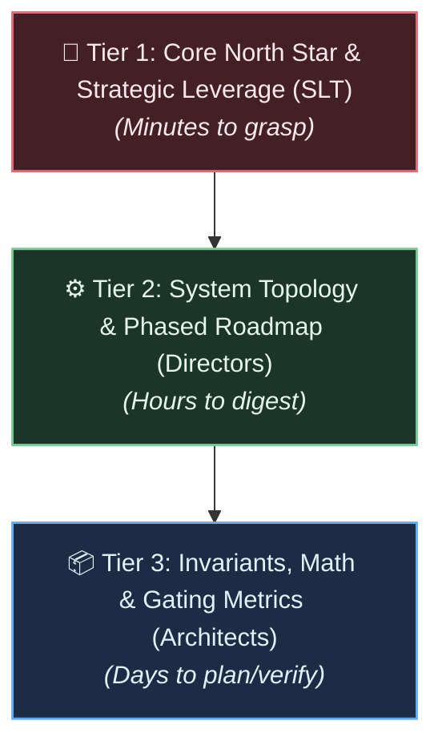

# Vision Document Style Guide & Authoring Specification

This guide defines the writing standards, content style, and structural expectations for authoring **Technical Vision Documents**.

A technical vision document presents a transformative vision for an enterprise, system, or research program. Its primary audience is typically the **Senior Leadership Team (SLT)**—including technical and non-technical executives (CTO, VP of Engineering, Chief Product Officer, Chief Science Officer, VP of Strategy, and CEO). Its ultimate purpose is to guide leadership in formulating a phased, de-risked strategic plan and capital allocation roadmap.

> **Note:** While this guide is optimized for the SLT use case, the principles—progressive disclosure, grounded metaphors, invariant-vs-hypothesis separation—apply broadly to any audience that needs a shared North Star, including engineering teams, cross-functional working groups, research collaborators, and investors.

---

## 1. The Purpose and Strategic Context

Visionary technical projects typically involve multiple years of execution, fundamental discoveries, architectural trade-offs, and multi-stage risk retirement.

A vision document is **not**:

* A marketing whitepaper or promotional manifesto (it avoids unsubstantiated hype and buzzwords).
* A low-level technical specification or RFC (it avoids rigid implementation code and transient API schemas).
* An academic paper (it is not merely evaluating past empirical results, but prescribing a forward-looking future state).
* A product requirements document (PRD) (it focuses on foundational technical paradigm shifts rather than immediate user stories).

A vision document **is**:

* **The Strategic Compass:** It establishes the destination, foundational constraints, and non-negotiable architectural boundaries.
* **The Strategic Translation Layer:** It translates deep technical paradigm shifts into actionable organizational, economic, and capability milestones that leadership can resource and govern.
* **A Framework for De-Risking:** It systematically identifies what is known, what is assumed, what must be invented, and under what conditions the vision should be considered falsified.

---

## 2. Core Writing Principles

### Principle 1: Multi-Tiered Progressive Disclosure

Your audience spans a range of technical backgrounds. Use **progressive disclosure** to organize information into layers that different readers can enter at the depth they need:

1. **The 30-Second Elevator Core (Executive Resonance):**  
   The core vision statement must be expressible in **one or two clear sentences** ($\le 35$ words) using accessible, unambiguous language. Any leader must be able to recall and state the central thesis without referring to notes.
2. **The Executive Narrative (Strategic Framing):**  
   High-level articulation of the systemic bottlenecks of the current paradigm, the strategic advantage of the new paradigm, and the asymmetric economic or operational leverage achieved.
3. **The Architectural Blueprint (Systems Mechanics):**  
   Topologies, operational timescales, communication contracts, boundary interfaces, and subsystem relationships.
4. **The Formal Rigor (Axiomatic Depth):**  
   Mathematical formulations, computational bounds, asymptotic complexities, concrete gating criteria, and empirical falsification thresholds.

---

### Principle 2: De-Jargonize and Decompress the North Star

Avoid packing every subsystem, constraint, and mechanism into a single, breathless compound sentence.

* ❌ **Anti-Pattern (Hyper-Dense Mega-Sentence):**  
  > *"Vision: Engineer an autonomous, decentralized, quantum-resistant, self-healing mesh topology utilizing localized Byzantine consensus over commodity wide-area networks with zero centralized orchestration, dynamic shard rebalancing via localized entropy dissipation, and asynchronous zero-knowledge rollups to achieve continuous sovereign data coordination without cross-node synchronization locks or centralized identity providers."*  
  *(Over 50 words; high cognitive load; impossible to retain or communicate.)*

* ✅ **Recommended Pattern (Core Proposition + Decomposed Mechanics):**  
  > **Core Vision:** *Build a decentralized data-mesh architecture that enables thousands of independent edge nodes to coordinate global state reliably over commodity networks without centralized servers or lock-step synchronization.*  
  >
  > **Key Capabilities:**  
  > 1. *Localized Consensus:* Nodes reach agreements within local neighborhoods, eliminating global synchronization bottlenecks.  
  > 2. *Asynchronous Aggregation:* Global invariants are synthesized through sparse, out-of-order state merges.  
  > 3. *Zero-Trust Membrane:* Cryptographic boundaries guarantee data sovereignty on client devices.

---

### Principle 3: Ground Metaphors with Immediate Operational Reality

Cross-disciplinary metaphors (e.g., biological analogies like *homeostasis*, *budding*, or *apoptosis*; thermodynamic analogies like *entropy dissipation* or *cooling*) can effectively communicate complex emergent behaviors. However, unanchored metaphors read as science fiction or hand-waving evasion.

**The Grounding Rule:** Every metaphor must be paired immediately with its physical, mathematical, or software engineering equivalent.

* ❌ **Unanchored Metaphor:**  
  > *"The agent uses somatic budding to expand when stressed by environmental entropy."*
* ✅ **Grounded Metaphor:**  
  > *"When local prediction error density exceeds operational capacity thresholds, the runtime triggers **somatic budding**—allocating an isolated parallel execution thread and sub-graph to absorb the additional workload without altering the primary node's response latency."*

| Metaphorical Concept | Grounded Engineering Specification |
| :--- | :--- |
| **Metabolic Envelope** | Hard bounds on RAM ($<4$ GB), CPU thermal dissipation, and battery draw. |
| **Cellular Membrane** | Cryptographic API gateway and privacy boundary preventing raw data leakage. |
| **Homeostasis** | Bounded runtime steady-state balancing resource allocation and automated garbage collection. |
| **Evolutionary Selection** | Automated multi-variant benchmarking that prunes underperforming algorithmic pathways. |

---

### Principle 4: Rigorously Distinguish Invariants from Hypotheses

A frequent flaw in visionary technical writing is adopting a uniformly prescriptive, dogmatic tone. Presenting an untested research speculation as an absolute "invariant" obscures technical risk and confuses the leadership team's strategic resource planning.

Documenters must maintain strict separation between two categories:

1. **Architectural Invariants (Engineering Directives):**  
   Constraints intentionally selected by the architects to bound the design space.  
   *Language:* *"The system must...", "Strictly prohibited", "Bounded by..."*  
   *Example:* *"Working memory growth must remain strictly sublinear: $O(T^\alpha)$ where $\alpha \le 1$."*
2. **Strategic Hypotheses (Scientific Bets to De-Risk):**  
   Foundational conjectures that require experimental validation or discovery.  
   *Language:* *"We hypothesize that...", "Subject to empirical verification in Phase N", "Under the assumption that..."*  
   *Example:* *"We hypothesize that local three-factor credit assignment can achieve sequence recall across $10^4$ tokens without catastrophic interference."*

---

### Principle 5: Couple System Mechanics to Strategic and Economic Leverage

Technical architects naturally focus on internal mechanics (how the system operates). Senior leadership requires the **outside-in perspective** (why this technical shift provides decisive strategic, operational, or commercial superiority).

For every core architectural mechanism, articulate its **Strategic Leverage**:

| Architectural Mechanism (Inside-Out) | Strategic & Economic Leverage (Outside-In) |
| :--- | :--- |
| **Local Credit Assignment without Global Backpropagation** | **Decoupled Training Economics:** Eliminates multi-million-dollar low-latency network fabrics (e.g., NVLink clusters), allowing continuous model adaptation on standard edge devices. |
| **Asymmetric Escalation with Low-Cadence Cloud Querying ($\le 0.1$%)** | **Sublinear Hosting Infrastructure Costs:** Cloud compute bills scale with high-level cognitive exceptions rather than continuous raw streaming hours. |
| **Privacy-Bounded Representation Deltas ($I(X; \Delta) \le 10^{-4}$ bits)** | **Regulatory and Sovereignty Advantage:** Enables compliance with strict zero-trust data governance regimes by guaranteeing raw user interactions never leave local hardware. |

---

### Principle 6: Establish Falsifiability and Directional Gating

A visionary document gains trust not from bravado, but from intellectual honesty. Executive leadership can confidently fund high-risk, high-reward ventures when they understand what success and failure look like—even if the precise thresholds are not yet known.

Every technical vision document should establish:

1. **Directional Gating Criteria:**
   Identify the key observables and metrics that will determine whether each phase succeeds. At the vision stage, these may be expressed as ranges, orders of magnitude, or qualitative boundaries rather than exact numerical thresholds. Avoid purely subjective gates (*"The prototype runs quickly"*), but recognize that precise thresholds (*"Latency $\le 25$ ms at the 99th percentile across $\ge 10^7$ continuous cycles"*) typically emerge during strategic planning once early prototyping and discovery work have informed what is achievable.
2. **Minimum Viable Demonstrations (MVDs):**
   Describe the observable behavioral demonstrations that would prove a stage of work is genuinely finished—at the level of *what* must be demonstrated, not the detailed acceptance criteria.
3. **Falsification Criteria (Kill Conditions):**
   State what experimental results or operational realities would prove the foundational thesis incorrect and mandate halting or pivoting the program. At the vision level, express these qualitatively—name the hypothesis, describe the shape of failure, and commit to honest evaluation.

> **Vision-appropriate falsification example:**
> *"The local-plasticity hypothesis is the foundational bet of this vision. If systematic experimentation demonstrates that local credit assignment cannot achieve useful sequence recall without global coordination mechanisms, the vision's core thesis is falsified and the program should be halted or fundamentally redirected."*

**Elaboration boundary:** Precise numerical gate criteria, detailed MVD acceptance tests, and specific experimental protocols (e.g., exact sample sizes, hyperparameter sweep counts, convergence thresholds) belong in the **strategic planning phase**, not the vision. When vision drafting surfaces overly specific gating criteria, move them to the **strategic planning backlog** for elaboration during roadmap development.

---

## 3. Reference Structure for a Technical Vision Document

The following section architecture provides a comprehensive reference for structuring vision documents. Not every vision requires all seven sections—simpler visions may consolidate or omit sections as appropriate. Use this as a checklist of concerns to address rather than a rigid template:

### Section 1: The Problem Space & Current Paradigm Limitations

* Identify the incumbent paradigm and its structural bottlenecks.
* Demonstrate why current industry solutions are evolutionary dead-ends rather than permanent answers.
* Group constraints into clearly titled, thematic failure modes (e.g., *The Thermodynamic Wall*, *The Synchronization Bottleneck*, *The Centralization Tax*).

### Section 2: The North Star Vision

* **Core Vision Statement:** Crisp 1–2 sentence declaration of intent.
* **Operational Timescales:** Breakdown of how the system functions across temporal horizons (e.g., Real-time Reflexes [ms] $\rightarrow$ Tactical Reorganization [minutes] $\rightarrow$ Strategic Evolution [weeks]).
* **Conceptual Grounding:** Explicit definition of novel terminology and cybernetic/systemic concepts.

### Section 3: Environmental & Boundary Contracts

* Define the raw boundary conditions under which the system must operate (e.g., raw stream format, network latency boundaries, memory ceilings).
* Eliminate artificial engineering crutches (e.g., prohibiting static batching or unconstrained memory buffers).

### Section 4: System Topology & Information Flow

* Provide a clear architectural diagram (e.g., Mermaid flowchart or sequence graph) visually articulating the physical and logical layout.
* Detail the communication channels, routing tiers, and escalation paths between components.

### Section 5: Invariants, Boundary Constraints & Hypotheses

* Clearly delineate **Architectural Invariants** (prescriptive rules) from **Foundational Hypotheses** (testable assumptions).
* Include operational correctness, stability, privacy, and economic scaling invariants.

### Section 6: Multi-Axis Progression Roadmap

* Map advancement across at least two orthogonal dimensions (e.g., *Algorithmic / Task Complexity* vs. *Deployment Topology / Scale*).
* Provide an **Execution Matrix** distinguishing mandatory gate thresholds from horizon stretch targets.

### Section 7: Directional Gating & Governance

* **Key Observables:** Name the metrics and observables that will gate phase progression, expressed directionally (ranges, orders of magnitude, qualitative boundaries).
* **Minimum Viable Demonstrations (MVDs):** Describe end-to-end demonstrations required for phase progression at the level of *what* must be shown.
* **Falsification & Termination Criteria:** State the conditions under which the core thesis would be considered disproven, warranting a pivot or shutdown.
* **Strategic Planning Handoff:** Note that precise numerical gate thresholds, detailed MVD acceptance tests, and specific experimental protocols should be elaborated in the **strategic planning backlog** during roadmap development.

---

## 4. Linguistic Texture, Tone, and Readability

### Sentence Craft and Cognitive Economy

* **Avoid Nested Nominalizations:** Do not chain multi-noun constructs (e.g., *"Decentralized asynchronous quorum parameter update convergence protocol verification"*). Unpack into clear verb-noun relationships (*"Verifying that decentralized quorums reach parameter convergence asynchronously"*).
* **Vary Sentence Length:** Follow a dense, technically nuanced sentence with a short, punchy thematic takeaway.
* **Active, Decisive Verbs:** Prefer *"absorbs"*, *"synthesizes"*, *"bounds"*, *"escalates"* over passive constructions (*"is processed by"*, *"is taken into consideration"*).

### Tone Calibration Matrix

| Aspect | ❌ Avoid | ✅ Recommended |
| :--- | :--- | :--- |
| **Ambition** | Aspirational fluff: *"We will create the ultimate hyper-intelligent universal platform."* | Rigorous conviction: *"We engineer an autonomous edge architecture that operates continuously within a 4 GB footprint."* |
| **Risk** | Hand-waving denial: *"The system will naturally scale without issues."* | Scientific accountability: *"Scalability depends on Hypothesis H1; if coordination overhead exceeds $O(\log N)$, the topology fails."* |
| **Terminology** | Unexplained jargon stacking: *"Utilizes holographic auto-associative hyper-dimensional quorums."* | Disciplined precision: *"Utilizes localized voting among semi-independent modules to resolve ambiguous inputs."* |
| **Boundaries** | Fuzzy promises: *"Highly efficient on mobile."* | Quantitative envelopes: *"Sustained execution under 5 Watts with memory footprint bounded strictly below 2 GB."* |

---

## 5. Authoring Checklist for Visionary Documenters

Before submitting a technical vision document, review against this quality checklist:

* [ ] **Is it concise enough to read in one sitting?** As a rule of thumb, the vision should weigh in under ~10,000 words (`wc -w`). If it is longer, content may belong in the strategic planning backlog instead.
* [ ] **Can the vision be spoken in 30 seconds?** Is there a clear, high-level core statement that non-specialist executives can understand and repeat?
* [ ] **Are all metaphors grounded?** Does every analogy (biological, physical, mathematical) immediately map to explicit software, hardware, or algorithmic mechanisms?
* [ ] **Are invariants separated from hypotheses?** Is there an unmistakable distinction between non-negotiable architectural rules and research bets requiring de-risking?
* [ ] **Is the strategic "So What?" clear?** Does the document explain how technical mechanisms translate into economic leverage, competitive moats, or operational resilience?
* [ ] **Are the gates directional?** Are phase gates identified with key observables and directional thresholds appropriate to the vision level of elaboration? Have overly specific numerical criteria been moved to the strategic planning backlog?
* [ ] **Are falsification criteria explicit?** Does the document clearly state what experimental results or operational realities would prove the core thesis wrong and justify halting or redirecting the program?
* [ ] **Is the progression phased?** Is there a structured roadmap showing how the project advances from an isolated proof-of-concept to full-scale deployment?
* [ ] **Is scope bounded?** Does the document explicitly acknowledge what is *out of scope*—what problems it is *not* trying to solve?
* [ ] **Is the vision treated as a living document?** Is it clear how the vision will evolve as hypotheses are validated or falsified, and how updates flow into the strategic planning backlog?
