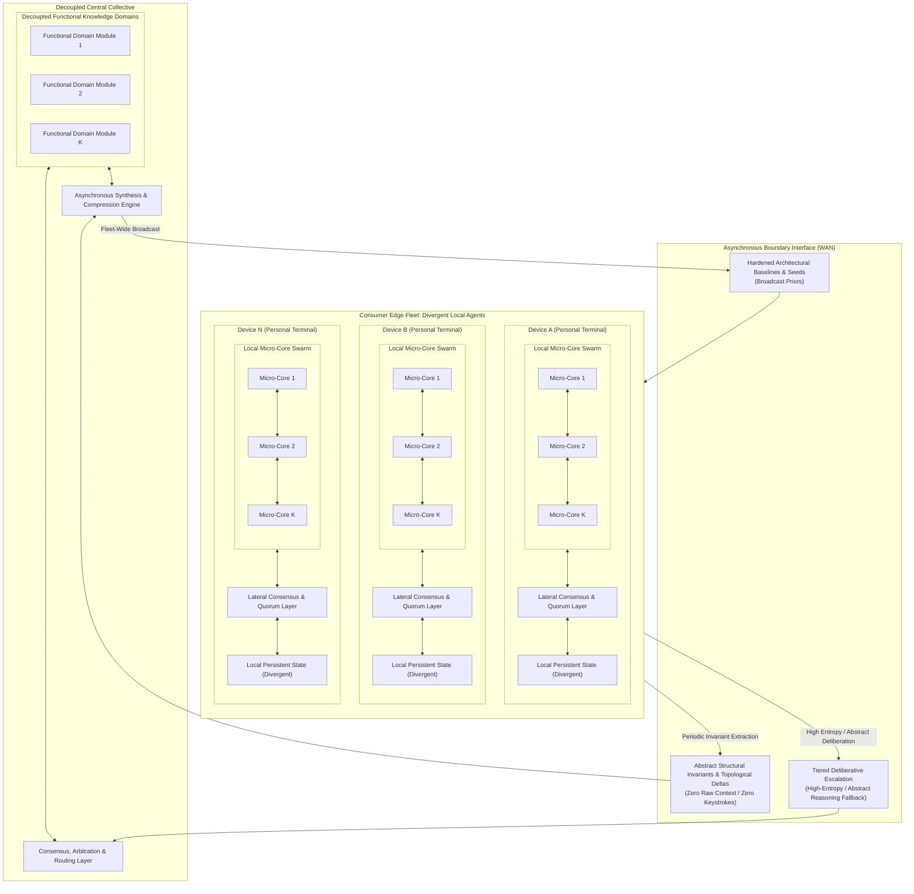

# Project Vision: The Autopoietic Collective

## From Autonomous Edge Micro-Cores to an Asymmetric Planetary Collective

---

## 1. The Problem Space

Modern artificial intelligence achieves functional utility through architectures that are structurally rigid, hyper-centralized, and biologically anomalous. These limitations are not incidental engineering hurdles; they are direct structural consequences of relying on monolithic parameter tensors optimized via global gradient descent, devoid of endogenous temporal dynamics, structural capacity growth, localized credit assignment, or autonomous error recovery.

The existing paradigm is constrained by six intertwined systemic bottlenecks:

* **Train Once, Freeze Forever (Static Optimization vs. Continuous Reality):**  
  A model is optimized offline over a static, historical dataset, then deployed as a fixed, immutable function. Continuous adaptation in a non-stationary world requires complete retraining or fine-tuning, both of which induce catastrophic forgetting of prior competencies.

* **Monolithic Parameter Entanglement & Global Gradient Coupling:**  
  End-to-end backpropagation couples every weight matrix to every other weight matrix through an analytical loss function. This total interdependence renders isolated local adaptation mathematically impossible: updating a sub-circuit to incorporate novel information perturbs the shared coordinate space (catastrophic interference). Consequently, models cannot accept asynchronous, time-lagged, or decentralized updates without stalling execution across ultra-low-latency interconnects or destabilizing the global parameter manifold.

* **The Asynchronous Distributed Wall:**  
  Global backpropagation requires instantaneous, synchronous awareness of the entire network state. It cannot tolerate non-deterministic latencies, time-lagged updates, or intermittent disconnections over commodity wide-area networks (WAN). As a result, continuous learning cannot naturally scale across geographically dispersed, loosely coupled devices.

* **Recompute Everything, Every Time (Statelessness & Thermodynamic Waste):**  
  Stateless transformer architectures maintain no persistent, embodied physical state across invocations. The entire contextual "memory" must be reconstructed from a volatile key-value (KV) cache on every forward pass, forcing redundant computational sweeps over historical inputs. Furthermore, dense floating-point tensor contractions on high-wattage accelerators run orders of magnitude above the physical thermodynamic minimum, completely decoupling computation from metabolic costs.

* **Brute-Force Dense Attention:**  
  Global all-to-all attention grants every token direct access to every other token. This imposes quadratic computational scaling, enforces no intrinsic notion of temporal or topological locality, and lacks resemblance to physical or biological information processing.

* **Capital and Infrastructural Centralization:**  
  Because monolithic substrates demand multi-terabit, low-latency interconnects (e.g., NVLink) to coordinate dense matrix operations across thousands of accelerators, training and large-scale inference are locked inside capital-intensive hyperscaler data centers. Meanwhile, billions of consumer-edge processors sit idle as passive terminal consumers rather than active computational participants—a structural barrier to entry that is purely an artifact of monolithic architecture.

---

## 2. The North Star

> **Vision:** Engineer an autopoietic intelligence architecture spanning an asymmetric, hierarchical topology: autonomous, locally plastic edge agents composed of autopoietic micro-core swarms operating directly on raw byte streams without global backpropagation, coupled asynchronously across commodity networks to a decoupled, modular central collective. Terminal agents instantiate from a common homogeneous baseline, deliberate locally via lateral quorum, expand capacity via somatic modular budding, and asynchronously contribute abstract structural invariants and deltas to the central collective—which synthesizes distributed discoveries and broadcasts hardened baseline priors across the fleet without monolithic parameter synchronization, raw data harvesting, or context recomputation.

This objective spans five distinct operational timescales:

1. **Local Experiential Plasticity (Runtime Adaptation — Milliseconds to Seconds):**  
   Continuously assimilate incoming byte streams and adapt internal states in real time using strictly local error signals (such as three-factor predictive coding or local contrastive energy minimization). Surprise and novelty absorbed by a sub-circuit remain topologically isolated, never corrupting established baseline competencies.

2. **Lateral Consensus & Quorum (Inference Deliberation — Milliseconds to Seconds):**  
   Resolve ambiguous inputs, cross-domain relational reasoning, and multi-step tasks locally through lateral voting, debate, and verification across redundant, semi-independent micro-experts rather than through an unconstrained, monolithic forward pass.

3. **Somatic Growth & Modular Budding (Structural Expansion — Minutes to Hours):**  
   Autonomously detect internal state and capacity saturation under high-entropy streams, triggering physical structural expansion (budding parallel sub-graphs, allocating localized compute units, and pruning redundant pathways) to match environmental complexity without degrading vector-parallel execution throughput or altering global operational latency.

4. **Asynchronous Collective Synthesis (Hive Integration — Hours to Days):**  
   Absorb sparse, time-lagged, and heterogeneous structural updates and topological invariants from millions of divergent edge agents into a decoupled central collective (comprising routing arbiters and domain-specific functional modules), reconciling distributed discoveries without requiring global cluster synchronization, lock-step training passes, or access to private client context.

5. **Fleet-Wide Baseline Distribution (Evolutionary Inheritance — Days to Weeks):**  
   Periodically compress, stabilize, and broadcast updated baseline architectural priors and minimal seed configurations back to the consumer edge fleet, lifting the general capability ceiling of all terminal instances across operational lifecycles.

### Operationalizing Autopoiesis

To ground "autopoiesis" as a rigorous engineering specification rather than a biological metaphor, the system satisfies three foundational cybernetic criteria:

1. **Self-Production of Components (Somatic Budding & Apoptosis):**  
   The system does not rely on static topology or manual architecture search. Instead, internal dynamical stress (local prediction error density, entropy saturation, attractor collapse) triggers the endogenous generation and integration of new computational units (micro-cores, lateral pathways). Conversely, unreinforced or energetically wasteful units undergo metabolic decay and apoptosis, recycling allocated substrate.

2. **Organizational Closure:**  
   While the physical components (weights, dynamical sub-graphs, active cores) are continually produced, rewired, and pruned through real-time experiential plasticity, the overarching *system organization* remains invariant. The continuous, closed-loop cycle—ingesting raw bytes, settling into attractors, computing local credit residuals, maintaining homeostasis, and emitting actions—is dynamically self-sustaining and conserved across all structural transformations.

3. **Dynamic Boundary Generation (Operational Membrane):**  
   The boundary separating the agent from its environment—and separating the local edge terminal from the central collective—is not merely an arbitrary API contract. It is an endogenously generated operational membrane: an active Markov blanket formed by predictive attractor basins and lateral quorum consensus. Incoming raw byte streams act as external perturbations across this membrane, which the agent actively assimilates or filters; interactions crossing into the collective upstream are strictly constrained to invariant attractor summaries, preserving internal sovereign state.

---

## 3. Environmental & Interface Constraints

To prevent accidental solutioning via arbitrary data representations, the environment contract is defined strictly at the raw byte boundary:

* **Standardized Raw UTF-8 Byte Stream:**  
  * The environment presents an unbroken sequence of discrete symbols standardized at the raw **UTF-8 byte level** ($\vert{}V\vert{} \le 256$, or constrained subsets during early development).  
  * No external multi-thousand-token vocabularies, BPE tokenizers, or arbitrary high-dimensional embedding projections are permitted at the interface.  
  * All compositional abstractions—from byte combinations to morphemes, syntax, and relational concepts—must be discovered and represented endogenously within the system's own internal dynamics.

* **Continuous, Open-Ended Ingestion:**  
  Input arrives as an unending temporal sequence without artificial episode resets, context-window flushes, or distinct training versus inference modes.

* **Active Cybernetic Closure:**  
  The environment is reactive and non-stationary. Output bytes emitted by an agent act directly upon the environment, altering its state and biasing future incoming sequences.

* **Dynamic Capacity Saturation:**  
  The environment's generative complexity and entropy will eventually outstrip any fixed-size computational state space, exerting continuous evolutionary selection pressure toward autonomous structural growth.

---

## 4. System Topology & Information Flow

The architecture decouples immediate interactive experience from collective planetary generalization via a hierarchical, asymmetric topology:



### Multi-Tiered Deliberation & Information Routing

1. **Edge-Native Reflex & Resilient Baseline:**  
   Every edge terminal runs a local micro-core swarm dedicated to high-bandwidth, ultra-low-latency byte ingestion, continuous experiential plasticity, and immediate interaction. It maintains a resilient, non-blocking baseline that functions autonomously when offline, guaranteeing graceful degradation rather than total capability parity with the collective.
2. **Local Lateral Quorum:**  
   Ambiguous inputs and immediate multi-step reasoning are evaluated locally across redundant micro-experts via lateral consensus and debate before any emission occurs.
3. **Tiered Deliberative Escalation:**  
   Consumer silicon is structurally bounded in thermal dissipation and memory bandwidth. The architecture establishes a clear effort distribution: the edge runtime absorbs the overwhelming majority (>99%) of continuous temporal byte ingestion, habitual reflex, and localized experiential plasticity. High-entropy, cross-domain relational abstraction escalates via `QueryFallback` to the central collective's specialized functional modules as an exception rather than a continuous stream. This asymmetry preserves thermodynamic viability, avoids linear infrastructure cost scaling with user streaming time, and prevents gold-plating the edge runtime.
4. **Zero-Knowledge Upstream Synchronization:**  
   Personal keystrokes, raw observations, and private context *never leave the edge device*. Only verified structural deltas (topological additions, rewiring graphs, invariant attractors) or ephemeral deliberative queries adhering to formal non-invertibility criteria cross the boundary interface into the collective.
5. **Decoupled Central Synthesis & Broadcast:**  
   The central collective reconciles time-lagged, heterogeneous structural deltas into modular functional domains. Periodically, the synthesis engine distills these into compressed baseline seeds (`DownPriors`) broadcast to elevate the general capability floor of all devices.

---

## 5. Hardware, Boundary & Architectural Invariants

To prevent the engineering effort from defaulting to traditional coupled deep learning techniques, the architecture must satisfy the following non-negotiable invariants:

* **Lifetime Invariance ($O(1)$ Complexity with respect to $T$):**  
  The computational cost and working memory footprint required to process incoming byte $N$ must remain strictly independent of the total accumulated historical lifetime $T$. State is embodied entirely within persistent dynamical attractors and structural topology—never accumulated in an expanding history log, replay buffer, or KV cache.

* **Locality of Credit Assignment Invariant:**  
  Internal parameter updates and state adaptations must depend exclusively on locally accessible signals within the immediate computational neighborhood (presynaptic activations, postsynaptic responses, and local predictive residuals or diffuse scalar modulators). Global backward passes requiring layer-synchronized execution locks, reverse-order graph traversals, or global gradient evaluations are strictly prohibited—both across distributed nodes and within individual micro-cores. Intra-core continuous temporal streaming requires true local credit assignment: reverse-mode backpropagation necessitates storing intermediate forward activations proportional to sequence depth (violating $O(1)$ memory lifetime invariance under continuous streaming) and imposes synchronous forward-backward locks that disrupt dynamic relaxation.  
  *Candidate mechanisms include, but are not limited to:* Three-factor predictive coding, local contrastive energy minimization, equilibrium propagation, feedback alignment, and localized topological rewiring.

* **Elastic Pacing & Bounded Relaxation:**  
  The core is not slaved to a rigid wall-clock tick. It interfaces via an elastic pull/backpressure mechanism, consuming variable internal relaxation cycles ($\tau$) per byte depending on input entropy and structural reorganization demands.

* **Operational Halting Invariant ($\tau \le \tau_{\max}$):**  
  State transitions must guarantee convergence to an attractor, an emission, or a stable quiescent state within a hard maximum computational budget ($\tau \le \tau_{\max}$). Unbounded livelocks, dynamic divergences, and silent stalls constitute fatal failure.

* **Asynchronous Emission Autonomy:**  
  The core independently decides *if* and *when* to emit bytes back into the stream. It may absorb multiple input bytes during internal contemplation before emitting, or stream an emission sequence across continuous observations.

* **Client Resilience & Absolute Privacy Boundary:**  
  A terminal agent must maintain operational resilience in an air-gapped environment, executing local sensorimotor and habituated reasoning loops without crashing, blocking, or stalling. Air-gapped autonomy functions as an operational fail-safe floor, not a ceiling of parity with the collective. When deliberative queries or structural updates cross the boundary interface into the collective, they must satisfy formal mathematical privacy constraints: structural deltas and query representations must be non-invertible with bounded mutual information with respect to private inputs ($I(X; \Delta) \le \epsilon$) and satisfy differential privacy ($\epsilon, \delta$-DP) bounds against reconstruction or membership inference attacks—never transmitting raw user logs, keystroke streams, or uncompressed private observations.

* **WAN-Native Interconnect & Latency Tolerance:**  
  The system must remain computationally stable and functional under arbitrary network latency, high packet loss, and intermittent device dropouts. Decentralized nodes communicate through sparse behavioral activations, structural deltas, or consensus votes—never through synchronous, high-bandwidth all-reduce tensor synchronization.

* **Silicon-Native Parallelism:**  
  Execution targets commodity CPU, GPU, and NPU architectures, not specialized neuromorphic silicon. All local dynamical updates, state transitions, lateral consensus votes, and structural graph transformations must compile into cache-coherent, vector-parallel (SIMD/SIMT) execution primitives.

* **Asymmetric Economic Scaling:**  
  Total infrastructure hosting costs scale with the rate of *macro-deliberative reasoning and collective capability synthesis*, not with *continuous raw stream ingestion*. Because edge devices absorb the overwhelming volume of temporal byte streaming, interactive pacing, and continuous local adaptation, the economic burden of routine, high-cadence operation remains decentralized—delivering an order-of-magnitude efficiency advantage over monolithic hyperscaler architectures.

### Foundational Safety, Alignment & Homeostatic Invariants

To guarantee that open-ended plasticity, structural budding, and decentralized execution remain bounded, secure, and aligned:

* **Homeostatic Bounding & Metabolic Quotas:**  
  Structural budding and capacity expansion are strictly bounded by hardware metabolic constraints (enforcing hard upper limits on memory footprint and thermal dissipation). Unreinforced pathways and idle micro-cores undergo homeostatic decay and apoptosis, guaranteeing that autonomous growth cannot induce memory exhaustion, resource monopolization, or runaway execution loops.

* **Byzantine & Adversarial Delta Sanitization:**  
  The central collective operates on a zero-trust model regarding distributed structural contributions. Incoming structural deltas and topological invariants undergo statistical anomaly filtering, topological outlier rejection, and multi-party quorum verification before baseline synthesis, preventing compromised, corrupted, or adversarially poisoned edge updates from destabilizing the collective priors.

* **Attractor Stability & Supervisory Containment (Deterministic Failsafe):**  
  Every edge agent incorporates an unalterable deterministic supervisory watchdog decoupled from experiential learning dynamics. If internal state trajectories enter pathological limit cycles, chaotic divergences, or exceed operational halting budgets ($\tau > \tau_{\max}$), the supervisor immediately clamps the core into a verified quiescent ground state or triggers local core re-initialization, ensuring deterministic containment without requiring external intervention.

---

## 6. Progression Roadmap: Staged Multi-Axis Progression

System advancement is measured along a rigorous multi-axis progression combining **Dynamical & Structural Complexity (Levels I–IV)**, **Dynamical Resilience (Nodes 0–D)**, and **Deployment Topology (Phases −1–3)**. Advancement requires earning passage through empirical gating invariants, minimum viable demonstrations, and operational gating criteria.

```text
Information Axis (Dynamical & Structural Complexity):
  Level I (Regular Grammars) ──► Level II (Hierarchical) ──► Level III (Context-Sensitive) ──► Level IV (Natural UTF-8)
  [Cross-cut by: Temporal Depth, Adaptation Velocity, Compositional Depth, Relational Binding]

Operational & Topological Staged Progression:
  [Phase −1: Foundational Existence Proof] (Isolated Micro-Core Substrate)
    ↳ Validates core mechanism: local credit assignment, O(1) memory, and bounded settling on raw bytes
         │
         ▼
  [Phase 0: Isolated Swarm & Dynamical Resilience] (Single Device / Laptop)
    ↳ Validates Node 0 (Streaming), Node A (Temporal Depth), Node B (Shift), Node AB (Compound), Node C (Expansion)
         │
         ▼
  [Phase 1: Divergent Sandbox & Lateral Quorum] (Multi-Instance / Local Swarm)
    ↳ Validates local multi-agent divergence, modular budding, and Node C+ (Lateral Quorum & Consensus)
         │
         ▼
  [Phase 2: Asymmetric Edge/Core Link & WAN Federation] (Emulated WAN / LAN)
    ↳ Validates asynchronous invariant absorption, latency-tolerant query offload fallback, and graph merging
         │
         ▼
  [Phase 3: Decentralized Fleet & Central Collective] (Commercial WAN Scale)
    ↳ Validates Node D (Collective Agency & Seed Distillation), fleet-wide broadcast, and asymmetric economics
```

### The Information Axis: Dynamical Learning Phenomena & Structural Regimes

Rather than treating representational complexity purely as formal static grammar classes, the evaluation framework evaluates four orthogonal, incrementally composable dynamical learning phenomena:

1. **Temporal Dependency Depth ($K$):**  
   The capacity to maintain, retrieve, and bind past state across intervening distractor streams from short-range ($1\text{--}8$ bytes) to intermediate ($10^2\text{--}10^3$ bytes) and long-range ($10^4\text{--}10^5+$ bytes) horizons without token buffers or KV caches.

2. **Non-Stationarity & Adaptation Velocity ($\Delta E$ / $T_{\text{recover}}$):**  
   The ability of local plasticity mechanisms to detect unannounced distributional shifts and re-settle into optimal attractor paths with minimal sample complexity, bounded degradation of prior attractors, and zero catastrophic forgetting.

3. **Compositional Depth & Hierarchy:**  
   The transition from local Markovian $n$-grams to nested recursive bracket structures (Dyck languages) and multi-level compositional semantics, formed endogenously without push/pop stack instructions.

4. **Relational Variable Binding:**  
   The dynamic binding of operational roles to arbitrary arguments ($w w$ patterns, symbol-to-address mapping, and pseudo-code execution traces) without global all-to-all cross-attention matrices.

These dynamical phenomena are progressively evaluated across four structural regimes:

* **Level I: Regular & Markovian Sequences ($\vert{}V\vert{} \le 8$):**  
  Micro-alphabets, local $n$-grams, parity checks, periodic and finite-state regular languages.  
  *Core Challenge:* Establishing fundamental state persistence, deterministic attractor transitions, and basic non-stationarity recovery under local credit rules.
* **Level II: Hierarchical & Context-Free Languages ($\vert{}V\vert{} \sim 8\text{--}32$):**  
  Nested byte sequences, Dyck languages, balanced bracket expressions, recursive syntax trees.  
  *Core Challenge:* Autonomous formation of internal counter- or stack-like attractor dynamics without hardcoded push/pop primitives.
* **Level III: Context-Sensitive Systems & Variable Binding ($\vert{}V\vert{} \sim 64\text{--}128$):**  
  Structured byte grammars, dynamic variable binding, cross-serial dependencies ($w w$ patterns), pseudo-code execution traces.  
  *Core Challenge:* Decoupling operators from arguments; dynamic relational reference without global cross-attention.
* **Level IV: Open-Domain Natural Distributions ($\vert{}V\vert{} = 256$):**  
  Full raw UTF-8 byte stream, natural language polysemy, open-ended conversational context, programmatic interaction.  
  *Core Challenge:* Compositional semantics, large-scale relational reasoning, and cross-domain generalization without external tokenizers.

---

### The Integrated Execution Matrix

| Stage & Topology | Level I: Regular Grammars ($\vert{}V\vert{} \le 8$) | Level II: Hierarchical ($\vert{}V\vert{} \le 32$) | Level III: Context-Sensitive ($\vert{}V\vert{} \sim 128$) | Level IV: Open Natural UTF-8 ($\vert{}V\vert{} = 256$) |
| :--- | :--- | :--- | :--- | :--- |
| **Phase −1: Foundational Proof**<br>*(Single Micro-Core Substrate)* | Stream raw periodic byte sequences with noise; demonstrate convergent next-byte prediction using strictly local credit assignment; verify flat $O(1)$ memory over $10^7$ bytes and bounded settling $\tau \le \tau_{\max}$. | [Empirical prerequisite gate for Phase 0 entry; establishes core substrate viability before hierarchical scaling.] | [N/A at Phase −1] | [N/A at Phase −1] |
| **Phase 0: Isolated Swarm**<br>*(Nodes 0–C on Single Device)* | Stream micro-tokens; establish settling ceiling $\tau_{\max}$; verify $O(1)$ memory; recall delayed trigger signals across distractor bytes (Node A); adapt to shifted Markov rules (Node B); allocate nodes upon regular state saturation (Node C). | Stream nested byte streams; confirm stack-free stability; Dyck-path resolution separated by long distractor streams; recursive matching with shifting grammar modes; grow dynamic attractor depth when nesting exceeds initial bounds. | Continuous stream of code execution traces; variable binding with distant operational calls; algorithmic execution with mid-stream protocol changes; allocate isolated parallel sub-graphs for disjoint variable scopes. | Sustained multi-gigabyte ingestion of raw UTF-8 text on commodity CPU/GPU; long-range context resolution across thousands of intervening UTF-8 bytes; fluid domain adaptation; expand structural parameter footprint under open-domain entropy. |
| **Phase 1: Divergent Sandbox**<br>*(Node C+ on Multi-Instance Host)* | Multiple local instances adapt to mutually exclusive Markov transition rules without baseline degradation; lateral majority voting across redundant micro-cores resolves noisy Markov streams (Node C+). | Instances diverge on conflicting delimiter/syntax systems; verify structural isolation; consensus resolution between competing stack-like attractors on ambiguous brackets. | Instances independently debug disjoint code traces; confirm zero cross-contamination; multi-expert quorum resolves branching variable bindings and conflicting execution traces. | Standalone terminal agent demonstrates real-time personal context adaptation on edge hardware ($<4$ GB RAM); dynamic consensus, debate, and verification across decoupled micro-experts synthesize complex text. |
| **Phase 2: Asymmetric Link**<br>*(WAN/LAN Client-Server)* | Local instance executes high-cadence stream; escalates unresolved state transitions to emulated central module; WAN latency tolerance verified. | Central module resolves ambiguous recursive branches; validates fluid, low-overhead deliberative escalation and re-absorption without edge stalls. | Client emits local structural deltas; escalates multi-step variable binding traces to central collective; central engine merges functional graphs without retraining. | Central collective absorbs time-lagged deltas from multiple edge instances and arbitrates complex reasoning queries; validates absence of catastrophic interference under asynchronous updates. |
| **Phase 3: Collective Fleet**<br>*(Node D at Commercial Scale)* | Distributed fleet maps disjoint state spaces; collective unifies them into a minimal baseline seed; generator steering across low-entropy Markov states (Node D). | Central engine extracts common grammar invariants from a fleet exposed to diverse synthetic dialects; active querying resolves grammatical ambiguities. | Distributed fleet resolves large-scale programmatic suites; collective synthesizes optimal execution paths; interactive debugging across distributed worker nodes. | Full autonomous agent dialogue: steering environments; edge executes high-bandwidth routine inference and continuous adaptation, escalating deep abstract reasoning to the central collective; collective distills global capabilities; asymmetric hosting economics verified. |

---

## 7. Multi-Tier Gating Framework

Advancement across operational nodes and topological deployment phases requires satisfying two complementary tiers of gating criteria:

### Tier 1: Mathematical & Dynamical Gating Invariants

To eliminate ambiguity, passage through operational gates is governed by concrete numerical criteria:

* **Homeostatic Invariant ($O(1)$ Memory & Settling Ceiling):**  
  Flat physical memory allocation ($\sigma^2_M = 0$, zero resource leakage) and bounded internal settling ($\tau \le 32$ relaxation cycles per byte) sustained across $\ge 10^7$ consecutive streaming bytes.
* **Retention Invariant ($\gamma$ Retention across Distractors):**  
  Mutual information between an early trigger signal $S_{t_0}$ and a conditional response at $t_0 + K$ must satisfy $I(S_{t_0}; R_{t_0+K}) \ge 0.95$ across distractor intervals of $K \ge 10^4$ bytes without historical caches, replay buffers, or token re-ingestion.
* **Plasticity Recovery Invariant ($T_{\text{recover}}$ Bound):**  
  Upon an unannounced environmental distribution shift ($\Delta E$), the time-to-recovery ($T_{\text{recover}}$) settles into an optimal asymptotic bound ($\le 500$ bytes on Level I benchmarks), demonstrating rapid active dynamic reconfiguration.
* **Backward Non-Interference Invariant ($\epsilon$ Degradation Ceiling):**  
  Adapting to novel environmental dynamics $B$ induces performance degradation on previously mastered dynamics $A$ bounded strictly by $\Delta \le 0.05$ (maximum 5% relative accuracy loss).
* **Consensus Coherence Invariant ($\delta$ Calibration Bound):**  
  When evaluated across a distributed ensemble of heterogeneous micro-experts receiving out-of-order, time-lagged updates, collective voting must maintain accuracy and calibration within bounded error $\delta \le 0.05$ relative to an un-lagged reference.
* **Information-Theoretic Privacy Invariant ($I(X; \Delta) \le \epsilon$):**  
  Structural deltas and upstream queries must have provably bounded mutual information with private observation streams ($I(X; \Delta) \le 10^{-4}$ bits) and satisfy $(\epsilon, \delta)$-differential privacy guarantees against reconstruction.

### Minimum Viable Demonstrations (MVD) by Phase Gate

Each phase transition requires a concrete, observable behavioral demonstration:

* **Phase −1 $\rightarrow$ Phase 0 MVD (Substrate Existence Proof):**  
  A single isolated micro-core, given a raw continuous byte stream of a periodic 4-to-8 symbol grammar injected with noise, demonstrates monotonic loss convergence to accurate next-byte prediction using strictly local credit assignment, with zero memory growth over $10^7$ streaming bytes and relaxation settling $\tau \le 32$.
* **Phase 0 $\rightarrow$ Phase 1 MVD (Edge Swarm & Budding):**  
  A single-device micro-core swarm running on commodity hardware ($<4$ GB RAM) absorbs competing non-stationary streams; individual cores specialize without cross-interference ($\Delta \le 0.05$); lateral quorum resolves ambiguous test sequences with $\ge 90\%$ accuracy; and capacity saturation autonomously triggers somatic budding of a new micro-core without stalling execution.
* **Phase 1 $\rightarrow$ Phase 2 MVD (Asymmetric Structural Sync):**  
  Two independent edge instances connected via an emulated 200ms-latency WAN link exchange structural invariant deltas. Device B demonstrably masters a task distribution it has never directly observed, utilizing synthesized deltas from Device A. Zero raw tokens or reconstructible private contexts cross the boundary link.
* **Phase 2 $\rightarrow$ Phase 3 MVD (Collective Scale & Asymmetry):**  
  A deployed network of 100+ heterogeneous edge nodes and a central collective proves: (a) collective model accuracy on multi-step reasoning exceeds any isolated edge node by $\ge 25\%$; (b) central infrastructure compute scales sublinearly ($O(\log N)$ or $O(1)$) with active fleet size $N$; and (c) a newly initialized edge node bootstraps from broadcast priors (`DownPriors`) to fleet-average competence within hours.

### Empirical Falsification & Termination Criteria

A rigorous scientific vision establishes clear conditions under which foundational premises are considered falsified:

1. **Substrate Viability Falsification (Phase −1):**  
   If an isolated micro-core cannot achieve convergent next-byte prediction on Level I regular grammars under local credit assignment constraints with $O(1)$ memory after exhaustive exploration of local learning rules, the local-plasticity core thesis is falsified, halting multi-core architectural composition.
2. **Dynamic Isolation Falsification (Phase 0/1):**  
   If continuous online adaptation inevitably induces catastrophic forgetting ($\Delta > 0.05$) across isolated cores despite structural budding and modular compartmentalization, the premise of non-interfering localized plasticity is falsified.
3. **Information Leakage Falsification (Phase 2):**  
   If structural invariants or deliberative queries transmitted over the WAN link permit non-trivial reconstruction of private input byte streams under adversarial auditing, upstream synchronization is immediately halted.

### Tier 2: Commercial & Operational Gating Criteria

* **Edge Footprint Feasibility (Phase 0 $\rightarrow$ Phase 1 Gate):**  
  The runtime must operate comfortably within constrained consumer compute envelopes (modern laptop/desktop CPU, integrated GPU, or NPU with $<4$ GB RAM footprint), maintaining responsive settling times without thermal throttling or continuous high-wattage utilization.
* **Privacy & Bandwidth Viability (Phase 1 $\rightarrow$ Phase 2 Gate):**  
  Invariant updates and deliberative queries sent over the network must be ultra-sparse, requiring bandwidth orders of magnitude lower than transmitting the raw interaction stream, with mathematical guarantees of zero reconstructible private context or user observations.
* **Decoupled Infrastructure Economics (Phase 2 $\rightarrow$ Phase 3 Gate):**  
  The central infrastructure must prove that compute consumption scales with the rate of *macro-deliberative reasoning and collective model synthesis*, and does *not* scale linearly with the continuous raw streaming volume or total active edge fleet size.
